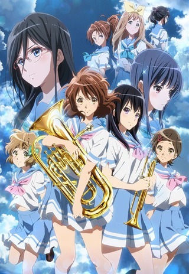
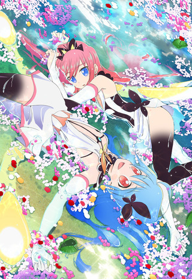

So between the holidays and getting sucked back into a few games (_cough_ Diablo III \*cough) I ended up not getting through most of the shows I intended. I'm still playing D3 and there a number of shows in the new season that are blocking me from going back and binging. In particular, I plan to get through [Yuri](https://anilist.co/anime/21709/YurionICE), [Udon](https://anilist.co/anime/21631/UdonnoKuninoKiniroKemari), [Gi(a)rlish Number](https://anilist.co/anime/21627/giarlishnumber), and [Fune wo Amu](https://anilist.co/anime/21703/FunewoAmu). The rest are a toss up between hold and dropped.

### [Hibike! Euphonium 2](https://hummingbird.me/anime/hibike-euphonium-2)

For some reason, I decided early on that I wanted to binge _Eupho_. I had watched the first cour well after it had finished airing and ended up binge watching it over a few days. Turns out this was a good decision. While it took me longer to get around to starting it that it should, I ended up binging series 2 over a few days and damn! So good!

I can't think of another show that _earned_ the drama the show revolved around. It wasn't lowest common denominator relationship triangles, misunderstandings, gossip destruction, etc. The drama in _Hibike_ felt genuine, heartfelt and real. Even Reina's unrequited love for Taki could be believed (even while seeming forced from a story perspective). As much as I wished the Kumiko-Reina ship to set sail, they at least didn't force romance on us.

As far as character dramas go, nothing tops what Kyoani has done here. _Eupho_ is easily one of my favorite anime of all time. I love the characters, the voice acting is scintillating, and the animation is jaw dropping. All the performance shots, the characters were animated with the correct fingerings! I can't imagine the dedication to pull something like that off.

My understanding is that there won't be a third cour. The source novels have wrapped at the same point in the story. The ending is satisfying (if not tear inducing). I will have to rewatch this show multiple times in the years to come -- I will miss the characters too much to stay away.

Studio 3Hz, Infinite

### [Flip Flappers](https://hummingbird.me/anime/flip-flappers)

This show was an awesome trip (in all senses of the word). While the story felt a bit rushed towards the end, the animation was just out of this world (quite literally). The sakuga was spectacular and the wide shots on all the crazy worlds were gorgeous. Along with my favorite [OP](https://my.mixtape.moe/qasybs.webm) of the season, I would highly recommend this show, especially to anyone looking for a reason why hand animation (non-3D) still matters.

Hero image created by Zana at <a href="https://neregate.com/blog/">neregate.com</a>  
The following websites were used as sources of information to create the chart : 
<a href="https://www.animenewsnetwork.com/">ANN</a>
<a href="https://m-p.sakura.ne.jp/">Moon Phase</a>
<a href="https://myanimelist.net/">MAL</a>

