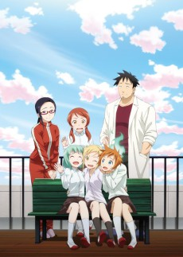

 

### [Kono Subarashii Sekai ni Shukufuku wo! 2](https://anilist.co/anime/21699)

_Konasuba_ is one of the few pure comedy shows I've watched in the past few years, and season 2 while not exactly living up to _all_ the hype, was a solid return to form for the series. They at least proved season 1 wasn't lightning in bottle and delivered quite a few hilariously epic moments. I was initially disappointed by Darkness' absence in the first few episodes, bit bottom line, this series is must watch material.

 

### [Masamune-kun no Revenge](https://anilist.co/anime/21857)

Watched a few episodes and put it on hold. I think I would have liked this show if there was a bit of flexibility in the protagonist, but early on it felt too much like a "protagonist reset" scenario (where any progress the main character(s) seem to make over the course of an episode is reset at the beginning of the next episode). It wasn't panned by the critics which is why it earns hold status rather than an outright drop. I might try the dub of this one to see if the humor improves it at all.

") 

### [Little Witch Academia (TV)](https://anilist.co/anime/21858)

Despite Netflix's abysmal treatment of this series, it is an absolute gem and I highly recommend diving into it as soon as you are able.

NUT

### [Youjo Senki](https://anilist.co/anime/21613)

This show. Holy Crap!

This show is a text book example on why you don't necessarily judge a show by the first episode. The wrinkle thrown into episode 2 puts an entirely different spin on the entire show and then it just goes bat-shit crazy from there. The animation and foley work were fantastic though I would have made different character design decisions.

I _loved_ this show and I truly hope they'll do a second season very soon.

One thing to keep in mind was this show was the first show done by the new studio. I'm eager to see what they will do for their second outing -- hopefully they can show that _Youjo Senki_ wasn't a fluke.

 

### [Fuuka](https://anilist.co/anime/21887)

Hold rather than dropped. Again, I heard that the ending was fairly satisfying, so I will probably get around to this (my only problem is I'm developing quite a _Hold_ backlog that I need to start being disciplined about making progress through).

 

### [Tales of Zestiria the X 2](https://anilist.co/anime/97645)

Continues where the first cour left off and delivers more of the same. They spun out a final 13th episode that has yet to air, so I can't give any conclusive thoughts, but if you enjoyed the first cour, you'll be on the train for this one. It was enjoyable to have a pure fantasy adventure (that wasn't a "boy trapped in a fantasy").

 

### [ACCA: 13-ku Kansatsu-ka](https://anilist.co/anime/21823)

Wow was I wrong about this one... I judged it after the first episode which was a huge mistake. Thanks to [JoJo](https://www.youtube.com/channel/UCe2DsKuv45QTTzDWwjvX4Jg) for sticking with it and making it clear:

This show is a really, _really_ slow burn so make sure you give it to at least episode 3 or 4. It is easily one of the best shows of the season (and hands down the best [OP](https://www.youtube.com/watch?v=pITNm95Sd1k))

 

### [Shouwa Genroku Rakugo Shinjuu: Sukeroku Futatabi-hen](https://anilist.co/anime/21733)

I'm almost half way through this and the only reason I haven't finished it yet is I've been trying to stay diligent about keeping up with the new season.

I'll hold off giving any definitive opinions on this second cour, but I still think this is one of the best (and underrated) animes of all time. The level of storytelling is on it's own plane of existence. Studio DEEN is doing yeoman's work with this one.

 

### [Demi-chan wa Kataritai](https://anilist.co/anime/97592)

Loved it. While I wish it went a bit deeper in its exploration of discrimination and bullying, it was cute, funny and heartfelt. The entire cast was great and don't judge the show based on the setting (high school). I picked up the manga and hope it will tell more stories about this engaging cast.

Let me also conclude: If any character _needs_ a happy ending, it's Sakie Satou.

 

### [Kobayashi-san Chi no Maidragon](https://anilist.co/anime/21776)

Also loved it! This one caught me more by surprise as there was actually tremendous depth to all the characters that came across very much in a "show me don't tell me" sort of way. Once again, a lot of the depth was only briefly touched on (a glance, a pause, etc) and I wish they explored it a bit more -- the result would have been truly great. This is another one I picked up the manga as soon as the season was over. While the manga is good, the anime adaptation is even better, and that is high praise for KyoAni (which usually only do their own properties...)

Hero image created by Zana at <a href="https://neregate.com/blog/">neregate.com</a>  
The following websites were used as sources of information to create the chart : 
<a href="https://www.animenewsnetwork.com/">ANN</a>
<a href="https://m-p.sakura.ne.jp/">Moon Phase</a>
<a href="https://myanimelist.net/">MAL</a>

