Crap! This is late! New job put this distinctly on the backburner! I'm just going to get this out now while I still can...

_sigh_

Note: some of the commentary was written after only the first few episodes...

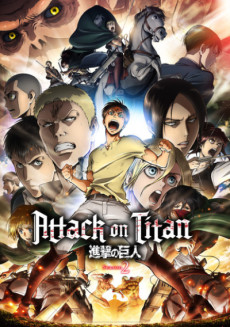 

### [Shingeki no Kyojin 2](https://anilist.co/anime/20958)

The first of course being _Attack on Titan_. I've only watched the first cour of the first season, so I have quite a bit to catch up on before I begin to dive into this new season. I've only heard good things, so I'm eager to catch up as quickly as I can.

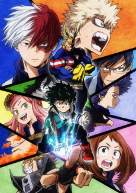 

### [Boku no Hero Academia 2](https://anilist.co/anime/21856)

The first season was unexpected -- I initially thought I wouldn't watch it at all but quickly got sucked into it after a few episodes. This second season is picking right where it left off and bringing us even more characters to enjoy. My _only_ complaint about this show is the lengthly reintroduction at the beginning of every episode. I wonder if most shonen series are done that way.

_Tournament Arc!!_

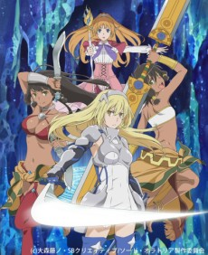 

### [Dungeon ni Deai o Motomeru no wa Machigatteiru Darou ka Gaiden: Sword Oratoria](https://anilist.co/anime/21676)

I'm disappointed this wasn't a season 2 of the original story. The new POV character mage didn't grab my attention and disappointed rumblings have caused this to move into the Hold List. There were too many other good shows this season to keep up with this one in real time.

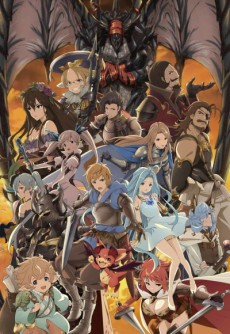 

### [GRANBLUE FANTASY The Animation](https://anilist.co/anime/21361)

Pure Epic Fantasy #1

A little heavy on the cheese and you can see the game mechanics bleeding through, but overall fun.

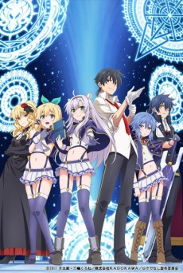

LIDENFILMS

### [Rokudenashi Majutsu Koushi to Kinki Kyouten](https://anilist.co/anime/21700)

Poor, trope filled first episode was followed up with a much stronger second episode. It's had it's up and downs (and seems to be the community's whipping child for this season due to it's light novel orgins and tropes) but still entertaining.

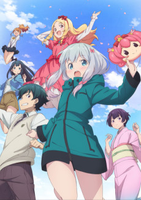 

### [eromanga sensei](https://anilist.co/anime/21685)

As a slightly apologietic fan of [OreImo](https://anilist.co/anime/8769/OrenoImoutogaKonnaniKawaiiWakegaNai) (at least the first season...) I was hoping this would be good.

Eh is about all I can say. The female protagonist isn't nearly as good so it feels luke warm to me. Holding on to it to catch up with at some point.

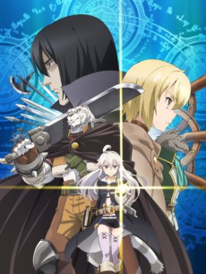 

### [Zero kara Hajimeru Mahou no Sho](https://anilist.co/anime/97682)

Epic Fantasy #2

Good world building in this one with what seems to be a very poor translation. One of the shows that I immediately watch every week.

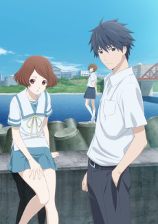

David Production

### [SAGRADA RESET](https://anilist.co/anime/97660)

Oh I really wanted to like this one. I thought it was a really great premise essentially combining [Hyouka](https://anilist.co/anime/12189/Hyouka) with super powers. Unfortunatley between the abysmal deadpan voice acting and stoic animation, I had to drop this. What a disappointment!

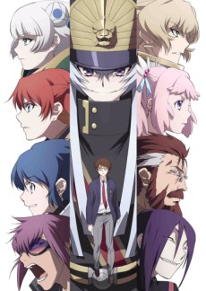 

### [Re:CREATORS](https://anilist.co/anime/97980)

While I'm fairly sure this will be good, I'm entirely watching it for [Hiroyuki Sawano](https://anilist.co/staff/103509/HiroyukiSawano)'s OST (which doesn't disappoint at all). This show is _very_ exposition heavy and I can't tell if that is going to be a good thing or bad thing yet.

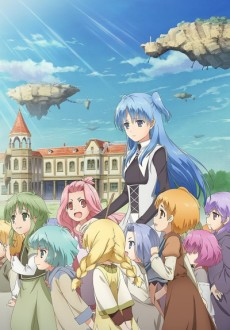

Satelight

### [Shuumatsu Nani Shitemasu ka? Isogashii desu ka? Sukutte Moratte Ii desu ka?](https://anilist.co/anime/21860)

This show opened with an absolutely perfect cover of _Scarbrough Fair_ that hooked me in instantly. This show really contrasts with _Re:Creators_ in that they manage to not explain _anything_ and really draw out the world building and character development. I have a feeling they are really rushing to fit everything in 12 episodes -- there are few "jump cuts" that skip a bunch of the usual training and build up, but that also might have been done on purpose.

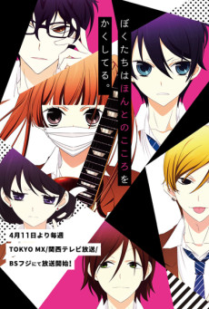 

### [Fukumenkei Noise](https://anilist.co/anime/21773)

If it wasn't a love triangle and was set in college, I think I would have loved this show. As it stands I put this on hold (mostly because of how full my ticket is this season) and unless something drastic changes, this will go in the same queue as [Fuuka](https://anilist.co/anime/21887/Fuuka) from last season.

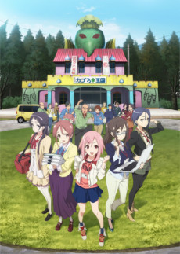 

### [SAKURA QUEST](https://anilist.co/anime/97903)

PA Works is at it again. This is a crushing reminder that I still haven't finished [Shirobako](https://anilist.co/anime/20812/Shirobako) which is criminal in it's own right.

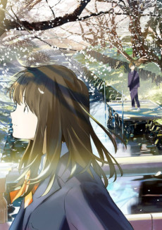

feel.

### [Tsuki ga Kirei](https://anilist.co/anime/98202)

This is Yang to [Kuzu no Honkai](https://anilist.co/anime/21701/KuzunoHonkai) from last season. The sweet awkwardness oozing from this show is adorable while at the same time realistically awkward as hell.

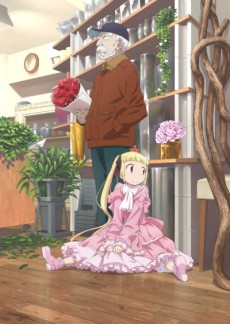 

### [Alice to Zouroku](https://anilist.co/anime/97821)

Pretty good. Enough to keep me coming back every week, but still feels like a budget JC Staff series.

Hero image created by Zana at <a href="https://neregate.com/blog/">neregate.com</a>  
The following websites were used as sources of information to create the chart : 
<a href="https://www.animenewsnetwork.com/">ANN</a>
<a href="https://m-p.sakura.ne.jp/">Moon Phase</a>
<a href="https://myanimelist.net/">MAL</a>

