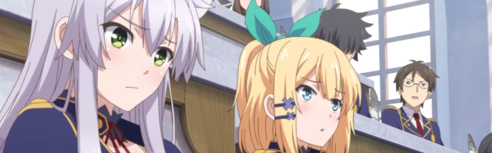

This season was particularly enjoyable. Great variety of genres and more shows above threshold than I could watch in real time. Additionally, we got a bunch of two cour shows (whose thoughts I will leave until next seasons retro).

I'm still not caught up on the heavy hitters (Attack on Titan, etc) and I'm still behind on the 2 two cour shows from last season (Little Witch Academia, etc). Such is life I guess...

### [GRANBLUE FANTASY The Animation](https://anilist.co/anime/21361)

An easy comparison is [Tales of Zesteria](https://anilist.co/anime/21221/TalesofZestiriatheX) -- _Tales_ felt more like a complete story whereas _Granblue_ suffered from obvious quest/reward scenarios. I'm not familiar with the game itself but the adaption wasn't enough to peak my interest, whereas with _Tales_ I immediately went and tried out the game.

As with _Tales_ it was nice just to follow along on an epic adventure. The ending is decently satisfying, given they didn't reach the endgame (so to speak). If you're a fan of the fantasy genre, you might like this one -- but not a must see.

### [Rokudenashi Majutsu Koushi to Kinki Kyouten](https://anilist.co/anime/21700)

I feel like the best analogy for this one is good B-Movie summer release. Keep your expectations in check and you might find something you like. There is more backstory that I would love to get into and as a result started reading the manga (yes, yes I know it was originally a LN adaption -- I just prefer manga), but I would be surprised if this gets a sequel.

I avoided most of the community discussions slamming this show, mostly because I didn't need to hear it. This show is what it is -- either you enjoy it or you don't. Move on.

### [Zero kara Hajimeru Mahou no Sho](https://anilist.co/anime/97682)

The one main criticism I have is that the world felt small and incomplete, especially in contrast with _SukaSuka_ (below). The resolution with the antagonist at the end, while somewhat believable, was very "plot convenient" and wasn't nearly as satisfying as it could have been. That being said, I did enjoy the dynamic of the main ensemble. I would definitely follow along on subsequent adventures.

### [Shuumatsu Nani Shitemasu ka? Isogashii desu ka? Sukutte Moratte Ii desu ka?](https://anilist.co/anime/21860)

I loved this show a lot more than I thought I would. It wasn't afraid to stick to its guns and give us the bittersweet ending we all knew was coming. The anime is an adaptation of the first 3 volumes in a 5 volume light novel and I felt crushed at the end knowing we probably wouldn't get a sequel. As a result I went and grabbed the LN translation (which I _never_ do) so I can find out how the story ultimately ends.

The OST was particularly excellent and the _Scarborough Fair_ callback in the final episode was brilliant.

Despite the ridiculousness of the title, _SukaSuka_ shows that you definitely can't paint all LN adaptations with the same brush.

### [Tsuki ga Kirei](https://anilist.co/anime/98202)

Gem of the season. If this show had some tighter editing and a bit more focus on the main characters being with each other (especially in the first half of the cour) this might well have been on of my all time favorites.

However... despite my gripes about pacing -- HOLY SHIT that final credit sequence! _THAT_ my friends, is how you nail an ending of a show.

### [Alice to Zouroku](https://anilist.co/anime/97821)

Surprise of the season for me. I felt sure after the first episode there wouldn't be enough there to keep me coming back every week, but surprisingly it did. With three story arcs told in a single cour it felt slightly disjointed, but ultimately the third arc was extremely satisfying and left me wanting more. If it weren't for some very questionable CGI this show would have scored higher.

Hero image created by Zana at <a href="https://neregate.com/blog/">neregate.com</a>  
The following websites were used as sources of information to create the chart : 
<a href="https://www.animenewsnetwork.com/">ANN</a>
<a href="https://m-p.sakura.ne.jp/">Moon Phase</a>
<a href="https://myanimelist.net/">MAL</a>

