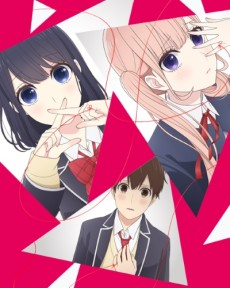
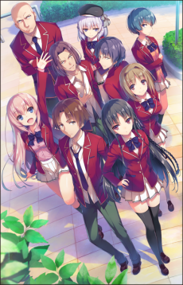

 

### [No Game No Life -Zero-](https://anilist.co/anime/21875)

I don't usually include movies on this list but wanted to mention this one:

It took me a while to figure out that this movie prequel story about the world of _Disboard_ despite it being an adaption of Volume 6. The original anime was only an adaptation of Volumes 1 and 2 (and to rub salt in the wound, they've only released a single volume of the manga adaptation).

_Sigh_

I still want a continuation, but I guess I'll have to settle for this. It's at least Madhouse.

 

### [Katsugeki Touken Ranbu](https://anilist.co/anime/21742)

Not being familiar _at all_ with Touken Ranbu the game, I went into this story cold -- I mean it's ufotable, which means there was no way I wasn't going to give it a shot. I can easily say that it doesn't disappoint. Great fight sequences, groundwork for some good character dynamics, and the hinting of an orchestrated conflict sells it for me.

 

### [The Reflection Wave One](https://anilist.co/anime/21461)

Don't know why this one is airing so late but it's at least on my radar. Really don't know much about it to be honest.

 

### [Princess Principal](https://anilist.co/anime/98505)

HOLY SHIT

From the studio that brought you [Flip Flappers](https://anilist.co/anime/21714/FlipFlappers)... Wow! I was not expecting any of that based on the previews. The animation and backgrounds were incredible and the dialog hints at some very interesting characters.

I must commend 3Hz in adapting original stories. It's very risky but I hope (_hope hope hope_) that they are rewarded for their work and that _Princess_ becomes more than an under-appreciated gem.

Creators in Pack

### [Netsuzou Trap -NTR-](https://anilist.co/anime/97833)

If they ditch the boyfriends completely rather than continually having them loom, I might stick with it. The violent boyfriend angle in episode 2 is a sure fire way to get dropped if not addressed quickly. It's a short anyway so minimal investment required.

 

### [Fate/Apocrypha](https://anilist.co/anime/98035)

Ok, this is my chance to **RANT** on how poorly Netflix have treated the anime properties they've acquired. OH MY FOR THE LOVE OF GOD JUST RELEASE THE DAMN EPISODES IN REAL TIME! WHAT ARE YOU DOING? DO YOU NOT UNDERSTAND HOW THIS COMMUNITY WORKS?

And while I have the soap box: Amazon

WORKOUT YOUR FREAKING PRICING! WHAT THE HELL IS WITH THE DOUBLE PAY WALL?

 

### [New Game!!](https://anilist.co/anime/98292)

It feels like they never left. _New Game!!_ (literally) Onwards!

 

### [Gamers!](https://anilist.co/anime/97766)

About half way through the opening episode I thought I had written off the show -- I thought I knew where it was going. The ending kind of threw me for a loop. If it's just a hook and it goes back to a club show playing it by the books, I'll probably drop it. If it goes to some new places and remains genuine, I think this show might be a pleasant surprise.

NAZ

### [Hajimete no Gal](https://anilist.co/anime/97863)

Ugh, I felt contaminated after watching this. Could have been good if treated with respect, but the writing is just flat out disgusting. There is a chance this was just a bad opening episode, but somehow I doubt it.

 

### [Koi to Uso](https://anilist.co/anime/98320)

What a waste of a premise. Maybe I'm judging too quickly, but it was hard to get over the whole: "I've loved you for five years but I've never talked to you once... Oh you've liked me too? What a coincidence"

And the eyes! It's like an entire cast modeled after [Visha](https://anilist.co/character/121057/ViktoriyaIvanovnaSerebryakova) from [Youjo Senki](https://anilist.co/anime/21613/YoujoSenki)!

 

### [Isekai Shokudou](https://anilist.co/anime/97617)

There has got to be something more than just food every week. At least with a show like [Death Parade](https://anilist.co/anime/20931/DeathParade) where the main characters where secondary to the weekly story and conflict, there was a gripping, dramatic scenario playing out. Making out with food just isn't going to do it for me without some sort of character development. I'll give it another episode or two, but it's going to have to turn things around to keep my interest.

 

### [Kakegurui](https://anilist.co/anime/98314)

Yep. This is bat-shit-crazy. I'm sold.

 

### [Tsurezure Children](https://anilist.co/anime/98291)

I'm actually caught up on the manga/comic with this one. The stories are really funny and the studio has done a good job of blending the stories together so it feels like it occupies one world (rather than just disconnected skits).

 

### [Aho-Girl](https://anilist.co/anime/98251)

This show is really, really stupid... But _really_ funny.

Emon

### [Centaur no Nayami](https://anilist.co/anime/98519)

Think [Demi-chan wa Kataritai](https://anilist.co/anime/97592/DemichanwaKataritai) with an opportunity to explore racial divisions because there aren't any humans and there are 4 (at least... something to do with 6 rather than for main appendages...) distinct racial groups. I don't yet know if they will actually explore those angles and what the conflicts will be, but they have definitely set themselves up to dive into those if they want. I'm hoping they do, and not just dance around the edges with it.

 

### [Youkoso Jitsuryoku Shijou Shugi no Kyoushitsu e](https://anilist.co/anime/98659/YoukosoJitsuryokuShijouShuginoKyoushitsue)

Initially, I didn't have this on my list. From the makers of [Assassination Classroom](https://anilist.co/anime/20755/AnsatsuKyoushitsuTV) comes yet another worst-class-against-the-world story, with a little less of the hijinx. It could still prove to be a dud, but as long as the soft-spoken protagonist has another gear or two, my gut says this could be good.

Kinema Citrus

### [Made in Abyss](https://anilist.co/anime/97986/MadeinAbyss)

Another "season first impressions" post had good things to say about this one so I decided to give it a shot -- Really could be a great adventure series! Some good world building combined with some nice animation and interesting characters (and good voice acting to be honest) and you can count me in for a few episodes.

I have no idea where the story can go but it really was a great opening episode. Fingers crossed this falls into the "weekly adventure" category.
