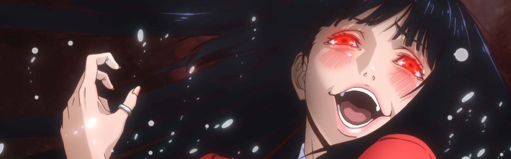

Solid season all around!

Due to the Netflix "release schedule", I skipped out on the two cour _Fate/Apocrypha_ and will binge it when it _finally_ comes out. Otherwise I did well to keep up each week with only a bit of binging at the end.

I ended up coming to terms with Amazon's Anime Strike, but I absolutely won't let Netflix off the hook. It is ridiculous that we can't watch their properties week to week like we can on literally every other platform -- it's a big aspect, more than I originally thought it would be. I caught up with _Little Witch Academia_ while on vacation, but I really wish it wasn't dumped on us _months_ after it's release.

### [Re:Creators](https://anilist.co/anime/97980)

I have to give this show credit -- it had a very interesting concept to explore and aside from a bit of awkward pacing delivered on the premise. It definitely made a lasting imprint in my head that has lasted long after I finished it.

The spring holdover won't be to everyone's liking: exposition heavy and a bit heavy handed at times. That being said, the music is fantastic (at this point I would expect no less from [Hiroyuki Sawano](https://anilist.co/staff/103509/HiroyukiSawano)) and the animation is solid overall.

### [Katsugeki Touken Ranbu](https://anilist.co/anime/21742)

I think if I played the game I would have been fully hooked. Without that, I was left drifting through the first few episodes essentially only enjoying the stylized animation and fight scene choreography. Maybe I'll come back to this one at some point when I have an urge to watch some ufotable fight scenes.

### [Princess Principal](https://anilist.co/anime/98505)

From where I sit, Studio 3Hz deserves all the credit in the world for drawing a line in the sand and pursuing original anime. I absolutely **loved** _Princess Principal_. The steampunk aesthetic, music, character designs, and a few _no-punches-pulled_ aspects in the story left me with a huge smile on my face.

The out of order story telling felt slightly gimmicky but well executed in the end, as it allowed them to hint, backfill, then reveal aspects of the plot. Each of the characters had their moment to shine and while I had guessed early on at the _Prince and the Pauper_ angle, I thought the ultimate reveal was very well done indeed.

### [New Game!!](https://anilist.co/anime/98292)

_New Game!!_ pulled off many remarkable feats with their second installment: not destroying the chemistry of the original cast, introducing meaningful new characters, and digging deep in to creative insecurities, crisis of confidence, and persevering when things very unfairly don't go your way. Even a bittersweet ending that felt honest and realistic.

Despite having more fan service that it needed, the second season was genuinely better than the first season. I immediately jumped into the manga to get more and I have my fingers crossed a third season is greenlit soon.

### [Gamers!](https://anilist.co/anime/97766)

I wanted to like this show. There was an honesty to the characters that felt genuine and endearing. I managed to get half way through before the crushing weight of the story/plot structure got to me. There is only so much of a story that repeated "misunderstandings" can support before it collapses under its own weight (and to be honest, _Gamers!_ managed to go a lot further than I thought they were going get). The show needed to get out from under its network of "misunderstandings" to give these characters time to shine together, but I guess that just wasn't going to fit into the comedy framework they had built for themselves.

### [Kakegurui](https://anilist.co/anime/98314)

Still waiting for the last few episodes to get fan translations. This is not a good gambling anime -- everyone cheats and the actual gambling doesn't really matter. There is a healthy amount of "morons getting their comeuppance" which is quite satisfying in it's own right... just as long as you weren't going into it expecting more.

### [Tsurezure Children](https://anilist.co/anime/98291)

Absolutely adorable and flawlessly executed. The 12 minute format felt perfect for the stories, all of which are honest, awkward, and real. I'm going back through the manga release (which is assembled in the correct order) and I hope the mangaka has more stories to tell with these characters.

### [Aho-Girl](https://anilist.co/anime/98251)

Absolutely stupid. Absolutely _hilarious_

This felt like everyone -- writers, animators and voice actors -- were having a blast making this. Everything is ridiculous. The spoofs of other anime are fantastic (love the OPM parody) and the voice acting was brilliant.

### [Youkoso Jitsuryoku Shijou Shugi no Kyoushitsu e](https://anilist.co/anime/98659/YoukosoJitsuryokuShijouShuginoKyoushitsue)

This show kept me entertained each week while not being exceptional in any one regard. I thought the premise of the school, rewarding performance this way and the tiering of the classes was really interesting. There were two unnecessary fan service episodes thrown in which it seems to me caused a rushed ending. There was a lot of hinted backstory to the main protagonist that I really want fleshed out.

I would definitely watch a second season if given the opportunity.

### [Made in Abyss](https://anilist.co/anime/97986/MadeinAbyss)

_Holy Shit_

This show. Oh man. What an awesome adventure.

They really nailed _all_ of the categories: art, characters, music, story. The world building (at least this tiny pocket of it) was done incredibly well. The civilizations that must have come before -- all the people who have died -- all leaving behind relics for the people who follow in their footsteps. Both the children and adults had their own motivations and every aspect felt believable in the shadow of the Abyss. The Abyss itself was developed as an antagonist -- almost alive -- with it's own reasons for behaving as it did.

The background art was stunning -- almost every shot could have been a desktop background. The OST was a perfect complement to the visuals -- atmospheric and haunting. To top it off, the writers managed to end the cour well while being not where near the end of the story. I really hope there is a season 2. The manga gets a US release in 2018 and you can bet I'll be diving into this one.
