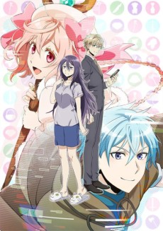
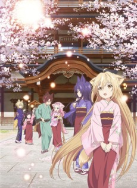

Ummm... And here I thought that my watch list would be light this season.

![Fate/stay night [Heaven's Feel] I. presage flower](fall/20791-qBVKnfdWc8fa.jpg "Fate/stay night [Heaven's Feel] I. presage flower") 

### [Fate/stay night [Heaven's Feel] I. presage flower](https://anilist.co/anime/20791)

Opening this seasons impressions again with a movie. Excited to see the third route adapted and doubly excited to see ufotable at the helm again. I wonder what it will take to get Type Moon to pay ufotable to re-adapt the first route so we have a complete ufo for F/SN...

The challenge for me will be to see if I manage to complete the visual novel before the third movie comes out next year.

  

### [Mahoutsukai no Yome](https://anilist.co/anime/98436)

On the heels of the gorgeous three episode prequel...

I can't tell you how excited I was for this show (and even more ecstatic that it's getting _two_ cours). There is magic in this show. _Squeeeeeeeeeeeee_

If you couldn't already tell, I'm excited for this one. I'm not sure how much of the manga they are planning to cover, but if they manage to nail the fantastical aspects of the manga as well as they did the prequel, this is going to be a fabulous series to follow.

 

### [Kekkai Sensen & Beyond](https://anilist.co/anime/97886)

It's like you never left...

This was a very rapid reintroduction to the world of Hellsalem's Lot, but I must say I had a smile on my face the entire time.

Welcome back Leonardo...

Studio Pierrot

### [Black Clover](https://anilist.co/anime/97940)

Jesus. One minute into this show I was scrambling to find the mute button. The VA for Astra... talk about nails on a chalkboard.

I just couldn't do an entire season of this, let alone one episode.

Genco

### [Dies irae](https://anilist.co/anime/21555)

_What the hell?!_

Ugh. Wasn't really expecting much going into it and I know I technically only watched episode "0", but there is just nothing here that I want to come back to watch. Solid pass.

 

### [Inuyashiki](https://anilist.co/anime/97922)

A few notes:

1. The kids and wife are assholes
2. We don't deserve dogs
3. ... _Interesting?_ ...
4. Nice to hear a _Man with a Mission_ OP again

I feel like this was an episode 0 -- the origin story if you will -- and that we'll get a better idea of the show in the next two episodes. I was encouraged to read (after the fact) that the VA for the MC is a 68 year old.

Graphinica

### [Juuni Taisen](https://anilist.co/anime/98443)

A dark _Battle Royale_ that doesn't seem to be afraid to not pull punches?

  

<small class="caption-text muted">Well
if you insist</small>

This should be entertaining if the ending of the first episode is the start of a trend line.

 

### [Just Because!](https://anilist.co/anime/98820)

I have high hopes for this one and the first episode didn't let me down. From the studio that gave us [Gamers!](https://anilist.co/anime/97766) last season I think this has tremendous potential because they aren't restricted to the comedy genre. The episode is slow but I loved the honesty in all the characters (see my first reaction to _Gamers!_... same thoughts). As long as they don't manufacture a bunch of overlapping relationship triangles and just focus on these characters interacting, this could be the gem of the season.

 

### [Kino no Tabi: The Beautiful World - the Animated Series](https://anilist.co/anime/98448)

I haven't seen the original, but know that many love this show. The first episode was I think a great intro to this episodic series (part of me wonders if there will be any sort of modern take of an arc). For a moment there I thought this was done by A1...

 

### [Kujira no Kora wa Sajou ni Utau](https://anilist.co/anime/98449)

Hmmm... The premise seems interesting. I like the art style and character designs...

Oh wait.

_DAMN IT NETFLIX_

Seven

### [Ousama Game The Animation](https://anilist.co/anime/99698)

I have questions...

_How in the hell does this kid get admitted to yet another school after being the sole survivor of a previous killing game?!_

I have no idea why they seem to be adopting a "sequel" and there was no attempt to make me feel empathetic to the MC or any of the supporting cast. I'm going to give this one or two more tries, but I suspect I'm not going to be able to accept this one (especially when we have _Juuni Taisen_ this season).

 

### [Shoujo Shuumatsu Ryokou](https://anilist.co/anime/99420)

This was a very interesting juxtaposition between cute and unsettling. The scene with the rations and the gun... Ugh, wow. If the music had made a bigger impact, it truly would have been great opening episode.

 

### [3-gatsu no Lion 2](https://anilist.co/anime/98478)

Cutting reminder that I still need to finish the first season...

M.S.C, Lantis, DAX Production

### [Code:Realize - Sousei no Himegimi](https://anilist.co/anime/98630)

I'm on the fence for this one. I think it was because there was no villain introduced, so I'm still uncertain exactly what kind of series this will end up being. Could be good, I guess we'll just have to wait and see.

Orange

### [Houseki no Kuni](https://anilist.co/anime/98707)

I'm going to go into this one with an open mind. While I still think this would be better hand drawn, the full CGI treatment isn't an immediate disqualification -- they at least picked the right story/characters to do it with CGI -- Anthropomorphize gemstones.

There could be some very interesting world building here, so I'm going to stick around and see if my interest is rewarded. The one gripe I will air is the eyes in the characters. It's the one key aspect that anime can utilize to its full extent and I feel like the eyes are a let down with these characters -- they feel flat and unexpressive.

It's the eyes. Nail that and it will cover a lot of other imperfections.

Signal.MD

### [Net-juu no Susume](https://anilist.co/anime/99726)

This one has the potential to be a favorite of the season. The MC is really endearing even if the pacing was a tad rough around the edges.

Creators in Pack

### [Osake wa Fuufu ni Natte Kara](https://anilist.co/anime/98657)

This 3 minute short is too short for it's own good. I'm skeptical it will win me over as throughly as [Danna ga Nani wo Itteiru ka Wakaranai Ken](https://anilist.co/anime/20735) did, but I'm willing to give it a chance.

 

### [Konohana Kitan](https://anilist.co/anime/98506)

Oh good lord is this shit cute.

If it's anywhere close to the feel good comfort that was [Non Non Biyori](https://anilist.co/anime/17549) I'll be very happy.

TYPHOON GRAPHICS

### [Sengoku Night Blood](https://anilist.co/anime/98603)

Ugh. Couldn't get through the first episode. Skip. Skip. Skip.

 

### [Two Car](https://anilist.co/anime/99672)

Ok, ok... I know it looks ridiculous, but I at least wanted to see one episode before tossing. I ended up dropping the "biking" animes from a few seasons ago, so the probability is high this one will follow. There wasn't a lot there other than rapid fire side character introductions and a very generic backstory for the two MCs. Will need another episode or two to get a proper gauge on what the rest of the season might have in store.

Shirogumi

### [URAHARA](https://anilist.co/anime/98513)

I have _no_ idea if this will hook me enough to keep it from the drop pile, but the first episode was at least... interesting?

It's very different to say the least. It kind of reminded me of [Flip Flappers](https://anilist.co/anime/21714) with a pastel color pallet, but _FF_ hooked me from the first episode, where as _Urahara_ was much more middle of the road. I'll give it a few more episodes and see where it lands.

WAO World

### [Anime-Gataris](https://anilist.co/anime/98607)

Initially reminded me of _Gamers!_ and then there was a very weird turn at the end. Another show that will take a few episodes to sort everything out.

Trying to follow all the references was fun.
