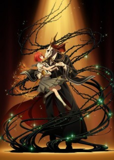
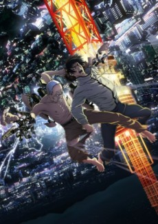
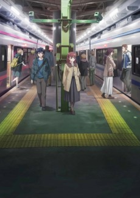
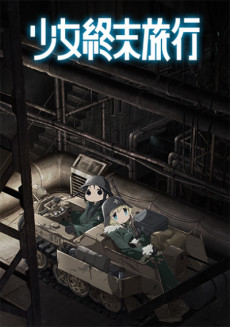
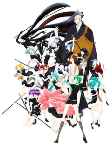
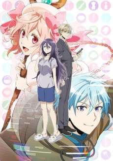
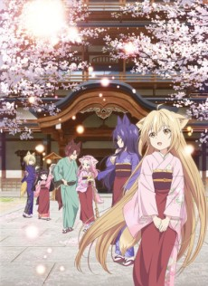
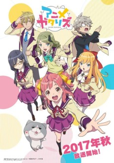

So Persona 5 completely derailed my keeping up with the fall season. Thankfully this season has sort of a built in buffer with the holidays at the end and most winter anime not starting until the first of the year -- I've been able to binge most of shows I wanted to keep up with. Looking back on this year, I wasn't able to post many individual series reviews (read: none) and want to pick that up again going into 2018 (along with more blogging in general, even if it's just to keep my already limited writing ability from completely hitting rock bottom again). There were a number of shows this year (especially in this fall season) that I'm hoping to talk about in more detail.

Note: This is going out late due to a combination of procrastination and illness. Sorry! 🤒

  

### [Mahoutsukai no Yome](https://anilist.co/anime/98436)

Quick thought since it's only halfway through: _LOVE!!_

 

### [Kekkai Sensen & Beyond](https://anilist.co/anime/97886)

A collection of episodic vignettes.

To be honest, I missed the overall arc that the first season had. This season was great too because I really do love these characters, but it ultimately fell short of it's stronger opening season.

 

### [Inuyashiki](https://anilist.co/anime/97922)

Went on Hold a few episodes in.

As a warning, this show is not for the faint of heart! Even just the first few episodes were extremely rough viewing.

Graphinica

### [Juuni Taisen](https://anilist.co/anime/98443)

For the sake of this initial discussion let's ignore the ED.

Not bad. Spoilers, but the ending felt a bit of a cheat, but it was acknowledged as such, so I'm willing to give it a pass. I liked that no character had plot armor, but the consequence was that we didn't get to know or sympathize with any of the characters outside of a single episode back-story-flashback.

Quick note on that ED. Good lord, someone should be fired for approving that storyboard. Good song though.

 

### [Just Because!](https://anilist.co/anime/98820)

I loved this show with a _huge_ asterisk: The Ending.

The ending fell extremely flat and almost took away all my enjoyment of the series. Compare this ending to the ending of [Tsuki ga Kirei](https://anilist.co/anime/98202/TsukigaKirei) which left me ecstatic even though it was just wrapped up during the credit sequence. I still recommend the show if you are into a well done, slow paced slice-of-life show -- just temper your expectations.

 

### [Kino no Tabi: The Beautiful World - the Animated Series](https://anilist.co/anime/98448)

I think I would have enjoyed this reboot more if it wasn't airing alongside Girls' Last Tour. Having not seen the original I have no real point of comparison other than hearing in general that the original was "better" -- take that for what you will.

 

### [Kujira no Kora wa Sajou ni Utau](https://anilist.co/anime/98449)

Fantastic! (Completely in spite of Netflix... thank god for fansubs)

High recommendation but didn't exceed in any one category. The ending implies that there is more coming. I'll be curious how that is ultimately handled. Netflix's poor treatment of anime is (in my opinion) robbing the shows of the acclaim that they would otherwise garner from the community. I'm not sure how much seasonal hype translates into long term acclaim, but if we take a show like Little Witch Academia, it seems to me that the shows can't recover from it. Simulcasts _mean_ something in the community, much more so that it did in the past. Netflix would have been a godsend 10 years ago -- now, it feels like a sentence to obscurity.

 

### [Shoujo Shuumatsu Ryokou](https://anilist.co/anime/99420)

This show exceeded all my expectations going into it. The atmosphere, the voice acting, the OST, all combine to effectively transcend the sum of its parts. While it might be compared to [Made in Abyss](https://anilist.co/anime/97986/MadeinAbyss) due to the use of moe in a serious setting, I think that is the only thing alike about them. Girls' Last Tour felt more like an episodic philosophical exploration whereas _Made in Abyss_ maintained a clear narrative structure.

Orange

### [Houseki no Kuni](https://anilist.co/anime/98707)

Outside of Mahoutsukai no Yome this was easily anime of the season for me -- and that's shocking for me to say given its CG anime. The story was _so_ good and they really used the _CG_ to their storytelling advantage rather than a gimmick. [Tomoyo Kurosawa](https://anilist.co/staff/106661/TomoyoKurosawa) is absolutely stunning as Phosphophyllite (and really channels her sarcastic "Kumiko Oumae" perfectly).

Don't let the CG be a deterrent from experiencing this show (also don't judge by the first two episodes alone... there is a noticeable improvement in their CG craft by episode 5 or 6)

Signal.MD

### [Net-juu no Susume](https://anilist.co/anime/99726)

Don't get me wrong -- I loved this show. I loved the MC. Fantastic all around. Highly recommend.

At some point, _someone_ has to give us a romcom that doesn't center around near debilitating shyness/awkwardness. Can't they just genuinely like each other and move incrementally forward? Essentially, I want this plot with the seriousness of [Tsuki ga Kirei](https://anilist.co/anime/98202/TsukigaKirei).

 

### [Konohana Kitan](https://anilist.co/anime/98506)

There was some genuine excellent story telling in this one. It's a shame they were obviously doing this on a shoe-string budget. The sheer percentage of single frame image set to music was absurd with this show. I would still recommend, but just keep that in mind going into it.

I have to say however, the last episode truly nails the ending for the show. _That_ is how you wrap a show.

WAO World

### [Anime-Gataris](https://anilist.co/anime/98607)

On hold but I should be able to finish in the next few months.
