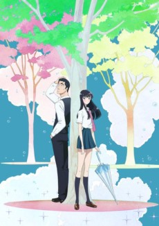

You'll notice [Pop Team Epic](https://anilist.co/anime/98549/PopTeamEpic) isn't on this list... Take that for what you will.

 

### [Violet Evergarden](https://anilist.co/anime/21827)

A feast of eye candy! You can tell this is exceptional animation even by Kyoto standards. There is not much more I can say given the hype already surrounding this show, other than...

**DAMN IT NETFLIX! WHY NOT SIMULCAST IN THE US IF YOU ARE ALREADY DOING SO IN OTHER ENGLISH SPEAKING COUNTRIES?!**

Passione

### [citrus](https://anilist.co/anime/97832)

Would I be watching this if I hadn't read the manga? Probably not.

This show is loaded with fanservice and cliches but I'm actually rather fond of the gyaru-girl MC. The combination of voice acting and character design really nails that character and I somehow can't help rooting for her.

 

### [Death March Kara Hajimaru Isekai Kyousoukyoku](https://anilist.co/anime/97907)

_Move along... nothing to see here (that you haven't already seen 10x over)..._

Geno Studio

### [Kokkoku](https://anilist.co/anime/100332)

* Great OP
* Really interesting lore and opportunity for world building

Unfortunately due to other good shows this season, this one might be on hold for me. That being said, I really hope I get a chance to binge it.

Aniplex

### [DEVILMAN crybaby](https://anilist.co/anime/98460)

_Hype?_ Check.

_Want heart crushed?_ Ehhhh....

So as far as I can tell from the word of mouth, this is a fantastic show... that unfortunately I may never watch. I hold out hope that one day I'll assemble the fortitude to wade in, but that time is not now.

 

### [Koi wa Ameagari no You ni](https://anilist.co/anime/98385)

Ok, this can go one of two ways: Tasteful or Rotten.

Thus far it's on the _tasteful_ side with fantastic visuals and a great ED by Aimer. I hold out hope it stays on the tasteful side, but this is an anime from Japan so I'm not sure the odds are in my favor for this one.

  

### [Darling in the FranXX](https://anilist.co/anime/99423/DarlingintheFranxx)

Ok, this one isn't subtle (but _is_ at the same time).

Initially, _Darling_ wasn't on my radar. I missed the fact that it was a Trigger show, but the Zero Two memes that sprang up let me to check out the first episode.

If you thought [Kill la Kill](https://anilist.co/anime/18679/KilllaKill) was excessive in it's fanservice... it has nothing on _Darling_. That being said, there is depth to the story and the use of fanservice is actually used for a reason. It's hard to describe, but _Darling_ is definitely worth checking out.

   

<small class="caption-text muted">Zero Two: Best Girl</small>

 

### [Grancrest Senki](https://anilist.co/anime/97768)

A poor mans [Tales of Zestiria the X](https://anilist.co/anime/21221/TalesofZestiriatheX)

I predict this is going to be one of those low rated shows that I actually end up finishing. If you aren't thirsty for real fantasy anime outside the isekai genre, then go ahead and skip this one.

Shin-Ei Animation

### [Karakai Jouzu no Takagi-san](https://anilist.co/anime/99468)

Oh this is so cute, but _MY GOD_ is the pacing slow. If each episode was 12 minutes instead of the full 24 I think I would adore this show to pieces. Since it's not, I probably won't be able to make my way through it.

 

### [Sora yori mo Tooi Basho](https://anilist.co/anime/99426)

Anime of the season for me. Calling it right now.

Original anime from Madhouse? _Yes please!_

This show is more than just cute girls in a slice-of-life. The depth of the characters and the storytelling eclipses everything else in the genre. Watch this show!

C-Station

### [Yuru Camp△](https://anilist.co/anime/98444)

This is the more of the normal cute girls slice-of-life fair. Camping looks fun presented this way.

Satelight

### [Hakata Tonkotsu Ramens](https://anilist.co/anime/99483)

This show needs one of those old school detective boards with strings going from picture to picture explaining the relationships. A highly entertaining yet mid-tier show.

 

### [Hakumei to Mikochi](https://anilist.co/anime/99748)

This feels like [Girls' Last Tour](https://anilist.co/anime/99420/ShoujoShuumatsuRyokou) without the apocalypse. A bit of the same vibe with out the existential crisis. A treat each week.

Hoods Entertainment

### [Märchen Mädchen](https://anilist.co/anime/99720)

Like _Grancrest_ this will probably be a low rating show that I actually complete. There is enough holding me curious each week to keep me coming back, but there really isn't anything spectacular about this show.

_Curious, but skippable_

Production IMS

### [Takunomi.](https://anilist.co/anime/99753)

It's truly amazing that anime includes shows like this: a show dedicated to cute girls drinking alcohol.

_Amazing_
