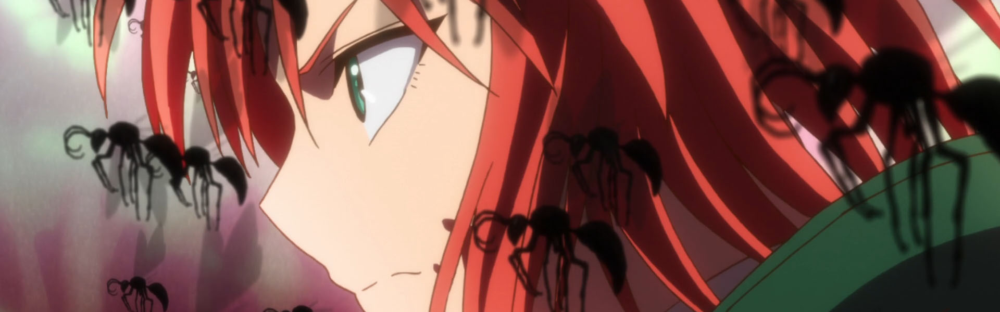
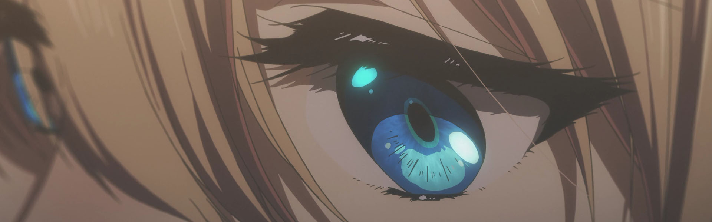
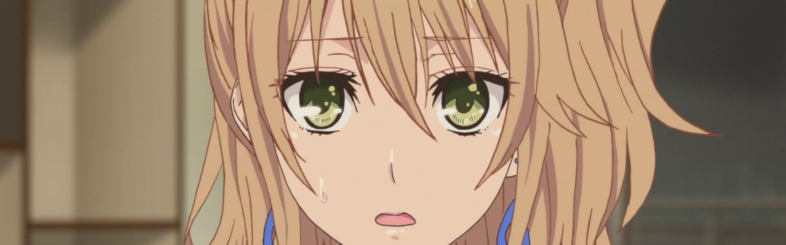
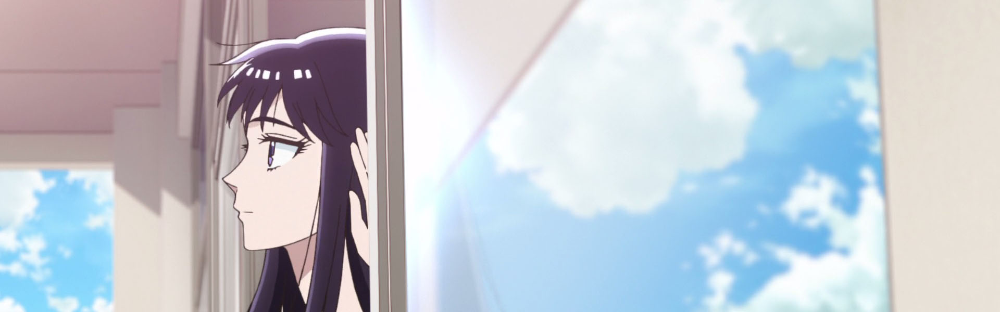
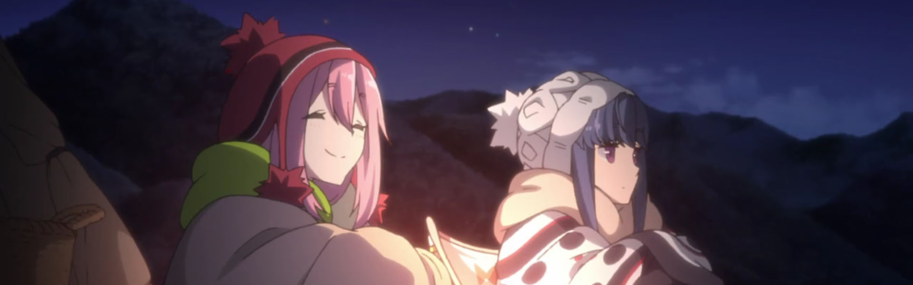
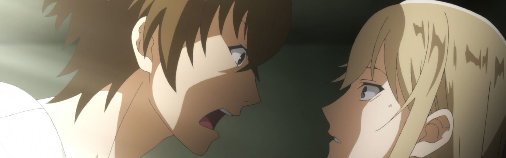
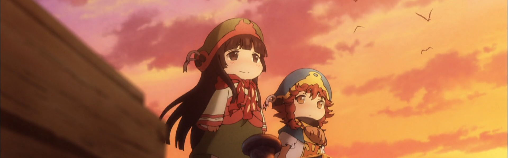
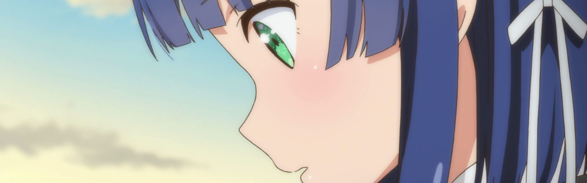

Is it just me or are there more two cour shows slated for 2018 than previous years?

Of the two two-cour shows still on my slate ([Darling in the FranXX](https://anilist.co/anime/99423/DarlingintheFranxx) and [Grancrest](https://anilist.co/anime/97768/GrancrestSenki)) *Darling* is an absolute trip with arguably *Best Girl* in Zero Two, whereas *Grancrest* feels like a show trying too hard to be ambitious in its world building. I'll definitely keep up with both, but my interest in *Grancrest* might wain in the later weeks given how strong the Spring 2018 slate is shaping up to be.

### [Mahoutsukai no Yome](https://anilist.co/anime/98436)

So let me get this out first: I loved it.

*But...*

It was often painfully obvious that they took the budget of a single cour and tried to spread it out over two. Now, I'm grateful that we got a full 24 episodes rather than a rushed 12, but the source material really demanded a full two cour budget (especially evident in the OPs. The first OP is saved by a great song, but the second OP feels completely cheap)

Chise was a brilliant protagonist and I loved the weaving of pagan and Irish mythology. All in all, I think I was hoping for a bit more based on the OVA, but I'm still ecstatic that we got what we did.

### [Violet Evergarden](https://anilist.co/anime/21827)

Putting aside Neflix again... &lt;grumble/&gt;

Really good.

It's far from Koyani's best work, but that's a high bar to clear. The art and animation are some of the best work you will see for TV budgets. As a war slash post-war story, it is exceptional. No other anime comes to mind that deals with this sort of PTSD struggle.

Props also to Episode 10 -- I haven't cried that hard since the end of [Shigatsu wa Kimi no Uso](https://anilist.co/anime/20665/ShigatsuwaKiminoUso)

### [citrus](https://anilist.co/anime/97832)

Trashy? *Yeah*

Is Mei kinda insufferable? *Nod*

Did I still enjoy it? *Yep*

Not more more to say. Great OP song from [nano.RIPE](https://www.nanoripe.com/)

### [Koi wa Ameagari no You ni](https://anilist.co/anime/98385)

Holy Shit! They stuck the landing!

I almost dropped this a few episodes in. I just had no confidence that I wouldn't be weirded out by the relationship resolution. If not for the fantastic art and music, I might have -- I would have missed out on a great heartwarming show.

Such a fantastic story about relationships, growing up, and reflecting on your past self.

### [Sora yori mo Tooi Basho](https://anilist.co/anime/99426)

> Anime of the season for me. Calling it right now.

I was wrong.

**Anime of the Year. Calling it right now**

Quite frankly, this could possibly be my favorite anime of all time (Steins;Gate probably still has a lead here, but it's very slim). The characters, the story, the music -- everything about this show is executed to perfection. The staff at Madhouse are angels for giving the world this work.

I cannot possibly articulate all of what this show has meant to me -- instead, below are two people that can explain it much better than I can:

<iframe width="560" height="315" src="https://www.youtube.com/embed/viB6-EDpTcY" frameborder="0" allowfullscreen></iframe>

&nbsp;

<iframe width="560" height="315" src="https://www.youtube.com/embed/wO6CGqKimC0" frameborder="0" allowfullscreen></iframe>

### [Yuru Camp△](https://anilist.co/anime/98444)

This show surprised me. All the normal tropes of your typical anti-social protagonist are completely avoided. Instead, we have a shy person who enjoys solitude but interacts perfectly well with others, and friends who recognize that aspect of the person and give them their space rather than *demanding* that everything is always better the other way. Much of the show was spent with Rin on her own and *everyone was OK with it!* So refreshing!

It definitely made me want to go camping... 

### [Hakata Tonkotsu Ramens](https://anilist.co/anime/99483)

Felt a bit like *Ocean's 11* with a cross dressing shippable "couple" and everyone is an assassin rather than thief. Entertaining but definitely not a much watch by any means.

### [Hakumei to Mikochi](https://anilist.co/anime/99748)

From the director of [Scum's Wish](https://anilist.co/anime/21701/KuzunoHonkai)...

Now, that may have turned you off this show, but don't let it. This is a delightful show about everyday situations for a group of little people (3 inches tall). Between this and *Yuru Camp△*, this season had a great selection of relaxing shows to veg out to.

### [Märchen Mädchen](https://anilist.co/anime/99720)

I was able to get about half way through before dropping this. There was *some* potential to be a little bit entertaining, but it seemed to get mired down without a clear indication that anyone knew where the show was going.

I've heard that this show had production problems galore, which might explain the result.

