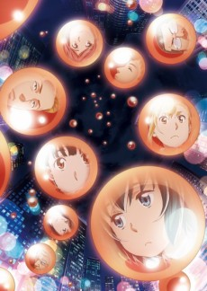
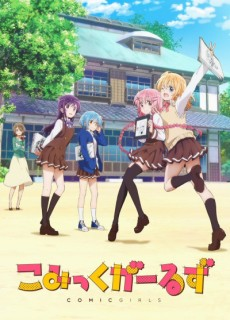

This year has been a feast of riches for the anime community. So many good shows -- originals and sequels to favorites. At the same time, I need to catch up on last seasons two cour series. What is one to do?

 

### [Steins;Gate 0](https://anilist.co/anime/21127)

How do you follow arguably the best anime of all time? I have absolutely no idea, and frankly I'm a little nervous.

I don't know *anything* about *S;G 0*, but after watching the first episode I fear this will be two cours worth of gut punches.

In addition to being my favorite anime of all time, the original is also my favorite dub of all time. For me, these characters *are* the english cast. I haven't seen any official announcement for the english cast but I *pray* the original members are back for the sequel. I'm definitely going to wait for Funimation to release the simuldub for this one (something which I almost never do)

 

### [Boku no Hero Academia 3](https://anilist.co/anime/100166)

It's back! And with another two cours!

*BnHA* is one of the only long running shonen series I've watched and mostly because it's one of the few that began airing after I started watching, so I don't have to slog through hundreds of episodes. It's also a show that thankfully doesn't feel the need to resort to any sort of filler arcs, which I'm dearly grateful for.

 

### [Sword Art Online Alternative: Gun Gale Online](https://anilist.co/anime/100183)

So before jumping to conclusions, you have to remember that this go around is done by *Studio 3hz* which made [Princess Principal](https://anilist.co/anime/98505/Princess-Principal/) -- one of my favorite shows from last year.

So far this one is extremely promising. The characters are good and it seems like they might avoid the pitfalls that bogged down the original SAO. The only thing that is needling in the back of my brain is juxtaposition of the gun worship in the show with the state of gun violence in the United States today. I'm curious if guns in the real world is called out at all in the shows run, though I highly doubt it.

 

### [Persona 5 The Animation](https://anilist.co/anime/99693)

> You'll never see it coming!

My god, watching this makes me want to play the game again. But with the show, I get to relive the game without re-investing the 100+ hours.

Objectively, anyone watching this who hasn't played the game may struggle with the pacing -- they rush through a lot in the first few episodes, so anyone without game experience might feel adrift.

But I'm going to enjoy every second of this one. Oh and just an aside, I really hope they ship Makoto, which is obviously the only *real* choice =)

 

### [Wotaku ni Koi wa Muzukashii](https://anilist.co/anime/99578)

This looks really fun. I tried picking up the manga a while back, but dropped it because it seemed like the translation was out of order for some reason. However, given the first episode, I might have to give it another try.

 

### [Megalo Box](https://anilist.co/anime/100298)

Ho...

Lee...

Shit!

*Picks jaw up from floor*

What a complete retro trip!

 

Geno Studio

### [Golden Kamui](https://anilist.co/anime/99699)

Ok, ignore the cringe worthy CG bear in the opening episode... Hopefully the show runners have enough sense not to bring something like that back again.

The characters are great and I'm really looking forward to this adventure.

Also -- Can I just say *Man With A Mission* kills it again with a fantastic OP song?

 

feel.

### [Hinamatsuri](https://anilist.co/anime/100077)

If you are a fan of dead-pan humor, then I highly recommend this one. I had quite a few *laugh out loud* moments during the first episode and there looks to be plenty of runway with the characters to really shine with the comedy.

 

Platinum Vision

### [Devils Line](https://anilist.co/anime/99531)

*What the fuck is this?*

Good lord. Stay the fuck away.

 

### [Tada-kun wa Koi wo Shinai](https://anilist.co/anime/100179)

This is going to be a challenge to see if the show crumples under the weight of all the romantic tropes it has already laid out for itself. I'm going to give this one a chance, but frankly I'm not expecting much.

 

production doA

### [Mahou Shoujo Site](https://anilist.co/anime/100010)

GAG!

Holy shit this is disgusting. Between this and *Devils Line*, I don't know who runs away with the worst anime of the season.

 

Satelight

### [Caligula](https://anilist.co/anime/100569)

This show is better than it has any right to be. With a setup reminiscent of [Angel Beats](https://anilist.co/anime/6547/Angel-Beats/) it still could fall flat.

 

Hoods Entertainment

### [3D Kanojo](https://anilist.co/anime/100526)

My first reactions to the opening episode were all variations of cringing. To the shows credit however, it pulled out and showed some backbone by actually moving the relationship dynamic forward. The whole setup feels extremely self indulgent and contrived. I put it on hold, but I'm going to check back in towards the end of the season to see if managed to carve a niche for itself.

 

Nexus

### [Comic Girls](https://anilist.co/anime/99131)

Vibes of [New Game](https://anilist.co/anime/21455/New-Game/) but not nearly as good. Characters are more trope archetypes than blends, but that doesn't mean there isn't an opportunity to have some character development. However, if I had to guess I don't think we'll see the sort of character exploration we saw in *New Game*.

 

### [Kakuriyo no Yadomeshi](https://anilist.co/anime/100500)

This one went immediately on hold. Not that it looks bad -- I just can't take on another two cour show that I'm only going to be so-son on.

 

ZEXCS, 

### [Asagao to Kase-san](https://anilist.co/anime/99916)

*ONLY A SINGLE OVA?*

**Crap**

I'm a *huge* fan of the manga and I have been hoping this was a full season adaptation, but I guess we are just getting a brief glimpse in this adorable couple (which is at least longer than the four minute short it got before).

