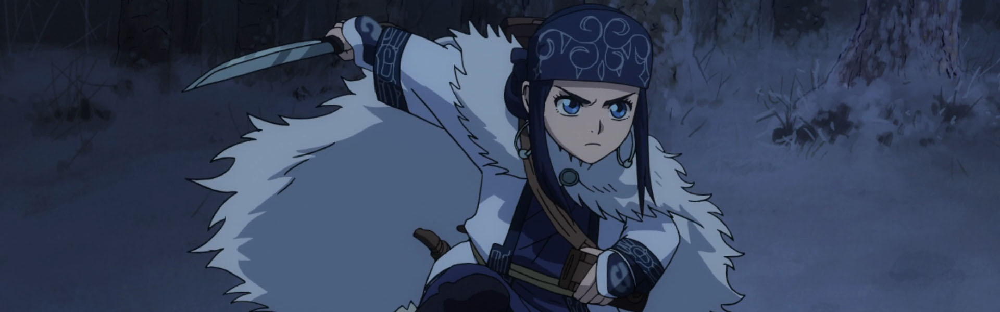

Woah! I'm behind this season.

As usual, two cour shows starting this season will be covered in the next retrospective, but let me say, *S;G 0* is shaping up to be a fantastic sequel to the best anime of all time. I'm following the English dub which puts me about three episodes behind so I've had to mute all *S;G* references from twitter and avoiding all the episode breakdowns I can. I totally support waiting to binge this series -- stringing out the feels is proving tough.

I also put *Hero Aca* on hold as I think it's a show better binged, but I'm hearing good things about it. *Persona 5* is good so far, but not great. I was hoping for better and the effort so far just feels lackluster at best. I'm still going to follow till the end, but my expectations have been significantly reduced.

### [SAO Alternative: Gun Gale Online](https://anilist.co/anime/100183)

Much better than we had any right to expect from this franchise.

Of course it helps to have a *Studio 3hz* and a new writer on board. There was actual character exploration (if not actual character development) which I appreciated. I'm hoping this paves the way for more stories to be told in this universe minus all the tropes and poor writing that plagued the original series.

Wait... What's that you say? [SAO 3](https://anilist.co/anime/100182/Sword-Art-Online-Alicization/) is coming this fall... 🧐

 

### [Wotaku ni Koi wa Muzukashii](https://anilist.co/anime/99578)

*Finally*

An adult based romance anime.

I can't recommend this one enough if you like romance anime. It's such a breath a fresh air to have a story centered around working adults that are dealing with believable personal issues in how they cope with themselves and others. I want a second season *so* badly! The manga is also very good, but I actually thought the anime was an improvement over the original source material.

 

### [Megalo Box](https://anilist.co/anime/100298)

Fantastic retro aesthetics but with a story that seems to peter at the end. I'm not saying it's bad at all, I just think the beginning out performs the ending by quite a large margin.

 

### [Golden Kamui](https://anilist.co/anime/99699)

The only show on this list that I haven't quite finished yet. If you can ignore the atrocious CG bear and wolf and exotic food moments, the show is not half bad.

 

### [Hinamatsuri](https://anilist.co/anime/100077)

This show had more heart and genuine LOL moments than any show in the past few years. The characters are truly empathetic and there is actual significant development on behalf of all the characters in the show. The only real flaw in this show is the ending -- it just peters out, leaving room for a sequel or "go read the source material" 

 

### [Comic Girls](https://anilist.co/anime/99131)

> Vibes of [New Game](https://anilist.co/anime/21455/New-Game/) but not nearly as good.

I'm going to stick to that analysis. There is a lot here to relate to for anyone dealing with creative pursuits, but the characters are a bit one note in comparison to other "cute girls working" shows.

 

### [Asagao to Kase-san](https://anilist.co/anime/99916)

*Why can't they just give us 12 episodes to do this series justice?!*

So they kinda pick up where the previous 6 minute ONA left off. I love these characters and I love this series. I just wish it got the proper treatment.

Maybe if everyone goes and buys the manga they will consider making yet another adaption &lt;/WishfulThinking&gt;

