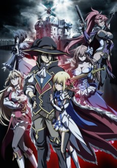

Damn! Through the premier of all the shows on my radar this season and I only dropped one. This is really a stacked season. 

### [Sword Art Online: Alicization](https://anilist.co/anime/100182)

 

The anime everyone loves to hate comes out swinging with a double length opening. I can't help it -- I'm on board for this one.

Sure there were a few bits that were eye-roll worthy, but there was just so much to like! I'm sure this third season will have it's ups and downs, but all I want from an anime is to have fun, and I think *SAO III* will deliver in spades.

### [Goblin Slayer](https://anilist.co/anime/101165)

 

*Holy Fuck! Content Warning! Trigger Warning!*

Do not! I repeat! Do not watch this show if for whatever reason you can't watch graphic violence (including sexual violence). Holy shit, this was gratuitous.

I was *this* close to insta-dropping this, but I think I'm going to give it another episode. This is ultra dark fantasy and that's not something you see very often. I want to see if the opening was done for shock or world building. Frankly, the most likely outcome is that this is dropped a few minutes into episode 2 as this is just not something I'm comfortable with.

### [Tensei Shitara Slime Datta Ken](https://anilist.co/anime/101280)

 

8-bit

I have to give this show credit -- even though it's full on isekai there is enough new ground here, I'm willing to let it see where it goes. Since this is a two cour show, they obviously have the luxury of explaining the mechanics of the world and the abilities of our *main slime*. There are still plenty of ways this can go off the rails quickly, but I definitely like what I've seen so far.

### [Seishun Buta Yarou wa Bunny Girl-senpai no Yume wo Minai](https://anilist.co/anime/101291)

 

CloverWorks

For some reason, my initial thought on this show was very much [Just Because](https://anilist.co/anime/98820/Just-Because/) vibes. However that is really selling it short.

Don't judge this show by the title or the premise. Our two main protagonists are *the* couple of the season -- their interactions feel sincere and the dialog/banter is top notch. It is *so* refreshing having two characters that can hold their own to each other in an anime without bouts of debilitating shyness. They are uncertain and nervous in the face of the mystery in front of them, but they are fully functional when relating to each other.

Can I please have more of this in my anime life?

### [Toaru Majutsu no Index III](https://anilist.co/anime/100185)

 

It's here! 

And what's even better is there is a third season of [Railgun](https://anilist.co/anime/104462/Toaru-Kagaku-no-Railgun-3/) coming *next* year as well!

Both *Index* and *Railgun* are up there for my favorite English dubs and I was ecstatic that Funimation announced they were doing a SimulDub release (a bit late but I'll take it). Like [Steins;Gate 0](https://anilist.co/anime/21127/SteinsGate-0/) I will be tracking this one 3-4 weeks behind everyone else.

### [Irozuku Sekai no Ashita kara](https://anilist.co/anime/101316)

 

I am on board for this one!

Leave it to PA Works to get me seriously hyped for a slice of life show combining magic and time travel. The visuals are vintage PA Works (aka bloody fantastic).

### [Zombie Land Saga](https://anilist.co/anime/103871)

 

*Damn!*

That's one way to do an idol show.

Given the *epic* rap battle in episode 2, it looks like we are going to get a different musical genre each week, and while I definitely would have taken 12 episodes of metal, the rap in episode 2 was so much fun.

Taking my bet for comedy of the season.

### [Yagate Kimi ni Naru](https://anilist.co/anime/101573)

 

Being a fan of the source manga, I was very excited for this show. While the character designs don't *quite* match what I expected coming from the manga, the animation is very good and the voice actresses of our two leads are pitch perfect. The only trick will be where and how they decide to end the show. There isn't an obvious point that I can recall and I will be interested to see what kind of story they end up telling.

### [SSSS.GRIDMAN](https://anilist.co/anime/99424)

 

Welp, I guess I'm watching another mech show this season.

Honestly, I think I would prefer character interactions over the mech battles -- I have a soft spot for Trigger's character aesthetics. I just hope this show is more than just *monster of the week*.

### [Kishuku Gakkou no Juliet](https://anilist.co/anime/101310)

 

I'm not sure how far I'll go with this one. A lot will depend on how the central relationship develops. If it becomes clear that their relationship is just a foil for contrived hijinx, I think I'll end up skipping it.

### [Radiant](https://anilist.co/anime/101024)

 

Despite the really interesting backstory to this production, *Radiant* is first on my dropped list this season. Shonen series aren't really my cup of tea to begin with and there really wasn't anything to hook me like there was with [My Hero Academia](https://anilist.co/anime/21459/Boku-no-Hero-Academia/). However, if you are a shonen fan, I would recommend checking this one out.

### [Tonari no Kyuuketsuki-san](https://anilist.co/anime/101371)

 

Studio Gokumi

This is so obviously a 4-koma comic adaptation. All the beats and pacing are really letting the source bleed through. I'm not familiar with the source material so I can't comment on how well the adaptation is, but I'll keep up with this one for another couple of episodes as they introduce more of the cast.

### [Uchi no Maid ga Uzasugiru](https://anilist.co/anime/101506)

 

This is taking lolicon to the point of pedophilia. There is some really great animation at work here, but if the relationship dynamic doesn't settle somewhere in the ballpark of normal, I'm just going to lump this into weird, unhealthy Japanese fetishes and move on.

### [RELEASE THE SPYCE](https://anilist.co/anime/101014)

 

Lay-duce

[Princess Principal](https://anilist.co/anime/98505/Princess-Principal/) did it better.

That's not to say *Spyce* isn't good -- I think I was just hoping for a show like this to have a bit more edge. Maybe that is coming now that everyone is introduced.

### [Ulysses: Jeanne d'Arc to Renkin no Kishi](https://anilist.co/anime/100432)

 

AXsiZ

Well that's one way to do a time skip.

I need a few more episodes to get a clear indication on what type of story they are going to tell after the time skip.

### [RErideD: Tokigoe no Derrida](https://anilist.co/anime/99413)

 

Geek Toys

Haven't started this one yet, but given the pedigree coming from [Steins;Gate](https://anilist.co/anime/9253/SteinsGate/), I'm going to give it a shot.

### [Tsurune: Kazemai Koukou Kyuudou-bu](https://anilist.co/anime/100402)

 

This one is airing late and no word as to who is going to pick it up. It's KyoAni so I'm definitely going to check it out as soon as it's available.

### [Ingress](https://anilist.co/anime/101500)

Craftar

*We interrupt this post to deliver a seasonal venting...*

...

**Damn it Netflix!**

...

*We now return you to your regularly scheduled post...*

### [Akanesasu Shoujo](https://anilist.co/anime/101360)

 

Dandelion Animation Studio

This feels like a middle of the road mystery show. Given how packed this season is I predict that I'll fall behind and then binge it at the end.

### [Gaikotsu Shotenin Honda-san](https://anilist.co/anime/100093)

 

DLE

This is a very off the wall comedy but the opening episode was extremely funny. As a 12 minute short it won't take much and I can't wait to see how it manages to skewer other aspects of otaku culture.

### [Satsuriku no Tenshi (ONA)](https://anilist.co/anime/104243)

") 

I'm invested at this point so I want to see how the story ends, but in retrospect, I'm not sure the show is worth starting if you haven't.

### [Anima Yell!](https://anilist.co/anime/101013)

 

A shoestring animation budget is doing this show no service. I'm going to reserve final judgment until the rest of the cast is introduced (and to see if the animation improves), but there was real *uncanny valley* going on.

