What a really great season! The two 2 cour shows (SAO & Slime) that I'm following regularly are doing well (with Slime being the surprise of the season). I haven't yet dived into *Index III* yet -- it's been such a stacked season something had to give.

### [Goblin Slayer](https://anilist.co/anime/101165)

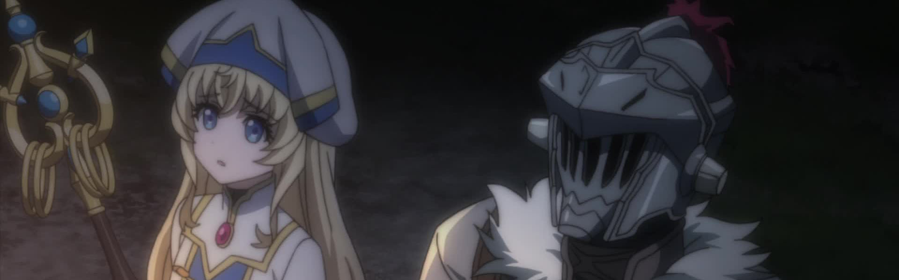

After a controversial and unnecessarily graphic opening episode, *Goblin Slayer* settled down into a decent D&D-style narrative. There is no character development here, but the show does manage to assemble an interesting and sympathetic party to surround the protagonist. This show is perfectly skippable however, especially if you don't need graphic violence in your life at this moment.

### [Seishun Buta Yarou wa Bunny Girl-senpai no Yume wo Minai](https://anilist.co/anime/101291)

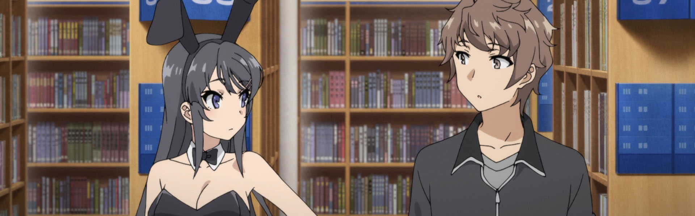

[Monogatari](https://anilist.co/anime/5081/Bakemonogatari/) done in rom-com fashion, and I absolutely loved it. [Mai](https://anilist.co/character/127222/Mai-Sakurajima) and [Sakuta](https://anilist.co/character/127221/Sakuta-Azusagawa) were couple of the season after the first arc and the show never strayed from that root romance even as it told the stories of the other characters.

Even if you don't normally watch shows like this, go watch the first three episodes and just treat it as a movie. It definitely won't disappoint.

### [Irozuku Sekai no Ashita kara](https://anilist.co/anime/101316)

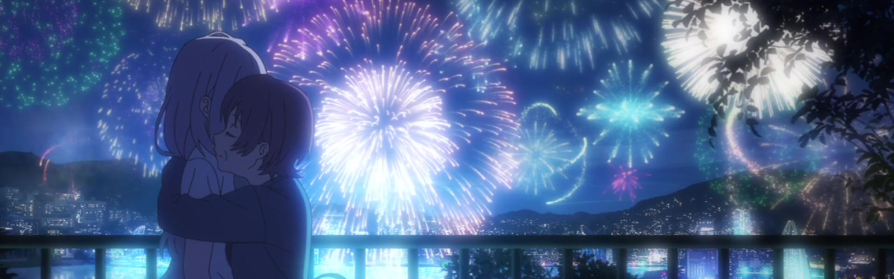

First, let me just say this show wins the award for best Background Art of the season and it's not even close. 

**Jaw Droppingly Gorgeous**

That said this story feels like it would have been better as a two hour film than a full cour. The middle third is very slow and the show doesn't delve deeply into any of the supporting character's stories and motivations. If I ever have time to do a large scale editing project, I'd love to take a pass at this show as a film.

### [Zombie Land Saga](https://anilist.co/anime/103871)

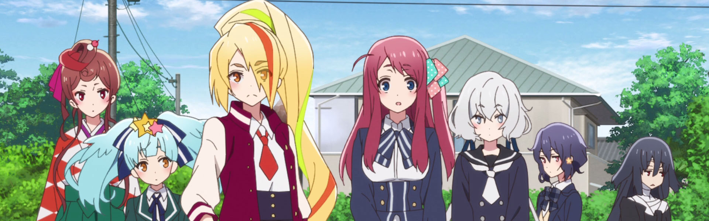

I *really* want to go see a full *Franchouchou* [concert](https://wowjapan.asia/2018/11/zombie-land-saga-group-franchouchou-holds-first-live/)... 

I've crossed over. There is no going back.

I'm absolutely hooked on the OST, but what made the show is the character exploration and how it was all woven together rather than pure episodic vignettes. I hope to god there is a second season because there are [still](https://anilist.co/character/127651/Yuugiri) [two](https://anilist.co/character/127650/Tae-Yamada) back stories that I desperately want fleshed out.

### [Yagate Kimi ni Naru](https://anilist.co/anime/101573)

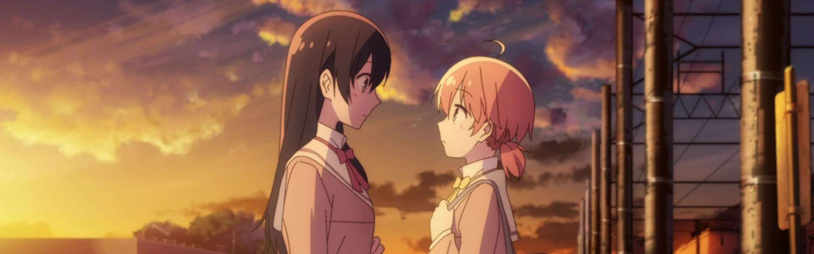

Probably the best yuri romance ever and *damn* do I hope we get a second season. The anime adaptation *essentially* ended where the English manga release is, so I think there is about a volume and a half of source material that is currently published but not adapted.

*Please, please, please let us have a happy resolution!*

The anime adaptation did what I wish all adaptations did -- enhance the source material with additional nuance and color that's just not possible in the manga medium. Once the show wrapped, I went back and reread the manga and enjoyed it even more than the first time through.

### [SSSS.GRIDMAN](https://anilist.co/anime/99424)

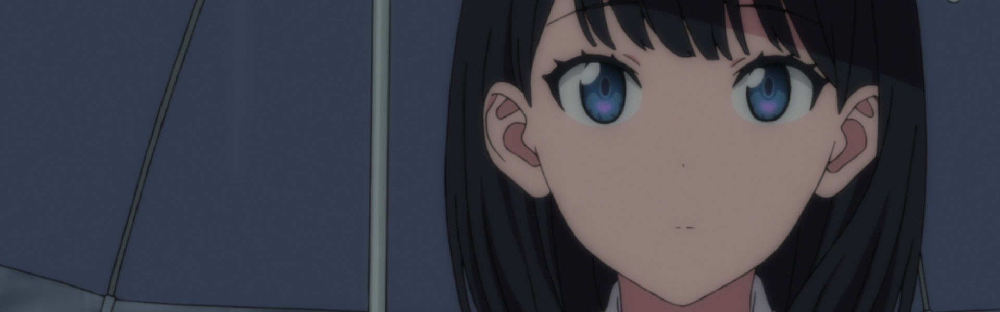

**The Trigger Rule**

*Nothing is ever as it seems...*

A really wonderful homage while at the same time constructing an entirely new mythos. The animation is spectacular (like you would have expected anything less from Trigger) and a great atmospheric OST.

And hot damn! Rikka for the win!

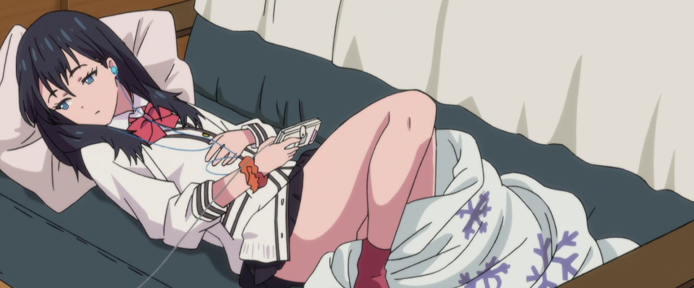

Also, we need to ship Rikka & Akane *stat!*

### [Tonari no Kyuuketsuki-san](https://anilist.co/anime/101371)

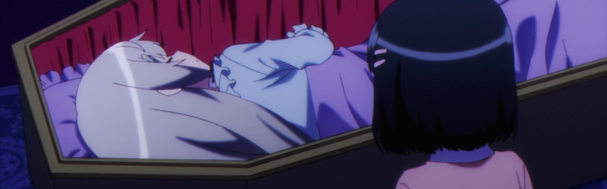

A cute 4-koma adaptation. If that's your cup of tea, then dive right in.

### [RELEASE THE SPYCE](https://anilist.co/anime/101014)

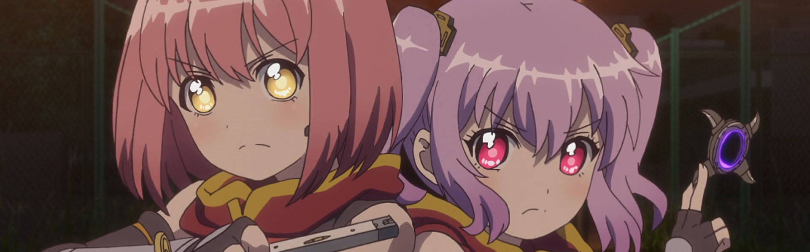

I ended up binging this once it finished and I am *very* happy I did. The last arc would have been really rough in real time.

I think I had higher expectations for this show that was reasonable which is why I ended sort of luke warm at the end. Don't get me wrong, I think it's pretty good, but compared with the other shows of the season I felt it was just playing second fiddle (albeit doing it very well).

### [Gaikotsu Shotenin Honda-san](https://anilist.co/anime/100093)

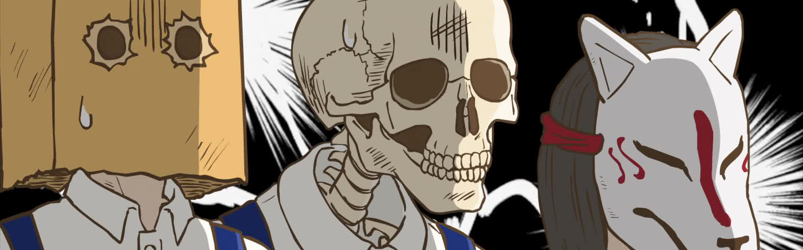

I've never worked retail so I don't embrace this show as fully as some others might, but it's damn funny.

### [Anima Yell!](https://anilist.co/anime/101013)

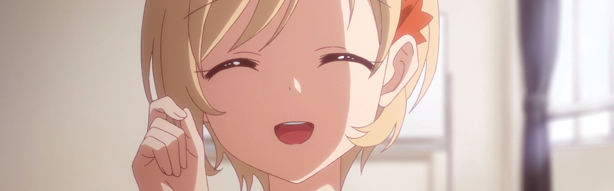

<blockquote class="twitter-tweet">
I am shook. We finally got a genuine &#39;coming out&#39; scene in a regular anime, not yuri or yaoi. This is how it should be handled and it came from a cheerleading show of all places! Props to Doga Kobo! (Via Anima! Yell, Crunchyroll) <a href="https://t.co/97OhmbeNQJ">pic.twitter.com/97OhmbeNQJ</a>
&mdash; Isla (@islamctear) <a href="https://twitter.com/islamctear/status/1054138313345548288?ref_src=twsrc%5Etfw">October 21, 2018</a></blockquote>

I will defend this show from all just because of this scene. The budget was small and it was more slice-of-life than sports anime, but damn it the way the above scene was handled with grace and dignity means *everything*.
