Due to circumstances beyond my control (germs making their way home) this is going up *extremely* late. That being said, also due to said germs, I've been able to stay current with almost everything so far this season!

### [Kakegurui ××](https://anilist.co/anime/100876)

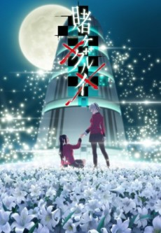 

> Insert latest Netflix rant here...

### [Tate no Yuusha no Nariagari](https://anilist.co/anime/99263)

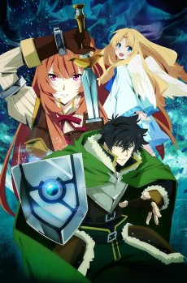 

Kinema Citrus

The manga is good. Nothing spectacular, mind you, but solid entertainment.

I sincerely wish I could binge this show in a 24hr blast. Like *Slime* I really eagerly want the story to progress. The composer for the series is [Kevin Penkin](https://anilist.co/staff/121796/Kevin-Penkin) from [Made in Abyss](https://anilist.co/anime/97986/Made-in-Abyss/) fame, so I had *really* high expectations for the OST going in. So far it hasn't been to the exceptional level of *Abyss*, but I'm hoping some more themes are introduced as we get further into the story.

### [Yakusoku no Neverland](https://anilist.co/anime/101759)

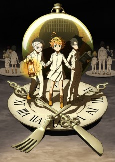 

CloverWorks

What ever you do, if you haven't read the manga go into this show knowing absolutely nothing. This show is my prediction of show of the season.

Also, the OP is **awesome**

<iframe width="560" height="315" src="https://www.youtube.com/embed/1JoFsTDfd-8" frameborder="0" allow="accelerometer; autoplay; encrypted-media; gyroscope; picture-in-picture" allowfullscreen></iframe>

### [Boogiepop wa Warawanai (2019)](https://anilist.co/anime/101283)

") 

I'm not at all familiar with the original (done almost 20 years ago at this point) so I went in completely cold turkey. First impression was excellent and a good decision to air the first two episodes at once. There seems to be a bit of overlapping character designs which caused a bit of confusion as to who is who, but I think I've manged to get the three initial groups straight now. The non-linear storytelling takes effort as there aren't a lot of queues for you to anchor on.

The OP and ED are each fantastic as well!

### [Kaguya-sama wa Kokurasetai: Tensai-tachi no Renai Zunousen](https://anilist.co/anime/101921)

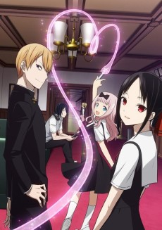 

The execution of this opening episode is top notch. The handling of the internal monologues was perfectly done. I hope there is more to this show however than just these two narcissistic characters bouncing off each other. If there is some actual development and some sort of arc, then I think I'll really enjoy this show.

### [Dororo](https://anilist.co/anime/101347)

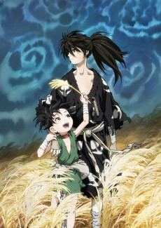 

Another strong showing by MAPPA. A killer OP and a no-hold-bar take on feudal Japan. If it weren't for *Neverland* this might have taken the lead for show of the season.

### [Manaria Friends](https://anilist.co/anime/21322)

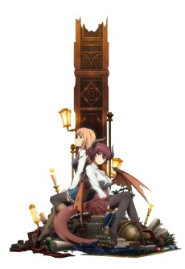 

CygamesPictures

Incredible production values for a short (given it seems to be reusing assets from it's parent show). It's sweet but I hope it's not 10 episodes of maneuvering (I don't have hope for that however).

### [5-Toubun no Hanayome](https://anilist.co/anime/103572)

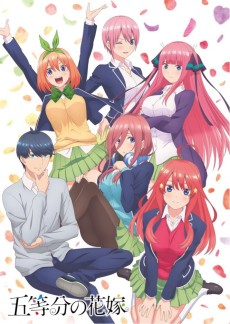 

Tezuka Productions

On first glance, this appears to be a basic harem trope filled show, but there was something about the handling of the characters that gives me hope that there might be something more to it. The one issue is there are *a lot* of off model shots in this show early on. If they are going off model already in episode 2 and 3, I shudder to think where they will be at 10 and 11.

That being said, the manga looks very good so that might be a better alternative.

### [Mahou Shoujo Tokushusen Asuka](https://anilist.co/anime/103222)

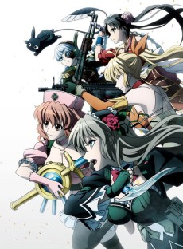 

Personally, I would have preferred a show that focuses on the PTSD aspect of Magical Girls rather than the show I think we are going to get. I'll give this a few more episodes to see what kind of narrative we are setting up.

### [Egao no Daika](https://anilist.co/anime/104674)

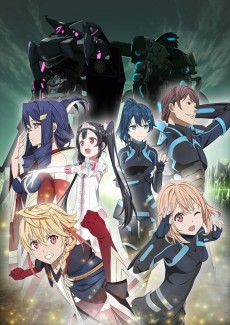 

Tatsunoko Production

This is almost a text book example of how *not* to structure your opening episode. No stakes, no context, and no hints at conflict until the last 20 seconds of the episode (post credits).  A perfect counter example is [Gakkou Gurashi!](https://anilist.co/anime/20754/Gakkou-Gurashi/)'s opening episode. There is an underlying sense of "not all is right" and a lot of hints at what is happening "outside" during the course of the episode to put you on your guard.

I'll tune in next week to see what this conflict is and how they are going to structure the greater narrative, but I bet lots of people drop this show without ever getting to the conflict.

### [Watashi ni Tenshi ga Maiorita!](https://anilist.co/anime/102680)

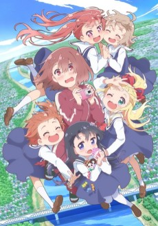 

Oh my god! *WHY?*

Two *extremely* questionable loli shows in back to back seasons...

### [Endro!](https://anilist.co/anime/103301)

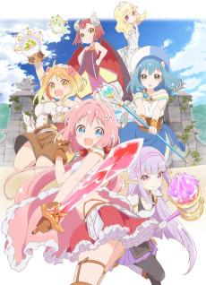 

Very clever opening episode.

I'm not sure there is going to be enough here to keep me coming back each week, but I applaud the execution of the first episode.

### [Kemurikusa](https://anilist.co/anime/101123)

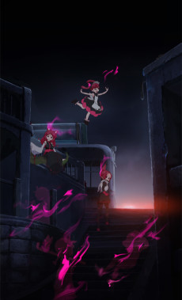 

Yaoyorozu

[Kemono Friends](https://anilist.co/anime/87496/Kemono-Friends/) in dystopian setting.  I'll pass.

### [Girly Air Force](https://anilist.co/anime/101930)

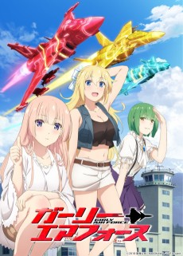 

Satelight

I have a question... Did this show enter production before or after [Darling in the Franxx](https://anilist.co/anime/99423/Darling-in-the-Franxx/) aired? Pass.

### [Kouya no Kotobuki Hikoutai](https://anilist.co/anime/104253)

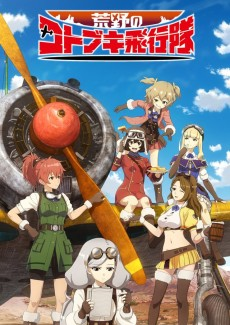 

GEMBA

So I don't think I'm a fan of the aesthetic choices (main characters in 3D, background characters in 2D), but *damn* the sound design was incredible! We don't know much about this show from the opening episode because the majority of time was spent in the dog fight. From the hints given at the end of the episode, there might be some very interesting character backstories to explore here. If they keep up that level of sound design, that just might be enough for me.

### [Pastel Memories](https://anilist.co/anime/101379)

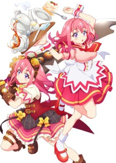 

project No.9

What the hell? What kind of *non sequitur* shit was that?

Honestly, who is the target audience for something like this?

