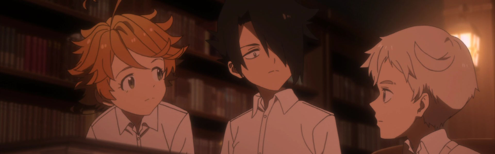
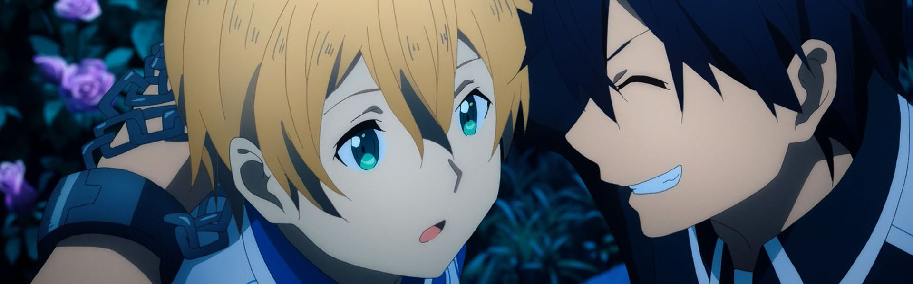
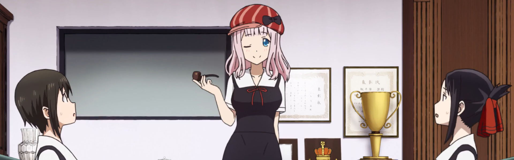
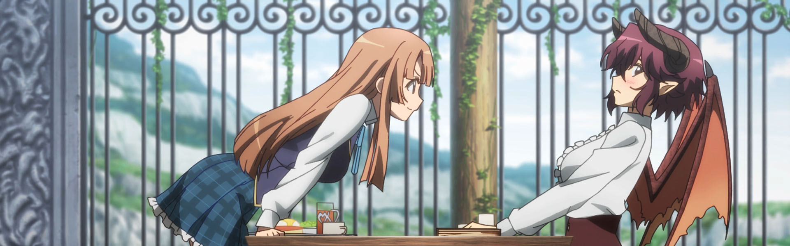
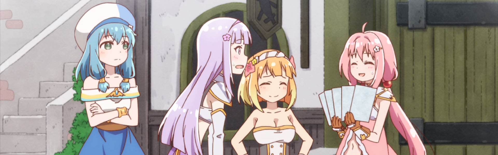

All around a solid start for 2019 (which has a lot to live up to given the strength of shows in 2018). As usual the two cour shows (Dororo and Shield Hero) will be covered in the next retro (spoiler: Dororo is *awesome!*)

### [Yakusoku no Neverland](https://anilist.co/anime/101759)

Anime of the Year?

Quite possibly.

This was *the* must watch of the season and it didn't disappoint. I'm very glad I had held off reading the manga. The impact of the scene framing, camera tracking and OST I think would be lessened if you knew what was coming each week (and I've heard the same from others who were caught up with the manga).

Now, if you'll excuse me, I need to now catch up in the manga so I'm ready for [Season 2](https://anilist.co/anime/108725/Yakusoku-no-Neverland-2nd-Season/)

### [Sword Art Online: Alicization](https://anilist.co/anime/100182)

Wrapping up it's second (of 4?) cours, Alicization was actually an entertaining entry in the SAO franchise. At times very exposition heavy, I enjoyed giving the plot room to breathe. If you're already predisposed to hate on SAO then I wouldn't bother jumping into this -- quite a number of the flaws from previous arcs bleed through as well some very heavy handed handling of themes in the final encounter.

Good entertainment. I'm not sure what more we should expect out of this franchise.

### [Kaguya-sama wa Kokurasetai: Tensai-tachi no Renai Zunousen](https://anilist.co/anime/101921)

Chika is best girl.

<iframe width="560" height="315" src="https://www.youtube.com/embed/mkNE_f3aG_Q" frameborder="0" allowfullscreen></iframe>

There were lots of *laugh out loud* moments and many of the predicaments were stitch inducing (that volleyball scene had me on the floor). You just have to be prepared for no actual evolution of the relationship. I think it would have been great if the same setup was in place but the relationship between Koga and Shirogane advanced little by little, so we could see this standoff apply to more aspects of relationships, rather than just the initial confession.

### [Manaria Friends](https://anilist.co/anime/21322)

Honestly, it exceeded my expectations. The production values alone for a show like this place this show in a category of it's own. The relationship between Anne and Grea is absolutely adorable and I think there was just the right amount of shipping tension for this show.

### [Endro!](https://anilist.co/anime/103301)

This had just enough to keep me going for the entire run. There were about 4 episodes that were just straight up filler, but the main arc of the story was actually quite good.

