I thought this season would shape up to be a much "lighter" season that recent ones, especially with the delay of the third season of [Chihayafuru](https://anilist.co/anime/101215/Chihayafuru-3/), but like usual, I seem to have gathered quite a lot after the first pass. I don't expect many of them to stick around.

Also, I think I will skip [One Punch Man 2](https://anilist.co/anime/97668) -- it doesn't look like this second installment will be able to hold a candle to the original.

Side note: is it just me or are a lot more shows getting two cours than before?

### [Kimetsu no Yaiba](https://anilist.co/anime/101922)

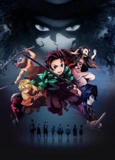 

I mean, it's ufotable... That should explain itself, right?

Either you're a fan of the ufotable aesthetic or you aren't, but this show looks fun. Given that we quickly speed through the training period in one episode (quite the time jump) I'm curious where the narrative will choose to spend it's time.

### [Fruits Basket](https://anilist.co/anime/105334)

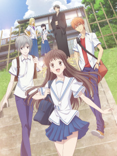 

I never saw (but had heard of) the original adaptation, but I'm really glad I can get to experience this story with refreshed design and animation. I kind of hope there isn't too much emphasis on a love triangle because I think I enjoy the characters' everyday interactions better then an overly dramatic romance.

### [Isekai Quartet](https://anilist.co/anime/104454)

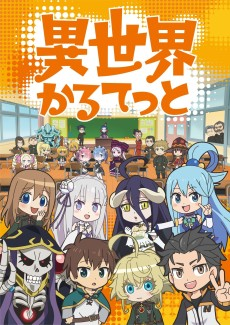 

Studio PuYUKAI

It's quite shocking to hear all the voice actors of these shows all in one place. While I expect there to be quite a few of unique hilarious moments with this one, the first few episodes have been rather slow. Hopefully we can get to a point where there is some fast back and forth banter.

### [Fairy Gone](https://anilist.co/anime/107418)

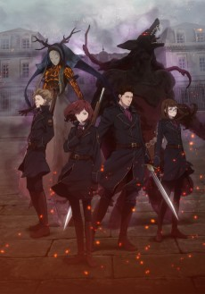 

Frankly, I'm a little disappointed with this one -- I had higher expectations from PA Works. I really like the music and OST, so I think that will keep me coming back at a minimum. The show tries to take itself very seriously and puts characters together because *plot* rather than natural development.

*sigh*

### [Boku-tachi wa Benkyou ga Dekinai](https://anilist.co/anime/103900)

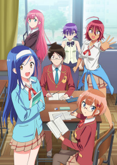 

Studio Silver, Arvo Animation

Back to back seasons of the tutor trope? *sigh*

That being said, I've enjoyed the first view episodes more than I thought I would so maybe that will be enough.

### [Carole & Tuesday](https://anilist.co/anime/101281)

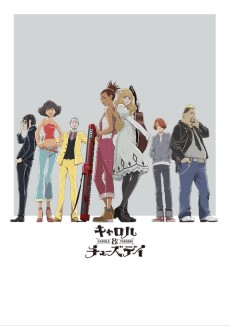 

*Why* oh *WHY* is this show in Netflix Purgatory? Definitely a candidate for show of the year. There is a fansub group taking on the release and it seems like a lot of people in the community are taking that route with this show.

The OP, ED and insert songs are *incredible!*

### [Hitoribocchi no Marumaru Seikatsu](https://anilist.co/anime/101386)

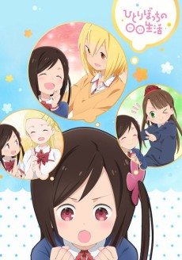 

C2C

Every episode has left me with a permanent smile on my face! Soooo good! Definitely recommend this one!

### [Senryuu Shoujo](https://anilist.co/anime/106051)

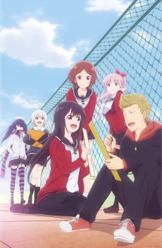 

CONNECT

Literally lost in translation. Pass.

### [Konoyo no Hate de Koi o Utau Shoujo YU-NO](https://anilist.co/anime/97995)

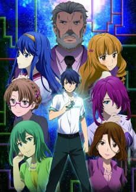 

feel.

Ok, so this show is very weird (and not in a good way). It's taking its time so I don't really have a good sense of what the show will be which is why I'm still sticking with it, but very narrowly.

### [Sarazanmai](https://anilist.co/anime/101261)

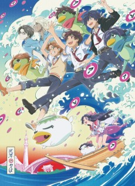 

Do yourself a favor and at least watch the opening episode. This show is an absolute trip and a half. I'm not sure it's *good*, but it's definitely something you should experience.

### [Mayonaka no Occult Koumuin](https://anilist.co/anime/102939)

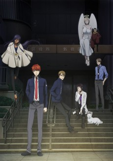 

Sort of feels like a poor man's version of [ACCA 13](https://anilist.co/anime/21823/ACCA-13ku-Kansatsuka/) so I'm going to give it a chance to hopefully present some interesting situations.

### [Hachigatsu no Cinderella Nine ](https://anilist.co/anime/104989)

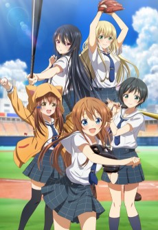 

Round out the season with a sports anime. By episode three we've rounded out a full cast of nine players each with their own quirks and foibles. This should be enjoyable in a way that only a sports anime can.

