So... much... isekai...

This is a packed season and I've already diverted myself by picking up the first season of [Symphogear](https://anilist.co/anime/11751/Senki-Zesshou-Symphogear/) (which has been surprisingly enjoyable so far). My backlog is really going to take a hit this year since I'm still not completely caught up with my spring shows!

### [Dr. STONE](https://anilist.co/anime/105333)

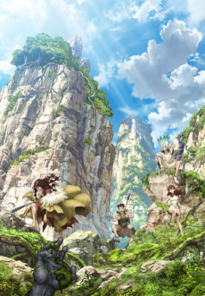

Another *Shonen Jump* adaptation -- it feels like it's been one a season for the last year or so. *Stone* feels a bit too on the nose for my tastes, but I'll give it a chance to see what kind of protagonist vs. antagonist vibe we end up with. 

### [Dungeon ni Deai wo Motomeru no wa Machigatteiru Darou ka II](https://anilist.co/anime/101167)

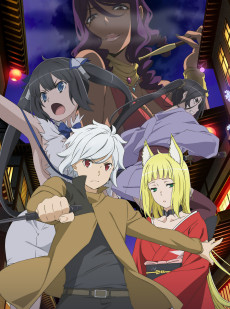 

It's **back**! Oh sooooo good. I really missed these characters and I hope the show can keep up the excellence we saw in the first season. 

As a side tangent, I really get a kick out of the sound design. The heavy distortion conveying how things are so loud you coudln't possibly imagine is really clever and a integral part of the overall aesthetic. It would definitely feel less *other-worldly* without that decision.

### [Enen no Shouboutai](https://anilist.co/anime/105310)

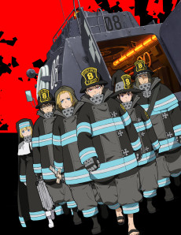 

David Production

Through no fault of it's own, this show will be tied up with the tragic arson of Kyoto Animation. It's unfortunate, because I think this show is already not flippant about the tragedy of it's own story -- the fire monsters they are fighting were once people too and the show already handles that with grave respect. Despite everything surrounding it, I definitely recommend this show as one of the core staples this season.

### [Vinland Saga](https://anilist.co/anime/101348)

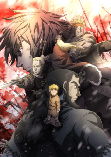 

My prediction is that this show will be in heavy contention for anime of the year. I'm so-so on it myself, but I'm definitely willing to give Wit the benefit of the doubt.

### [Dumbbell Nan Kilo Moteru?](https://anilist.co/anime/107226)

 

A guilty indulgence this season that has already guilt tripped me in to trying to work in a basic workout routine again. It also falls into the *edu-tainment* category as it wants to teach you about working out in addition to being *cute-girls-doing-cute-things-in-front-of-a-backdrop-of-muscle*.

### [Lord El-Melloi II-sei no Jikenbo: "Rail Zeppelin" Grace note](https://anilist.co/anime/106918)

 

Wow, Troyca is making it's way up to the echelon of studios that I will make sure to watch every show they release. As a side story spin-off of [Fate Zero](https://anilist.co/anime/10087/FateZero/) I fully endorse this expedition through the Nasuverse.

### [Kanata no Astra](https://anilist.co/anime/107663)

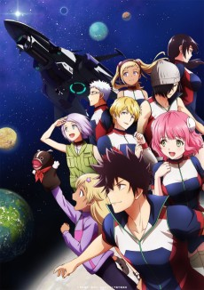 

This show lurches awkwardly (no pun intended) between comedy and seriousness which feels quite jarring. It definitely has that *Lost in Space* vibe but this time with absolutely no adults involved. There is room for some character growth within the episodic framework, but whether or not it will actually *happen* is left to be seen.

### [Toaru Kagaku no Accelerator](https://anilist.co/anime/104463)

 

But... But... I haven't finished the third season of *Index* yet! Give me a moment to catch up.

Still, excited about this one. Once again, will definitely wait for an English dub.

### [Araburu Kisetsu no Otome-domo yo.](https://anilist.co/anime/105932)

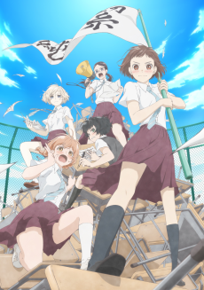 

Lay-duce

Despite the packed season, this is my sleeper pick for anime of the season. This gives off [place further than the universe](https://anilist.co/anime/99426/Sora-yori-mo-Tooi-Basho/) vibes (minus the grand adventure).

### [Sounan desu ka?](https://anilist.co/anime/108111)

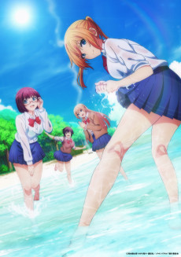 

Ezo’la

There isn't a whole lot of redeeming qualities to this show -- cute-girls-doing-disgusting-things. Since it's a short, the time invested is low so I'll probably stick around a few more episodes to see if there is anything to redeem it.

### [Cop Craft](https://anilist.co/anime/106893)

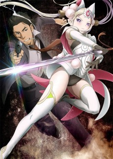 

Millepensee

OK, so I was really sold on the first two episodes -- Interesting setting, gritty no-holds-barred detectives and cops -- and then Episode 3 completely shit the bed in the animation production department (not to mention an extremely poorly implemented plot twist).

We'll see what Ep 4 & 5 bring to the table. If Ep 3 is an aberration, then I think I'll really enjoy this show -- but I have an unfortunate suspicion that Ep 3 is this shows true colors.

### [Joshikousei no Mudazukai](https://anilist.co/anime/105081)

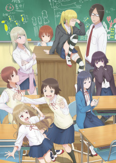 

Passione

A comedy very much in the vein of [Asobi Asobase](https://anilist.co/anime/101001/Asobi-Asobase/) which I paused early on as the humor wasn't quite my cup of tea. I'm going to give this one a few episodes to get in a groove before deciding whether or not to give this show the same treatment.

### [Granbelm](https://anilist.co/anime/108147)

 

Nexus, Infinite

A rather flawed magical girl Mecha show. Enough promise so far that I want to continue.

### [BEM](https://anilist.co/anime/107876)

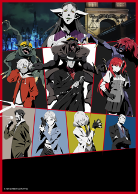 

LandQ studios, Production I.G, flying DOG

The other gritty cop show of the season -- also with a next door mysterious world.

### [Machikado Mazoku](https://anilist.co/anime/107490)

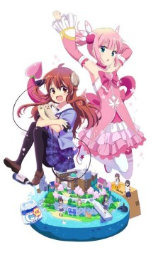 

Really, *really* funny. Seriously, don't pass this one up!
