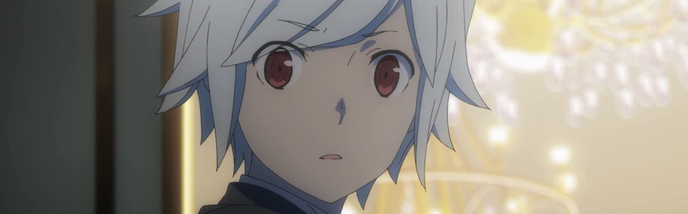
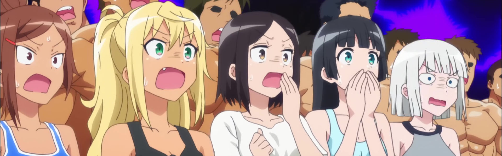
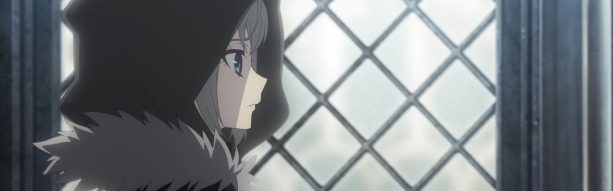
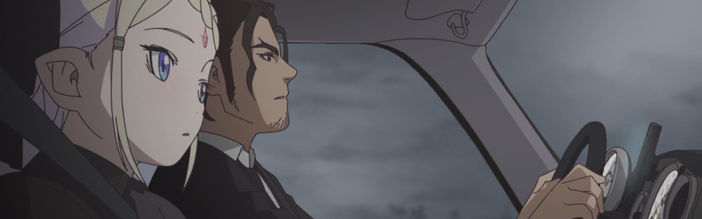
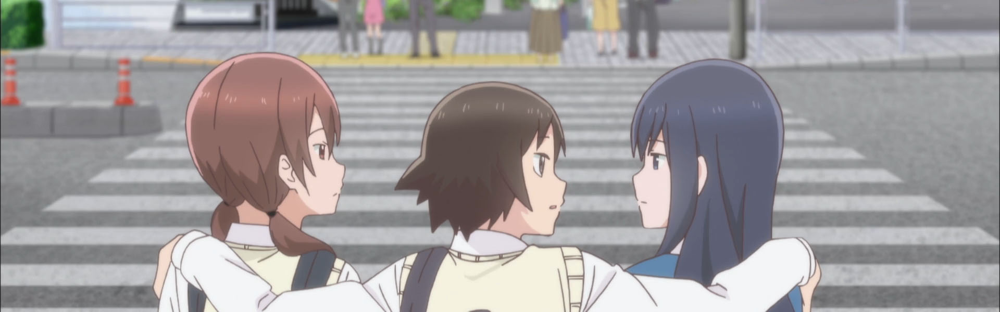
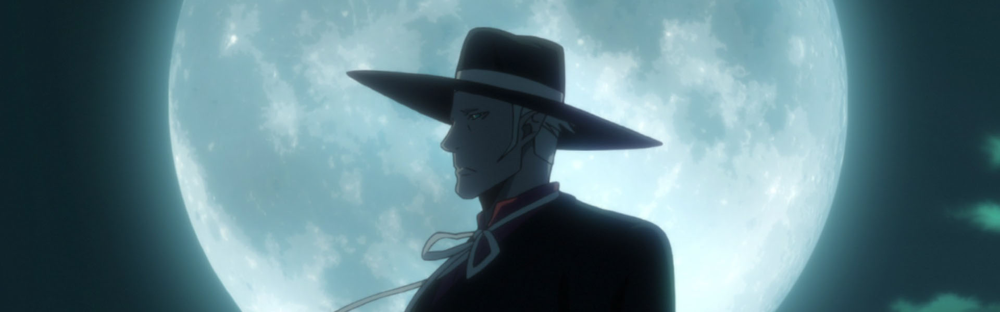
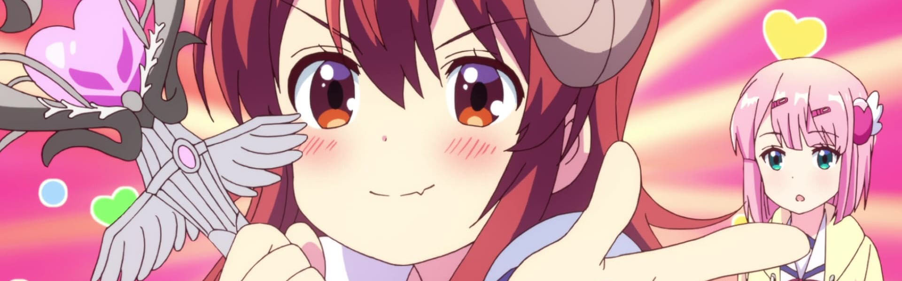

In what will be a running gag, I'm posting this retroactively as if I had composed it when it was timely.

### [Dungeon ni Deai wo Motomeru no wa Machigatteiru Darou ka II](https://anilist.co/anime/101167)

I was a fan of the first season -- great character designs, actual character development, and I personally enjoyed the sound design a great deal. This second season felt like a good continuation of the world building but the first arc felt rushed with the epic conclusion resolving in a single episode.

I hope there is a third season, but if we ever get it will be a while as I believe they are up to the same point in the source material.

### [Dumbbell Nan Kilo Moteru?](https://anilist.co/anime/107226)

If you ever wanted to craft an anime to see if you could influence a demographic, *Dumbell* is your test case. I'm not sure how much it sticks, but I definitely felt pressured to get off my butt and exercise.

The emergence of [Ai Fairouz's](https://anilist.co/staff/133625/Ai-Fairouz) with her performance as [Hibiki Sakura](https://anilist.co/character/132856/Hibiki-Sakura) was a notable highlight and I can't wait for more roles to come her way in the future.

### [Lord El-Melloi II-sei no Jikenbo: "Rail Zeppelin" Grace note](https://anilist.co/anime/106918)

First off, the animation by Troyca was excellent, and was perhaps the main reason I finished this show. [Waver](https://anilist.co/character/16023/Waver-Velvet) is a phenomenal character, so this should have been a no brainer hit, but the lack of a cohesive narrative and too many information dialog dumps resulted in just a *meh* show.

A real missed opportunity in my opinion.

### [Cop Craft](https://anilist.co/anime/106893)

I rather enjoyed this show despite it's obvious shoestring budget. There is an obvious low point around episode 3/4 but it does seem to recover a bit and at least let me enjoy the rest of the story without distraction.

### [Joshikousei no Mudazukai](https://anilist.co/anime/105081)

OP of the season for me. Loved the comedic interplay between the characters and the level of overall hijinx kept me throughly entertained week to week.

### [BEM](https://anilist.co/anime/107876)

Enough there for me to finish it, but overall fairly lackluster. Definitely skippable.

### [Machikado Mazoku](https://anilist.co/anime/107490)

Solid moe comedy with incredibly meme-able screencaps.
