*April 3, 2021 - I didn't get to post this in real time, but wanted to have a record of my thoughts on the season.*

### [BEASTARS](https://anilist.co/anime/107660)

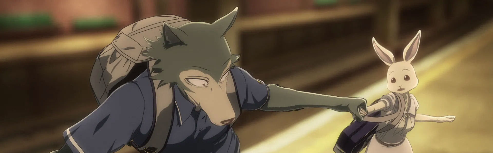

> In a world populated by anthropomorphic animals, herbivores and carnivores coexist with each other. For the adolescents of Cherryton Academy, school life is filled with hope, romance, distrust, and uneasiness.&lt;br&gt;&lt;br&gt;&lt;br/&gt;The main character is Legoshi the wolf, a member of the drama club. Despite his menacing appearance, he has a very gentle heart. Throughout most of his life, he has always been an object of fear and hatred by other animals, and he’s been quite accustomed to that lifestyle. But soon, he finds himself becoming more involved with his fellow classmates who have their own share of insecurities and finds his life in school changing slowly.&lt;br&gt;&lt;br&gt;
(Source: moetron)

### [Sword Art Online: Alicization - War of Underworld](https://anilist.co/anime/108759)

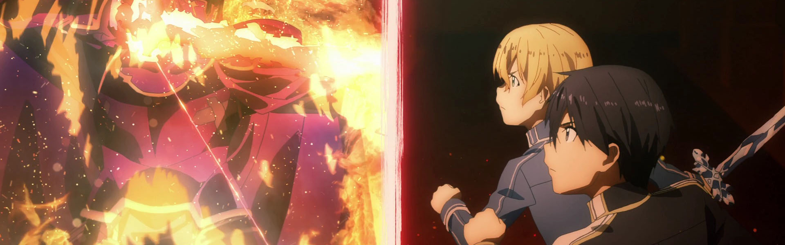

> Kirito, Eugeo, and Alice. Six months have passed since the two disciples and an Integrity Knight brought down the pontifex, Administrator. With the fighting over, Alice has been living in her hometown of Rulid Village. Beside her is Kirito, who has not only lost his arm and soul, but also his dear friend. As Alice devotes herself to looking after Kirito, she too has lost the will to fight she once had as a knight.&lt;br&gt;&lt;br/&gt;&lt;br&gt;
Nevertheless, the time for the final stress test – one which will engulf the entire Underworld with tragedy – draws relentlessly closer.&lt;br&gt;
&lt;br&gt;
Meanwhile, in the deepest areas of the Dark Territory, the Dark God Vecta has resurrected, as if to have waited for this very moment. Leading an army of dark forces, they begin their invasion into the human empire in hopes of attaining the Priestess of Light. The human empire force led by the Integrity Knight Bercouli prepares for a war of an unimaginable scale against the army of the Dark Territory. Even then, Alice is nowhere to be seen, nor the two heroes that saved the realm...&lt;br&gt;
&lt;br&gt;
(Source: Official Website)

### [Ore wo Suki nano wa Omae dake ka yo (ORESUKI: Are you the only one who loves me?)](https://anilist.co/anime/104464)

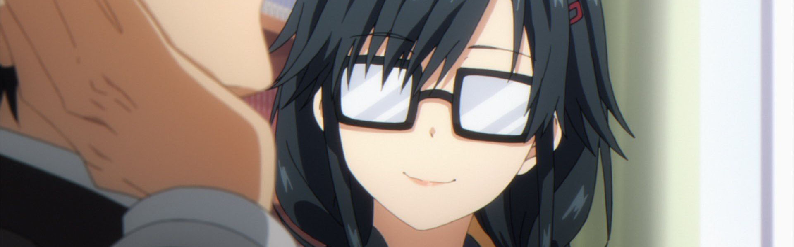

> Amatsuyu &quot;Joro&quot; Kisaragi finds himself in a rather delightful situation, two lovely girls asked him out on a date in the same week. Little does he know he&#x27;s not the actual target of their love, instead, he ends up as a love consultant forced to juggle a web of relationships more complex than initially thought. &lt;br/&gt;

### [Mairimashita! Iruma-kun (Welcome to Demon School! Iruma-kun)](https://anilist.co/anime/107693)

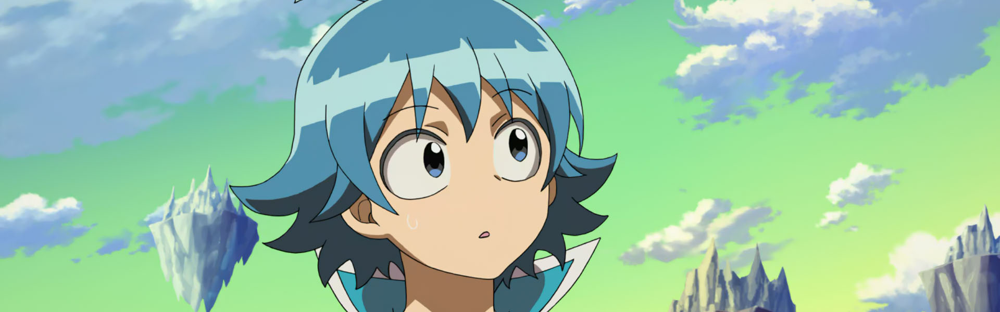

> Suzuki Iruma has just been abandoned and sold to a demon by his irresponsible parents! Surprisingly, the next thing he knows he&#x27;s living with the demon who has adopted him as his new grandson, and has been transferred into a school in the demon world where his new &quot;demon&quot; grandfather works as the principal. Thus begins the cowardly Iruma-kun&#x27;s extraordinary school life among the otherworldly as he faces his true self, takes on challenges, and rises to become someone great...

### [Boku-tachi wa Benkyou ga Dekinai! (We Never Learn!: BOKUBEN Season 2)](https://anilist.co/anime/110229)

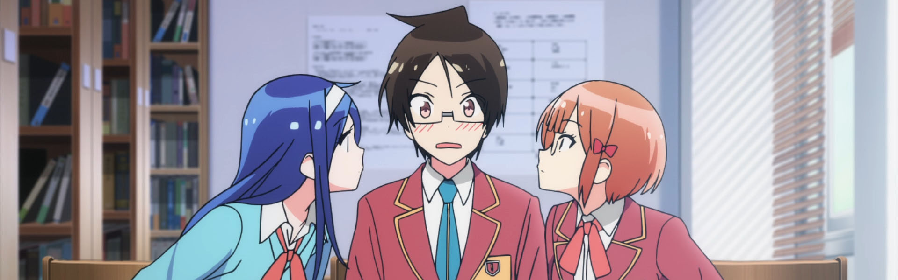

> &lt;i&gt;Second season of BOKUBEN.&lt;/i&gt;&lt;br&gt;&lt;br&gt;To get a scholarship, Nariyuki becomes a reluctant tutor to three unteachable girls. He must quickly make an art-lover adore mathematics, turn a literary genius into a bonafide scientist, and transform a top-tier athlete into a passing student.&lt;br&gt;&lt;br&gt;(Source: HIDIVE)

### [Honzuki no Gekokujou: Shisho ni Naru Tame ni wa Shudan wo Erandeiraremasen (Ascendance of a Bookworm)](https://anilist.co/anime/108268)

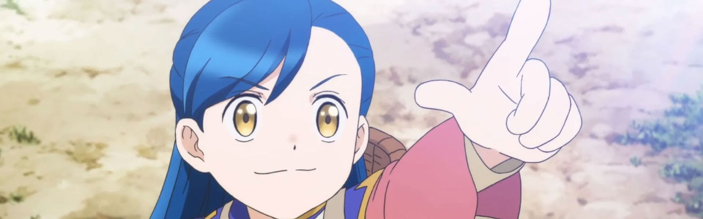

> Anime adaptation of Part 1 of &lt;i&gt;Honzuki no Gekokujou&lt;/i&gt;.&lt;br&gt;&lt;br/&gt;&lt;br&gt;
When a sickly young girl suddenly becomes obsessed with inventing new things, her family and friends are all puzzled. &quot;What has gotten into Myne?&quot; they wondered, never dreaming that the answer is not a &quot;What&quot; but a &quot;Who&quot;: Urano Motosu, a book-loving apprentice librarian who died in an earthquake in Tokyo who somehow found herself in Myne&#x27;s body! And since Myne&#x27;s world is still in a medieval stage, where books can only be owned by the elite, the new Myne intends to do everything she can to bring her beloved books to the masses in the time she has left.&lt;br&gt;
&lt;br&gt;
(Source: Sentai Filmworks)&lt;br&gt;
&lt;br&gt;
&lt;i&gt;Note: The first episode was included in a bonus DVD that came with the limited edition of the 8th volume of &lt;a href&#x3D;&quot;https://anilist.co/manga/110802&quot;&gt;Part 4&lt;/a&gt; of the light novel that was released on September 10th, 2019 prior to its TV premiere.&lt;/i&gt;

### [Watashi, Nouryoku wa Heikinchi de tte Itta yo ne! (Didn't I Say to Make My Abilities Average in the Next Life?!)](https://anilist.co/anime/101227)

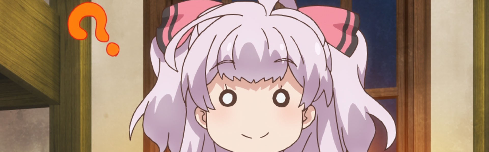

> When she turns ten years old, Adele von Ascham is hit with a horrible headache–and memories of her previous life as an eighteen-year-old Japanese girl named Kurihara Misato. That life changed abruptly, however, when Misato died trying to aid a little girl and met god. During that meeting, she made an odd request and asked for average abilities in her next life. But few things–especially wishes–ever go quite as planned.&lt;br&gt;&lt;br&gt;&lt;br/&gt;
(Source: Seven Seas Entertainment)

### [Babylon](https://anilist.co/anime/101349)

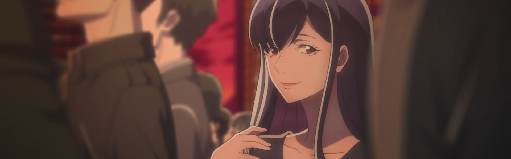

> The suspense story centers around Zen Seizaki, a prosecutor with the Tokyo District Public Prosecutors&#x27; Office. While investigating illegal acts by a certain pharmaceutical company, Seizaki stumbles across a conspiracy over an election for an autonomous &quot;new zone&quot; established in western Tokyo.&lt;br&gt;&lt;br&gt;&lt;br/&gt;
(Source: Anime News Network)

### [Chihayafuru 3](https://anilist.co/anime/101215)

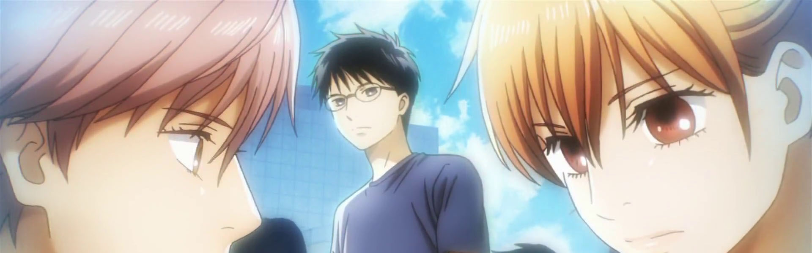

> They may have just won their most coveted karuta tournament, but members of the Mizusawa karuta team still have a long way to go. Each member chases their dreams, and with a win under their collective belt, those dreams are closer in reach than ever. Chihaya Ayase is determined to challenge Wakamiya Shinobu and win the title of Queen, and Taichi Mashima is ready to take on Arata Wataya now that he’s made it into the most elite of karuta players — but an unexpected revelation will deal these karuta players a hand none of them saw coming.&lt;br&gt;&lt;br&gt;(Source: Sentai Filmworks)

### [BLACKFOX](https://anilist.co/anime/101317)

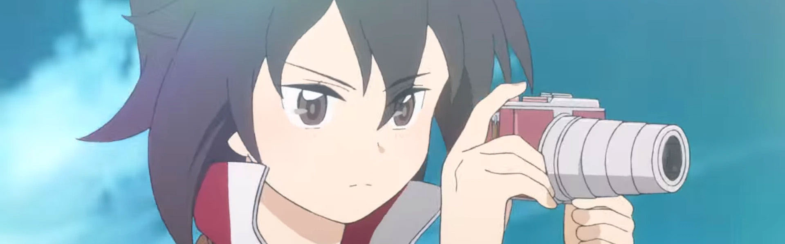

> Living in a ninja residence tucked away in a corner of a futuristic city is Rikka, the eldest daughter of a Ninja clan, who looks up to her father—a researcher—very much.&lt;br/&gt;Carrying on with her life normally, Rikka&#x27;s home came suddenly under attack one day. Driven into a corner, what would she do to overcome this crisis?
Rip darkness to pieces and become &quot;BLACK&quot;!&lt;br&gt;&lt;br&gt;

(Source: Official website)

### [Houkago Saikoro Club (After School Dice Club)](https://anilist.co/anime/104115)

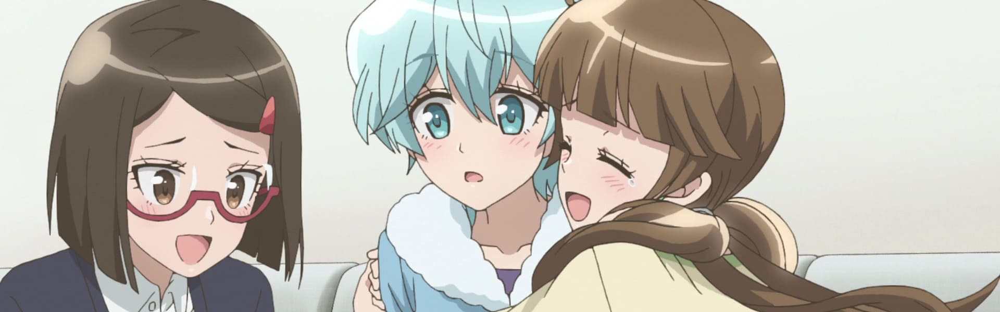

> Kyoto in Spring. Aya is a high school girl who’s just moved to a new town. Miki is her shy classmate, and her first friend. One day after school Aya and Miki follow the committee president Midori to a specialty board games store. The Dice Club. Without thinking they try out a German board game together. These girls, who are searching for fun, soon fall into the exciting world of games.&lt;br/&gt;

### [Fragtime](https://anilist.co/anime/108487)

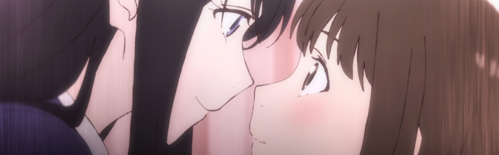

> All Misuzu Moritani has to do is think about it and, for three minutes, time seems to halt for everyone but herself. But three minutes isn&#x27;t long enough to go anywhere and come back, especially when you can only do it once a day. So, mostly Misuzu just amuses herself… until she makes the mistake of sneaking a peek up the skirt of a classmate she&#x27;s been crushing on and it turns out that Haruka Murakami is somehow immune to Misuzu&#x27;s powers! Oops. And now a really embarrassed Misuzu has to make it up to Haruka. Double oops. Even if it means getting into a &quot;relationship&quot;. Wait, what?&lt;br&gt;&lt;br/&gt;&lt;br&gt;
(Source: Sentai Filmworks)
