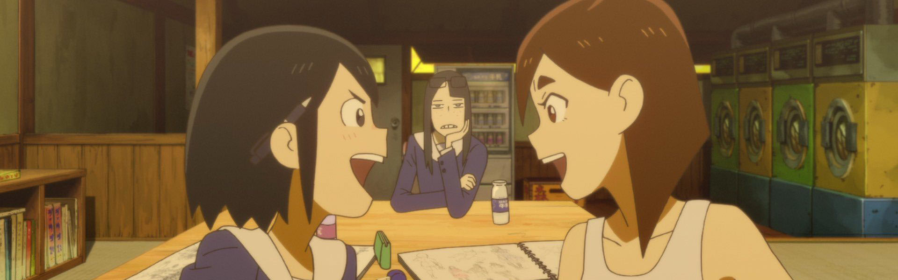

*April 3, 2021 - I didn't get to post this in real time, but wanted to have a record of my thoughts on the season.*

### [Itai no wa Iya nano de Bougyoryoku ni Kyokufuri Shitai to Omoimasu. (BOFURI: I Don't Want to Get Hurt, so I'll Max Out My Defense.)](https://anilist.co/anime/106479)

> The story centers on Kaede Honjou, who is invited by her friend Risa Shiramine to play a virtual reality MMO game with her. While Kaede doesn&#x27;t dislike games, what she really, truly dislikes is being in pain. She creates a character named Maple, and decides to put all her points in VIT to minimize pain. As a result, she moves slowly, can&#x27;t use magic, and even a rabbit can get the best of her. However, as it turns out, she acquires a skill known as &quot;Absolute Defense&quot; as a result of her pumping points into VIT, as well as a &quot;Counter Skill&quot; that works against special moves. Now, with her ability to nullify all damage, she goes on adventures.&lt;br&gt;&lt;br&gt;(Source: Anime News Network, edited)

### [Kyokou Suiri (In/Spectre)](https://anilist.co/anime/107201)

> At the young age of 11, Kotoko Iwanaga was abducted by youkai for two weeks and asked to become their &quot;God of Wisdom,&quot; a mediator between the spirit and human worlds, to which the girl quickly agreed but at the cost of her right eye and left leg. Now, six years later, whenever youkai wish for their problems to be solved, they make their way to Kotoko for consultation.&lt;br&gt;&lt;br/&gt;&lt;br&gt;
Meanwhile, Kurou Sakuragawa, a 22-year-old university student, has just broken up with his girlfriend after he fled alone when the two encountered a kappa. Seeing this as her chance to become closer with him, Kotoko immediately makes her move, hoping to get married to Kurou one day. However, she quickly realizes there is something more to Kurou. With this knowledge, she asks for his help in solving the various issues presented by the supernatural, all the while wishing her newfound partner will eventually reciprocate her feelings.

### [Eizouken ni wa Te wo Dasu na! (Keep Your Hands Off Eizouken!)](https://anilist.co/anime/109298)

> First year high schooler Midori Asakusa loves anime so much, she insists that &quot;concept is everything&quot; in animation. Though she draws a variety of ideas in her sketchbook, she hasn&#x27;t taken the first step to creating anime, insisting that she can&#x27;t do it alone. The producer-type Sayaka Kanamori is the first to notice Asakusa&#x27;s genius. Then, when it becomes clear that their classmate, charismatic fashion model Tsubame Mizusaki, really wants to be an animator, they create an animation club to realize the &quot;ultimate world&quot; that exists in their minds.&lt;br&gt;&lt;br/&gt;&lt;br&gt;
(Source: Crunchyroll)

### [ID: INVADED](https://anilist.co/anime/110350)

> Welcome to Kura, an organization that investigates crime using the Mizuhanome system which senses the drive to kill. Sakaido is a brilliant detective and pilot of the Mizuhanome. To solve a case, he enters the world of the killer&#x27;s unconscious mind: the id well. In the shadows of brutal and puzzling cases lurks John Walker, the Serial Killer Creator. Where will Sakaido&#x27;s pursuit lead?&lt;br&gt;&lt;br/&gt;&lt;br&gt;
(Source: Funimation)

### [Toaru Kagaku no Railgun T (A Certain Scientific Railgun T)](https://anilist.co/anime/104462)

> The third season of &lt;i&gt;Toaru Kagaku no Railgun&lt;/i&gt;.&lt;br&gt;&lt;/br&gt;&lt;br/&gt;
The Daihasei Festival has begun, and that of course means that Tokiwadai Middle School—a prestigious all-girls&#x27; middle school—is competing too. Despite the participation of the &quot;Ace of Tokiwadai,&quot; Mikoto Misaka, the other students who are participating are still putting their utmost effort into winning, no matter how impossible the feat may seem against her might.&lt;br&gt;&lt;/br&gt;

However, not all is fun and games. Due to the the festival, Academy City opens to the outside world, and various factions have begun plotting ways to infiltrate the city. Misaka appears to be on their radar, and as the festival proceeds, people lurking from the shadows begin to emerge...&lt;br&gt;&lt;/br&gt;

Toaru Kagaku no Railgun T brings back the Tokiwadai Ace and her friends as they dive deeper into the dark side of Academy City. From terrorist attacks to ruthless underground projects, anything is possible in this city.&lt;br&gt;&lt;/br&gt;

### [Magia Record: Mahou Shoujo Madoka☆Magica Gaiden (Magia Record: Puella Magi Madoka Magica Side Story)](https://anilist.co/anime/104051)

> In exchange for the fulfillment of a wish, Magical Girls keep fighting, unbeknownst to the rest of the world. But Iroha Tamaki can’t seem to remember her wish. A rumor begins to spread among Magical Girls. “Magical Girls can be saved if they go to Kamihama.” Kamihama City, the city where Magical Girls and Uwasa are gathering. The story of Iroha Tamaki, in search for her lost wish, begins…&lt;br&gt;&lt;br&gt;(Source: Aniplex of America)

### [Koisuru Asteroid (Asteroid in Love)](https://anilist.co/anime/108092)

> When she was little, Konohata Mira promises a boy she meets at a campsite that they can find an asteroid together. When she enters high school, she joins the astronomy club. But that year, the astronomy club happened to combine with the geology club, making it the astrogeo club?!&lt;br&gt;&lt;br/&gt;&lt;br&gt;
Won&#x27;t you find all kinds of sparkles with the astrogeo girls?&lt;br&gt;
&lt;br&gt;
(Source: Crunchyroll)

### [22/7 (nanabun no nijyuuni)](https://anilist.co/anime/99807)

> One day, Miu Takigawa suddenly receives a letter notifying her that she has been chosen as a member of a brand-new project. Half in disbelief, she heads over to the location stated on the letter. There, she finds seven other girls summoned there in the same fashion. The girls behold a giant, top-secret facility. They stand in bewilderment as they are told:&lt;br&gt;&lt;br/&gt;&lt;br&gt;
&quot;You are going to debut for a major record label as an idol group.&quot;&lt;br&gt;
&lt;br&gt;
A new kind of idol, never-before-seen, is about to be born here…&lt;br&gt;
&lt;br&gt;
(Source: Aniplex of America)

### [Oshi ga Budoukan Ittekuretara Shinu (If My Favorite Pop Idol Made It to the Budokan, I Would Die)](https://anilist.co/anime/104391)

>  Eripiyo is an extreme idol fan. She is wildly enthusiastic about Maina, the shy and lowest-ranking member of the minor underground idol group ChamJam that performs in Okayama Prefecture. Eri will continue to give her complete devotion to Maina until the day she can perform at Budokan.&lt;br&gt;&lt;br&gt;(Source: 

