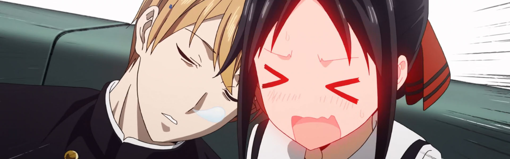
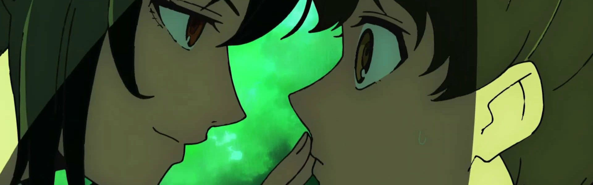
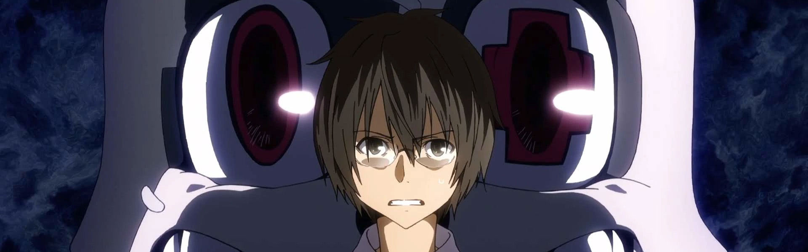
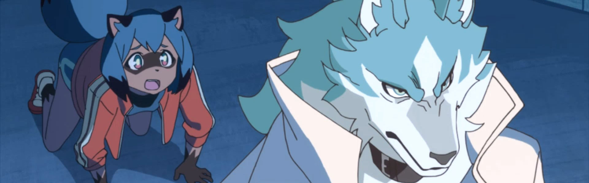
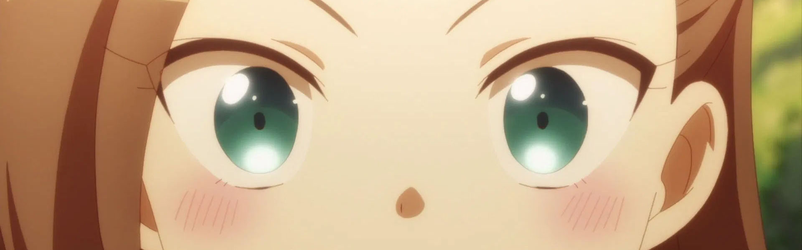
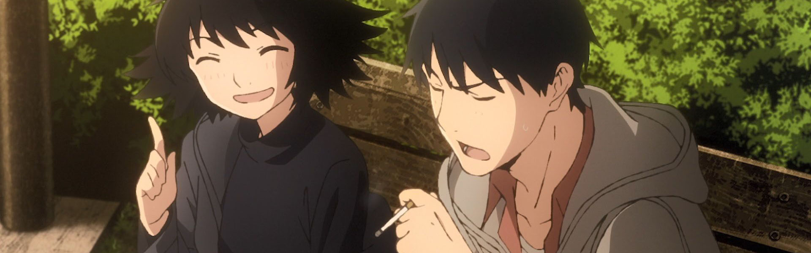
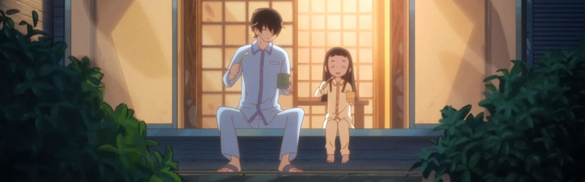
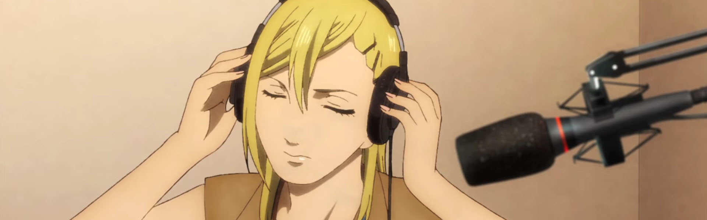
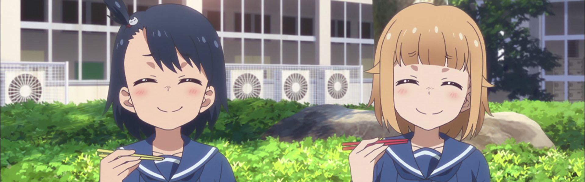
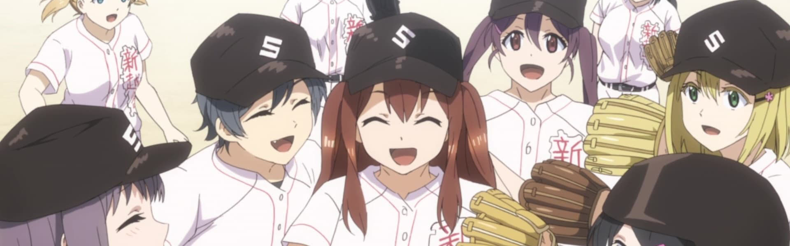

*April 3, 2021 - I didn't get to post this in real time, but wanted to have a record of my thoughts on the season.*

### [Kaguya-sama wa Kokurasetai?: Tensai-tachi no Renai Zunousen (Kaguya-sama: Love is War?)](https://anilist.co/anime/112641)

> After a slow but eventful summer vacation, Shuchiin Academy&#x27;s second term is now starting in full force. As August transitions into September, Miyuki Shirogane&#x27;s birthday looms ever closer, leaving Kaguya Shinomiya in a serious predicament as to how to celebrate it. Furthermore, the tenure of the school&#x27;s 67th student council is coming to an end. Due to the council members being in different classes, the only time Kaguya and Miyuki have to be together will soon disappear, putting all of their cunning plans at risk.&lt;br&gt;&lt;/br&gt;&lt;br/&gt;
A long and difficult election that will decide the fate of the new student council awaits, as multiple challengers fight for the coveted title of president.&lt;br&gt;&lt;/br&gt;

### [Kami no Tou: Tower of God (Tower of God)](https://anilist.co/anime/115230)

> There is a tower that summons chosen people called &quot;Regulars&quot; with the promise of granting their deepest desires. Whether it be wealth, fame, authority, or something that surpasses them all—everything awaits those who reach the top.&lt;br&gt;&lt;br/&gt;&lt;br&gt;
Twenty-Fifth Bam is a boy who had only known a dark cave, a dirty cloth, and an unreachable light his entire life. So when a girl named Rachel came to him through the light, his entire world changed. Becoming close friends with Rachel, he learned various things about the outside world from her. But when Rachel says she must leave him to climb the Tower, his world shatters around him. Vowing to follow after her no matter what it takes, he sets his sight on the tower, and a miracle occurs.&lt;br&gt;
&lt;br&gt;
Thus begins the journey of Bam, a young boy who was not chosen by the Tower but opened its gates by himself. They call his kind &quot;Irregulars&quot;—beings that have shaken the very foundation of the Tower each time they set foot inside it.

### [Gleipnir (Gleipnir)](https://anilist.co/anime/108241)

> Shuuichi Kagaya isn’t human. He has an unnatural sense of smell, and can transform into an incredibly powerful beast… of sorts. He does all he can to avoid standing out and being discovered, but no good deed goes unpunished, and his decision to use his power to save a girl spells the end for his quiet life.

### [BNA (BNA)](https://anilist.co/anime/110354)

> In the 21st century, the existence of animal-humans came to light after being hidden in the darkness of history. Michiru lived life as a normal human, until one day she suddenly turns into a tanuki-human. She runs away and takes refuge in a special city area called &quot;Anima City&quot; that was set up 10 years ago for animal-humans to be able to live as themselves. There Michiru meets Shirou, a wolf-human who hates humans. Through Shirou, Michiru starts to learn about the worries, lifestyle, and joys of the animal-humans. As Michiru and Shirou try to learn why Michiru suddenly turned into an animal-human, they unexpectedly get wrapped up in a large incident.&lt;br/&gt;&lt;br&gt;&lt;br&gt;
(Source: Anime News Network)
&lt;br&gt;&lt;br&gt;
&lt;i&gt;The TV broadcast ended on June 25, 2020.&lt;/i&gt;

### [Otome Game no Hametsu Flag shika Nai Akuyaku Reijou ni Tensei shiteshimatta… (My Next Life as a Villainess: All Routes Lead to Doom!)](https://anilist.co/anime/104647)

> Wealthy heiress Katarina Claes is hit in the head with a rock and recovers the memories of her past life. It turns out the world she lives in is the world of the game Fortune Lover, an otome game she was obsessed with in her past life... but she&#x27;s been cast as the villain character who tries to foil the protagonist&#x27;s romances! The best ending the game has for Katarina is exile, and the worst, death! She&#x27;ll have to find a way to avoid triggering the flags of doom, and make her own happy future!&lt;br&gt;&lt;br/&gt;&lt;br&gt;
(Source: Crunchyroll, edited)

### [Yesterday wo Utatte (SING &quot;YESTERDAY&quot; FOR ME)](https://anilist.co/anime/109020)

> A story of love and humanity, following four boys and girls trying to live their best lives through hardship and turmoil, in a small town on a private rail line just outside of Shinjuku. Minor misunderstandings lead to big complications, and their various feelings become entangled.&lt;br&gt;&lt;br/&gt;&lt;br&gt;
A story of daily life lived 49% looking back, 51% looking forward.&lt;br&gt;
&lt;br&gt;
(Source: Crunchyroll)

### [Kakushigoto (Kakushigoto)](https://anilist.co/anime/113311)

> Single father Kakushi Gotou has a secret. He’s a top-selling artist of popular erotic manga, but his impressionable young daughter, Hime, can never find out! Now he’s having to bend over backwards just to keep her inquisitive little mind from discovering what he does for a living. A father-daughter tale of love and laughter.&lt;br&gt;&lt;br/&gt;&lt;br&gt;
(Source: Funimation)

### [Nami yo Kiitekure (Wave, Listen to Me!)](https://anilist.co/anime/112353)

> The stage is Sapporo, Hokkaido. One night, our heroine, Minare Koda, spills her heartbroken woes to a radio station worker she meets while out drinking one night. The next day, she hears a recording of her pitiful grumbling being played live over the air. Minare storms into the station in a rage, only to then be duped by the station director into doing an impromptu talk show explaining her harsh dialogue. With just one recording, the many eccentric facets of Minare&#x27;s life begin to pull every which direction as she falls ever deeper into the world of radio.&lt;br/&gt;&lt;br&gt;&lt;br&gt;
(Source: Kodansha USA)

### [Houkago Teibou Nisshi (Diary of Our Days at the Breakwater)](https://anilist.co/anime/109019)

> Hina is an indoor-oriented girl who likes crafts and moves to a seaside town to continue with her high school education. She meets upperclassman Kuroiwa as she walks along an embankment and joins the mysterious &quot;Embankment Club.&quot; Hina dislikes sea creatures, but she fishes with her fellow club members and eats their catches. She gradually starts to appreciate the appeal of the ocean.&lt;br&gt;&lt;br&gt;(Source: Anime News Network)

### [Tamayomi (TAMAYOMI: The Baseball Girls)](https://anilist.co/anime/110130)

> In her Junior High years, the pitcher Yomi Takeda was not able to get very far in a cross-school baseball tournament. Since the catcher on her team wasn&#x27;t at her level, she couldn&#x27;t use her signature move, the &quot;Magic Throw,&quot; and eventually regretted not being able to use it. After Junior High, she decided to stop playing baseball and went to Shin Koshigaya High School, a school without a baseball club.&lt;br/&gt;&lt;br&gt;&lt;br&gt;
There, she found her long lost childhood friend, Tamaki Yamazaki, who used to play catch ball​ with her when they were kids. Tamaki also played baseball during her Junior High years as a catcher, and could even catch Yomi&#x27;s &quot;Magic Throw!&quot;
&lt;br&gt;&lt;br&gt;
Their promise with each other during their childhood could now be fulfilled! Walking together on the road of baseball once again...
&lt;br&gt;&lt;br&gt;
&lt;i&gt;The first episode pre-aired on March 8.&lt;/i&gt;
