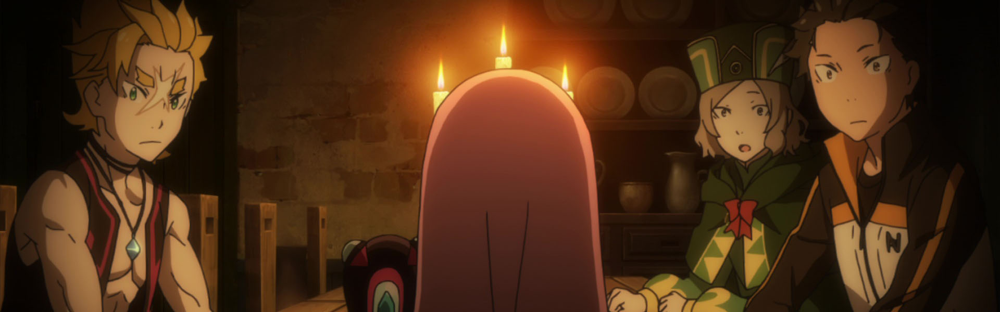
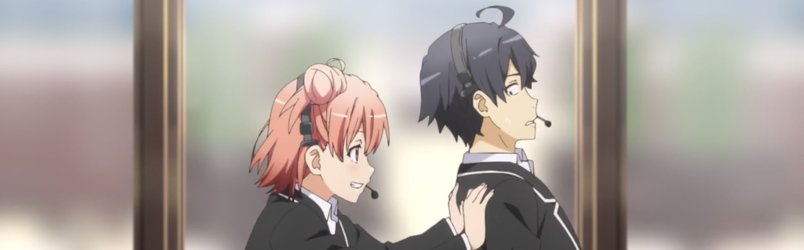
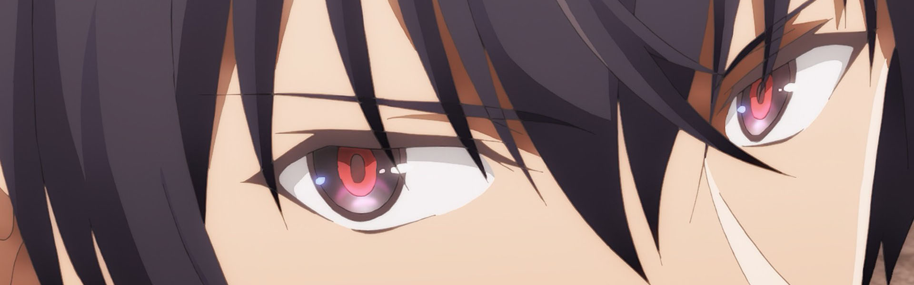
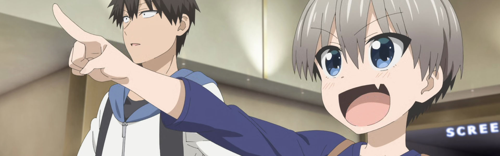
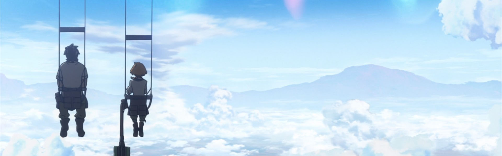
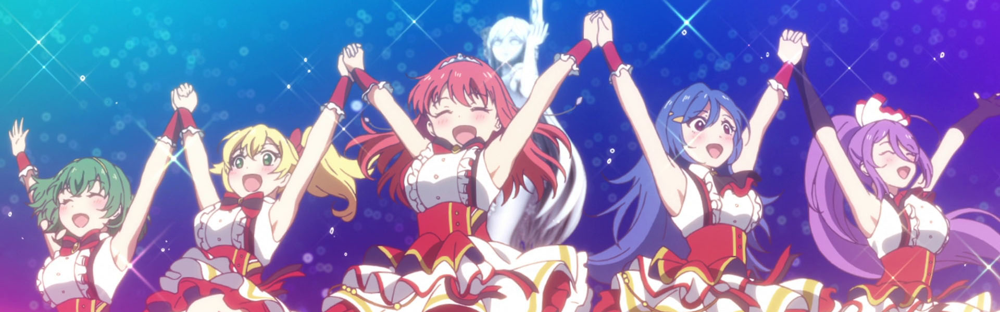

*April 3, 2021 - I didn't get to post this in real time, but wanted to have a record of my thoughts on the season.*

### [Re:Zero kara Hajimeru Isekai Seikatsu 2nd Season (Re:ZERO -Starting Life in Another World- Season 2)](https://anilist.co/anime/108632)

> The first cour of the second season of &lt;i&gt;Re:Zero kara Hajimeru Isekai Seikatsu&lt;/i&gt;.&lt;br&gt;&lt;br&gt;Even after dying countless times, Subaru finally ended the threat of the White Whale and defeated the Witch Cult&#x27;s Sin Archbishop representing sloth, Petelgeuse Romaneeconti. But only shortly after overcoming a tragic ending and reuniting with his beloved Emilia, Subaru learns that Rem has been erased from this world, having fallen victim to the White Whale&#x27;s Fog of Elimination in the midst of Subaru&#x27;s death loop. With the White Whale now gone, Subaru and Emilia are forced to confront a reality they never dreamed would happen.&lt;br&gt;&lt;br&gt;(Source: Crunchyroll)

### [Yahari Ore no Seishun Love Come wa Machigatteiru. Kan (My Teen Romantic Comedy SNAFU Climax!)](https://anilist.co/anime/108489)

> The third season of &lt;i&gt;Yahari Ore no Seishun Love Come wa Machigatteiru&lt;/i&gt;.&lt;br&gt;&lt;br/&gt;&lt;br&gt;
As the members of the Service Club band together to host a school prom, Hachiman, Yukino and Yui will have to put their feelings into words and truly learn to understand each other at long last… if the Service Club can even stay afloat, that is!&lt;br&gt;
&lt;br&gt;
(Source: Sentai Filmworks)

### [Maou Gakuin no Futekigousha: Shijou Saikyou no Maou no Shiso, Tensei shite Shison-tachi no Gakkou e Kayou (The Misfit of Demon King Academy: History’s Strongest Demon King Reincarnates and Goes to School with His Descendants)](https://anilist.co/anime/112301)

> Anos, the Demon King of Tyranny, has defeated humans, spirits, and gods alike. But even demon kings get tired of all the fighting sometimes! Hoping for a more peaceful life, Anos decides to reincarnate himself. When he wakes two thousand years later, though, he finds the world has become too peaceful--his descendants have grown weak and magic is in serious decline. Intending to reclaim his rightful place, he enrolls in Demon King Academy, where he finds that his magical power is off the charts. Literally. And because they can&#x27;t measure his power, the faculty and other students regard Anos as a misfit. With the support of Misha, the one student he manages to befriend, the misfit (Demon King) begins his climb up the demon ranks!&lt;br/&gt;&lt;br&gt;&lt;br&gt;
(Source: Square Enix Manga &amp; Books)

### [Uzaki-chan wa Asobitai! (Uzaki-chan Wants to Hang Out!)](https://anilist.co/anime/115113)

> Sakurai Shinichi’s one wish is for a little peace and quiet. But Uzaki Hana–his boisterous, well-endowed underclassman–has other plans. All she wants is to hang out and poke fun at him. With the help of her chipper charm and peppy persistence, this might just be the start of a beautiful relationship!&lt;br&gt;&lt;br/&gt;&lt;br&gt;
(Source: Seven Seas Entertainment)

### [Deca-Dence](https://anilist.co/anime/110353)

> Many years have passed since humanity was driven to the brink of extinction by the sudden emergence of the unknown life forms Gadoll. Those humans that survived now dwell in a 3000 meter-high mobile fortress Deca-dence built to protect themselves from the Gadoll threat.&lt;br&gt;&lt;br/&gt;&lt;br&gt;
Denizens of Deca-dence fall into two categories: Gears, warriors who fight the Gadoll daily, and Tankers, those without the skills to fight. One day, Natsume, a Tanker girl who dreams of becoming a Gear meets surly Kaburagi, an armor repairman of Deca-dence.&lt;br&gt;
&lt;br&gt;
This chance meeting between the seemingly two opposites, the girl with a positive attitude who never gives up on her dreams and the realist who has given up on his, will eventually shake the future course of this world.
&lt;br&gt;&lt;br&gt;
(Source: Funimation)

### [Lapis Re:LiGHTs](https://anilist.co/anime/104937)

> Tiara is setting out on her new life whether her older sister wants her to or not. Taking a coach from Bristol, she comes to Flora Girls&#x27; Academy with dreams of not only joining her old friend Rosetta, but also of entering the prestigious witch school. Much to her surprise, she&#x27;s admitted almost instantly by not-at-all-suspicious headmistress Chloe, whose one directive is that Tiara join Rosetta&#x27;s &quot;group.&quot; That&#x27;s fine by Tiara, and she&#x27;s thrilled to meet fellow group mates Lynette, Ashley, and Lavie. But there&#x27;s more going on than meets the eye, and Tiara learns the alarming truth about her admittance: all four members of her group are failing, and if they don&#x27;t pass this semester, all of them will be expelled as a group – including their newest member.&lt;br/&gt;&lt;br&gt;
&lt;br&gt;
(Source: Anime News Network)

