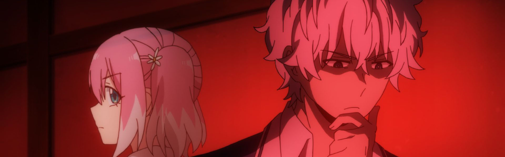

### [Jujutsu Kaisen](https://anilist.co/anime/113415)

> A boy fights... for &quot;the right death.&quot;&lt;br&gt;&lt;br/&gt;&lt;br&gt;
Hardship, regret, shame: the negative feelings that humans feel become Curses that lurk in our everyday lives. The Curses run rampant throughout the world, capable of leading people to terrible misfortune and even death. What&#x27;s more, the Curses can only be exorcised by another Curse.&lt;br&gt;
&lt;br&gt;
Itadori Yuji is a boy with tremendous physical strength, though he lives a completely ordinary high school life. One day, to save a friend who has been attacked by Curses, he eats the finger of the Double-Faced Specter, taking the Curse into his own soul. From then on, he shares one body with the Double-Faced Specter. Guided by the most powerful of sorcerers, Gojou Satoru, Itadori is admitted to the Tokyo Metropolitan Technical High School of Sorcery, an organization that fights the Curses... and thus begins the heroic tale of a boy who became a Curse to exorcise a Curse, a life from which he could never turn back.
&lt;br&gt;&lt;br&gt;
(Source: Crunchyroll)&lt;br&gt;
&lt;br&gt;
&lt;i&gt;Note: The first episode received an early web premiere on September 19th, 2020. The regular TV broadcast started on October 3rd, 2020.&lt;/i&gt;

### [Tonikaku Kawaii (TONIKAWA: Over The Moon For You)](https://anilist.co/anime/116267)

> The story follows a protagonist whose name is written with the characters for &quot;Hoshizora&quot; (&quot;Starry Sky&quot; in Japanese), but whose name is pronounced as &quot;Nasa&quot;. On the day of his high school entrance exams, Nasa encounters a beautiful girl named Tsukasa. For Nasa, it feels like destiny is finally calling out to him that he will have a girlfriend, but things take a turn for the worse when Nasa is hit by a car and unable to attend his entrance exams.&lt;br&gt;&lt;br/&gt;&lt;br&gt;
After Tsukasa helps the injured Nasa, he confesses his feelings to her, and she agrees to go out with him, but only if Nasa agrees to marry her first. A year later Nasa aces the entrance exams, but he decides to work a part time job and live by himself instead of going to school. After Nasa turns 18, Tsukasa re-appears, and their happy, romantic, and mysterious married life together begins.&lt;br&gt;
&lt;br&gt;
(Source: Crunchyroll)

### [Dungeon ni Deai wo Motomeru no wa Machigatteiru Darou ka III (Is It Wrong to Try to Pick Up Girls in a Dungeon? III)](https://anilist.co/anime/112124)

> The third season of &lt;i&gt;Dungeon ni Deai wo Motomeru no wa Machigatteiru Darou ka&lt;/i&gt;.&lt;br&gt;&lt;br/&gt;&lt;br&gt;
When Bell encounters a frightened little girl in the dungeon, he doesn’t think twice to help. But this simple act of kindness has consequences. The girl is a monster and proof that monsters can be eerily human. And not everyone can accept this...&lt;br&gt;
&lt;br&gt;
(Source: HIDIVE)

### [Akudama Drive](https://anilist.co/anime/116566)

> Many years ago, a Great Civil War ravaged Japan, leaving the country fragmented between two regions: Kansai and Kanto. In Kansai, a group of six Akudama carry out missions given to them by a mysterious black cat, while evading the police. But a dangerous journey is about to unfold when a civilian girl becomes twisted into the Akudama’s way of life and witnesses their criminal drives.&lt;br&gt;&lt;br/&gt;&lt;br&gt;
(Source: Funimation)

### [Majo no Tabitabi (Wandering Witch: The Journey of Elaina)](https://anilist.co/anime/112609)

> Inspired by her favorite book, Elaina ventures out to see the world she&#x27;s read so much about. Like a leaf on the wind, she travels from one country to another, looking to sate her inquisitiveness and searching for new experiences. She&#x27;s confronted by humanity in all its forms, whether strange, bizarre, or emotional. Exploration and curiosity drive her journey. Where to next, Elaina?&lt;br/&gt;&lt;br&gt;
&lt;br&gt;
(Source: Funimation)

### [Mahouka Koukou no Rettousei: Raihousha-hen (The Irregular at Magic High School: Visitor Arc)](https://anilist.co/anime/112300)

> The second season of &lt;i&gt;Mahouka Koukou no Rettousei&lt;/i&gt;.&lt;br&gt;&lt;br/&gt;&lt;br&gt;
Miyuki Shiba’s classmate Kitayama Shizuku is on her way to study abroad. For magicians, this is normally impossible, since allowing the genes of someone who can use magic outside their home country’s borders is tantamount to giving up national secrets. But it’s allowed to happen in one case—exchange programs.&lt;br&gt;
&lt;br&gt;
And that’s how Angelina Kudou Shields, known as Lina, has arrived in Japan from the USNA to study at First High. Around the time Lina arrived in Japan, magicians began getting attacked by a mysterious being who leaves his victims drained of blood. Will Tatsuya and Miyuki Shiba be able to discover the identity of the “Vampire”?&lt;br&gt;
&lt;br&gt;
(Source: Funimation)

### [Kamisama ni Natta Hi (The Day I Became a God)](https://anilist.co/anime/118419)

> Youta Narukami is a student focused only on his college entrance exams. During his last summer break of high school, he is approached by a girl named Hina who says she is the god of omniscience. She tells him that in thirty days, the world will end. At first Youta doesn&#x27;t believe her, but after she demonstrates supernatural predictive abilities, he becomes convinced her power is genuine. Hina, meanwhile, decides for some reason to stay at his house, and they begin a tumultuous vacation facing the end of the world together.&lt;br&gt;&lt;br/&gt;&lt;br&gt;
(Source: Anime News Network)&lt;br&gt;
&lt;br&gt;
&lt;i&gt;Note: The first episode received an early screening on October 3rd, 2020. The regular TV broadcast started on October 11th, 2020.&lt;/i&gt;

### [Munou na Nana (Talentless Nana)](https://anilist.co/anime/117343)

> It is the year 20XX. Earth has been assaulted by monsters known as &#x27;the Enemy of Humanity&#x27;. In order to deal with this threat, special schools comprised of teenagers with extraordinary abilities were formed. These people, who came to be known as &#x27;the Talented&#x27;, have abilities that defy the rules of reality. Among these superpowered individuals was an outlier, someone who was sent to one of these schools despite having no innate special abilities whatsoever. This is the story of our protagonist, who attempts to defeat the Enemies of Humanity through the use of intelligence and manipulation.&lt;br/&gt;

### [Higurashi no Naku Koro ni Gou (Higurashi: When They Cry - GOU)](https://anilist.co/anime/114446)

> New kid Keiichi Maebara is settling into his new home of peaceful Hinamizawa village. Making quick friends with the girls from his school, he&#x27;s arrived in time for the big festival of the year. But something about this isolated town seems &quot;off,&quot; and his feelings of dread continue to grow. With a gnawing fear that he&#x27;s right, what dark secrets could this small community be hiding?&lt;br/&gt;&lt;br&gt;
&lt;br&gt;
(Source: Funimation)

### [BURN THE WITCH](https://anilist.co/anime/116673)

> Historically, 72% of all the deaths in London are related to dragons, fantastical beings invisible to the majority of the people. While unknown to most, some people have been standing up to these dragons.&lt;br&gt;&lt;br/&gt;&lt;br&gt;
Only inhabitants of Reverse London who live in the hidden &quot;reverse&quot; side of London can see the dragons. Even then, only a selected few become qualified enough as witches or wizards to make direct contact with them.&lt;br&gt;
&lt;br&gt;
The protagonists of the story are witch duo Noel Niihashi and Ninny Spangcole. They are protection agents for Wing Bind (WB), an organization for dragon conservation and management. Their mission is to protect and manage the dragons within London on behalf of the people.&lt;br&gt;
&lt;br&gt;
(Source: Official Site)&lt;br&gt;&lt;/br&gt;

&lt;i&gt;Note: The show was screened in theaters and released online on the same date, the theatrical release combines all three episodes into one.&lt;/i&gt;

### [Yuukoku no Moriarty (Moriarty the Patriot)](https://anilist.co/anime/114124)

> In the late 19th century, the British Empire nobility reigns while its working class suffers at their hands. Sympathetic to their plight, William James Moriarty wants to topple it all. Frustrated by the systemic inequity, Moriarty strategizes to fix the entire nation. Not even consulting detective Sherlock Holmes can stand in his way. It&#x27;s time for crime to revolutionize the world!&lt;br&gt;&lt;br/&gt;&lt;br&gt;
(Source: Funimation)&lt;br&gt;
&lt;br&gt;
&lt;i&gt;Note: The first episode received an early screening on September 21st, 2020. The regular TV broadcast started on October 11th, 2020.&lt;/i&gt;

### [Adachi to Shimamura](https://anilist.co/anime/109287)

> Adachi spends her school days skipping class until she meets fellow delinquent Shimamura and the two become fast friends. Cutting class together deepens their friendship but soon unexpected emotions blossom.&lt;br&gt;&lt;br/&gt;&lt;br&gt;
As awkwardness and confusion settle in, the two girls travel this sea of emotions without a paddle as they learn about each other’s feelings.&lt;br&gt;
&lt;br&gt;
(Source: Funimation)

### [Kuma Kuma Kuma Bear](https://anilist.co/anime/114340)

> Yuna&#x27;s not your typical 15-year-old. First, she&#x27;s crazy rich from playing the stock market. Second, she&#x27;s a recluse obsessed with a VRMMO game, and she&#x27;s really good at that too. Her life is pretty much perfect—until she wakes up one day inside the game she loves and back at level one. She has to start over, but this time, she has a powerful bear suit that&#x27;s guaranteed to take her places!&lt;br&gt;&lt;br/&gt;&lt;br&gt;
(Source: Funimation)
&lt;br&gt;&lt;br&gt;
&lt;i&gt;Note: The first episode was streamed on Abema TV on September 19, 2020. The regular TV broadcast started on October 7, 2020.&lt;/i&gt;

### [Iwa Kakeru!: Sport Climbing Girls](https://anilist.co/anime/117757)

> The story centers around girls who compete in sport climbing, particularly climbing artificially constructed walls. First-year high school student Konomi Kasahara discovered this sport at Hanamiya Girls&#x27; High School after training her mind with puzzle games during junior high school.&lt;br&gt;&lt;br/&gt;&lt;br&gt;
(Source: Anime News Network)

### [Assault Lily: BOUQUET](https://anilist.co/anime/112479)

> An anime project based off of the Assault Lily doll series.&lt;br&gt;&lt;br&gt;On Earth in the near future, humanity faced imminent destruction from mysterious giant creatures known as &quot;Huge.&quot; The entire world unites against the Huge, and successfully develops weaponry known as &quot;CHARM&quot; (Counter Huge Arms) by combining science and magic. CHARM exhibits high rates of synchronization with teenaged girls, and the girls who use CHARM are viewed as heroes called &quot;Lilies.&quot; Throughout the world, &quot;Garden&quot; military academies are established to train Lilies to face the Huge and to serve as bases to protect and guide people. This is a story about fighting girls who aim to become Lilies at one such Garden.&lt;br&gt;&lt;br/&gt;&lt;br&gt;
(Source: Anime News Network)

### [Love Live! Nijigasaki Gakuen School Idol Doukoukai (Love Live! Nijigasaki High School Idol Club)](https://anilist.co/anime/113970)

> Nijigasaki High School is known for their diverse subjects and the freedom they give to students. Second-year student Yuu Takasaki has been turned on to the charms of school idols, so she knocks on the door of the School Idol Club with her friend, Ayumu Uehara. Sometimes friends, sometimes rivals, the members of this club each contribute their own thoughts and motivations to the group.&lt;br&gt;&lt;br/&gt;&lt;br&gt;
(Source: Funimation)

### [Senyoku no Sigrdrifa (Warlords of Sigrdrifa)](https://anilist.co/anime/116173)

> When the Pillars suddenly appear on Earth, threatening all life, it&#x27;s only the act of the god Odin that offers humanity salvation. Providing a means of fighting back, he gives Earth the Valkyries, young female pilots with supernatural powers and spirit fighter planes. These skilled troublemakers, all young, risk their lives in a long-running war—but the final battle is fast approaching!&lt;br/&gt;&lt;br&gt;&lt;br&gt;
(Source: Funimation)&lt;br&gt;
&lt;br&gt;
&lt;i&gt;Note: The first episode aired with a runtime of ~48 minutes.&lt;/i&gt;
