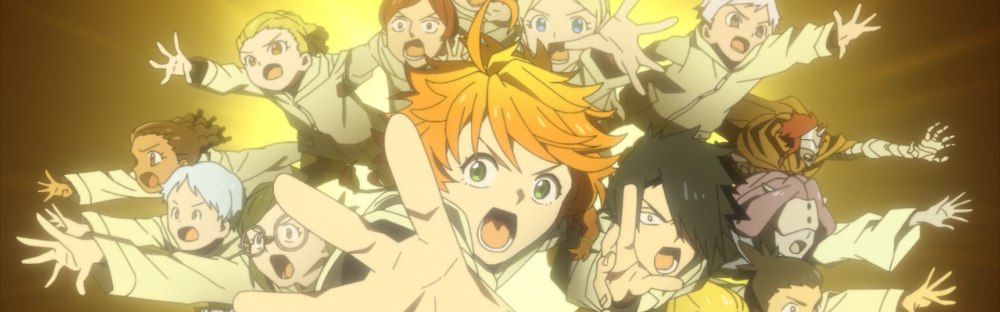
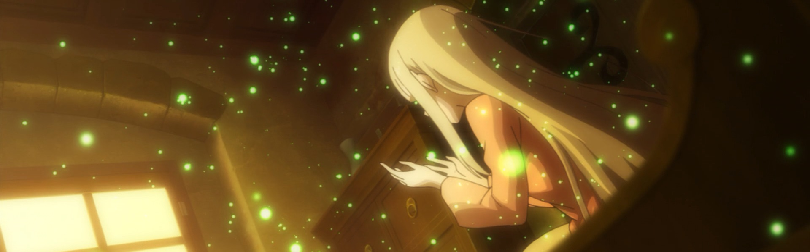
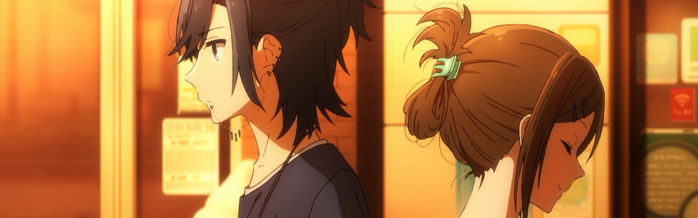
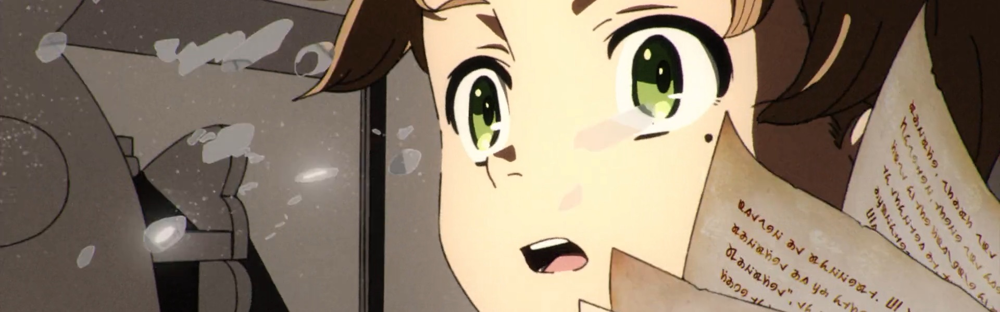
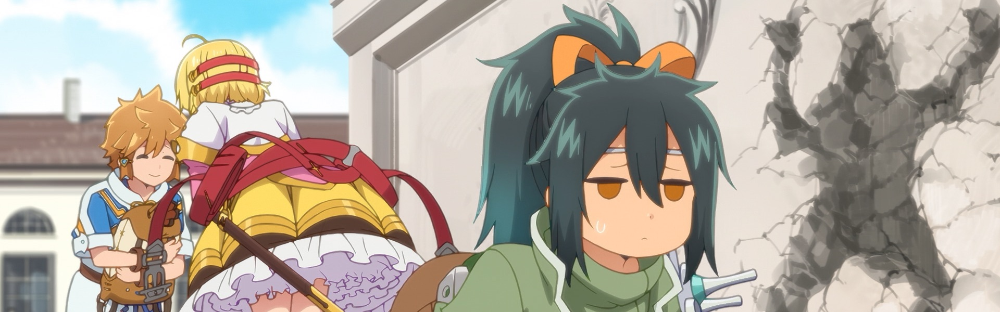
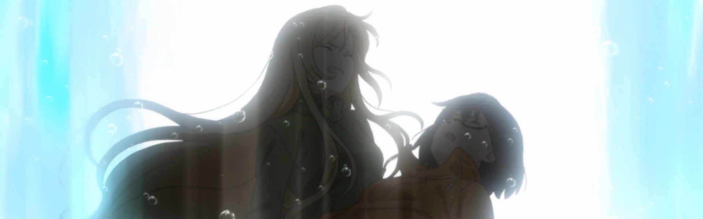
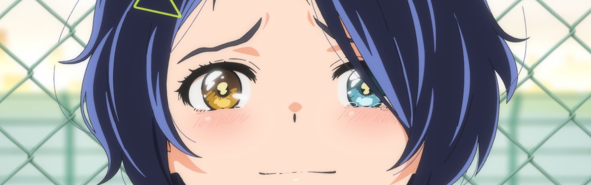
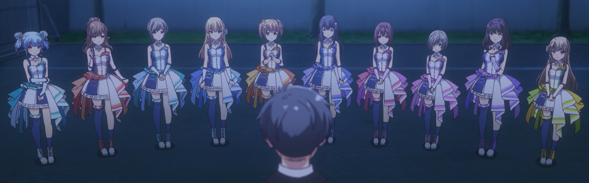
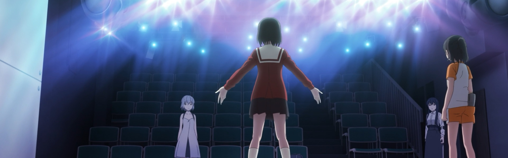

After taking a hiatus for 2020 (*woof*) wanted to get back to writing about the shows I'm going to be following (or try to follow) this season. 

*Update: So much for that line of thinking...*

Winter 2021 is definitely the season of sequels, though I'm still not caught up with [*Attack on Titan*](https://anilist.co/anime/110277/Shingeki-no-Kyojin-The-Final-Season/) and [*Beastars 2*](https://anilist.co/anime/114194/BEASTARS-2/) will be in Netflix Jail for a while. I will probably watch [*Slime*](https://anilist.co/anime/108511/Tensei-Shitara-Slime-Datta-Ken-2nd-Season/) and [*Quintuplets*](https://anilist.co/anime/109261/5Toubun-no-Hanayome-/) but they are not quite a must watches for me.

### [Yakusoku no Neverland 2](https://anilist.co/anime/108725)

Wow, I wasn't expecting this...

No, I'm not referring to any unexpected plot twist (or maybe I am...).  It seems that a very popular arc of the manga is being skipped by the anime and has everyone up in arms. I haven't yet had the chance to do my season one catch up with the manga, but suddenly I'm feeling more pressure to.

It's usually (if not always) the case that an anime adaptation will **adapt** it's source material, and that usually means there are some things that don't make it in. It's why I usually watch an anime first and then read the source material (if I haven't already been following the manga).

Definitely not giving up on it, but definitely curious to find out what arc they ended up skipping.

### [Re:Zero kara Hajimeru Isekai Seikatsu 2nd Season Part 2](https://anilist.co/anime/119661)

More backstory! And the heavy hits keep on coming. Bring on the rollercoaster!

### [Horimiya](https://anilist.co/anime/124080)

Huge fan of the manga and I definitely had a *squeeeee* moment when I saw it was getting an anime adaptation. So far it doesn't disappoint (though again, it's worth treating the anime and manga almost as separate (but related) stories).  Pick up the manga when the show is done. You won't be disappointed.

### [Mushoku Tensei: Isekai Ittara Honki Dasu](https://anilist.co/anime/108465)

I find this one hard to recommend, but I can't deny it's *really* good. There is a level of base perversion that will definitely turn off a lot of people, and there is a constant worry in my mind while that they will at some point cross a line that is just unacceptable.

However, if you can handle that, the art on display and the world building is absolutely top notch. Apparently, the original light novel is really the isekai progenitor -- I'm actually interested to check out how the manga adapted the story.  A second cour has already been announced, so as long as they manage to only approach the line and not cross it, this show has a chance to be really great.

### [Yuru Camp△ SEASON 2](https://anilist.co/anime/104459)

Oh my heart! Where have you been? It's been *so* long!

I have to say, with this season having so many **heavy** shows, I *really* need *Yuru Camp* to relax to. Mandatory watching whenever a new episode drops.

### [Tatoeba Last Dungeon Mae no Mura no Shounen ga Joban no Machi de Kurasu Youna Monogatari](https://anilist.co/anime/112649)

Fun with a humorous hook, but the definite potential to get old fast. Of all the shows this season, this is probably the first that gets put on hold if I'm being realistic.

### [Ura Sekai Picnic](https://anilist.co/anime/116287)

Yuri with a touch of horror or horror with a touch of yuri? Fingers crossed it's the former and not the latter.

So far I like the characters and can excuse the not-so-good CG. I also enjoy that these aren't high school students. More stories need to be told centered around university. Incorporating the maturity of that respective age group really helps in character development (or at least I enjoy it more).

### [Wonder Egg Priority](https://anilist.co/anime/124845)

I'm going to call it now, this show is quite possibly anime of the year. That being said... **TRIGGER WARNING!!** This show deals with situations and themes that may be too much for many. Take care when watching.

But if you can, *please* watch this show. The level of craft on display here is breathtaking.

### [IDOLY PRIDE](https://anilist.co/anime/113814)

I'm not sure why most idol shows feel the need to pack their cast. It really is too many characters to give any shred of development to. Given the additional focus on the Manager for this series, that development is probably going to be spread even thinner than usual. I'm going to give it a few more episodes, but this also might be destined for the *hold* or *dropped* list.

### [Gekidol](https://anilist.co/anime/124131)

Despite the title, this isn't your traditional idol show. I'm not exactly sure what it is, but early on it's hooked me sufficiently that I'm going to stick around to find out.

There is an OVA (*Alice in Deadly School*) which seems to be a "sidecar" story to this main series.  I haven't watched it yet and I can't tell if it is supposed to be viewed before or after the main series.  Just something to keep in mind.

