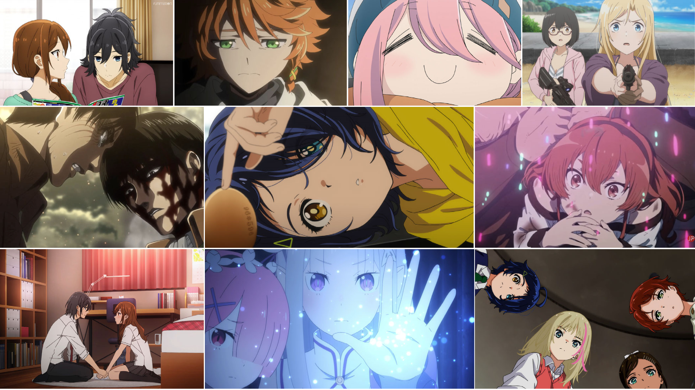

Been a while since I've used this format.  I had *thoughts* for Winter 2021 so I figured I'd revive the format (slightly modified):

## Wonder Egg Priority

Despite what seemed like a torturous production process from the outside, this show is the most ambitious anime I've ever seen. The twelve episode run doesn't quite conclude the story, but thankfully instead of wrapping or rushing a thirteenth episode, they will have a chance to finish it properly with an OVA in June.

While it might be premature to declare anime of the year this early, I'm all in on *WEP*. It will take a monumental show to dislodge it from the top spot this year.

I need to reiterate my **TRIGGER WARNING** from my earlier post -- This show deals with a lot of very fucked up shit (suicide, bullying, child abuse, rape, transphobia... and that's far from exhaustive). If you are *able* to watch in spite of the triggers, I *highly* recommend giving *WEP* a try.

## Re:Zero Season 2

*That* my friends is how you wrap a two cour season. It says something that *Re:Zero* can command a 30 minute weekly runtime (often forgoing the OP & ED).

I hope Season 3 is right around the corner, though I'm not sure where the adaptation is in terms of the source material.

## Attack on Titan

In prep for the story finally wrapping up, I binged Season 3 and was ready to dive into Season 4 only to find out that there is one more cour coming in *Winter 2022*!

*sigh*

Season 3 was great (and I'm really glad I binged it... anyone that can deal with the week-to-week cliff hangers of *Titan* deserves a metal). I need to decide when I want to make my way through the first cour of Season 4 -- probably the end of this year right before the second half begins.

## Promised Neverland 2

I can't think of a sequel that screwed up the good will earned by the first season as badly as *TPN 2*. When the uproar first started, I put the anime on pause and went back to the manga to try to understand what everyone was saying.

The anime adaptation decided to skip over an entire arc (Goldy Pond) which I can logically understand on the surface; Goldy Pond is the epitome of a narrative cul de sac arc if there ever was one. Having said that, the decision was wrong and the entire fandom knew it. The only explanation I can think to justify the decision was they were only given three 12-episode cours to cover the entire story.  Combined with COVID delays in 2020, I can sympathize with the production troubles, but I lament what could have been a thrilling and blistering adaptation.

I haven't finished the anime yet -- Seeing what was happening, I committed to finishing the story through the manga (there are two more volumes left to get an English translation). The manga is spectacular and at this point is the superior way to experience *TPN*.

## Horimiya

I think I'm just so happy the manga finally received an adaptation that I'm willing to forgive its faults.  Outside the main leads, there is a large ensemble cast that the manga has time to explore, whereas the anime feels rushed trying to give everyone their little moments.

The manga just finished in Japan, so as soon as the last few volumes get translated I will definitely be devouring the rest of the story there.

## Mushoku Tensei

I have complicated thoughts on this show. On the one hand it absolutely embraces a line they shouldn't cross (and many would legitimately say they crossed it in episode 8). On the other hand, it managed to do it in such a way where you are supposed to hate the protagonist -- he is not a blank-wish-fulfillment-stand-in-for-the-audience character.

The world building here is top notch and the art and animation are breathtaking (especially when you realize it's from a brand new studio). Without those elements, I'm sure I would have dropped the show.

I won't go out of my way to recommend this show. There are far too many legitimate issues around a 34-year-old in a 10-year-old body on display here. That being said, I am looking forward to the second cour in a few months.

## Yuru Camp△ 2

My weekly shot of serotonin is going away and I'm very sad about that.

*Yuru Camp* is the pinnacle of feel-good slice-of-life anime and something I desperately needed in my life as we came up to the 1 year anniversary of the start of the COVID pandemic.

## Ura Sekai Picnic (Otherside Picnic)

I said at the start I hoped this show was going to be more yuri than horror/thriller -- turns out it was really neither. The story and pacing were were incredibly choppy and I couldn't tell if that was in the spirit of the source material or just a bad adaptation. Horror is really hard to do well in anime and the bad CG certainly didn't help. As far as yuri elements, we didn't get anything more than wistful looks and embarrassing blushes.

# Favorite OPs

<iframe width="560" height="315" src="https://www.youtube.com/embed/lUmLhQBGtYw" title="YouTube video player" frameborder="0" allow="accelerometer; autoplay; clipboard-write; encrypted-media; gyroscope; picture-in-picture" allowfullscreen></iframe>

<iframe width="560" height="315" src="https://www.youtube.com/embed/Rh22_9aEQV4" title="YouTube video player" frameborder="0" allow="accelerometer; autoplay; clipboard-write; encrypted-media; gyroscope; picture-in-picture" allowfullscreen></iframe>

<iframe width="560" height="315" src="https://www.youtube.com/embed/tVdgHnK71MY" title="YouTube video player" frameborder="0" allow="accelerometer; autoplay; clipboard-write; encrypted-media; gyroscope; picture-in-picture" allowfullscreen></iframe>

