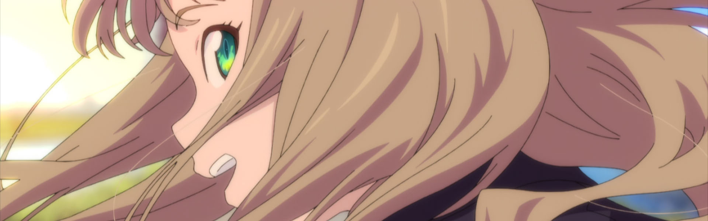

And here I thought Winter 2021 was a packed season. It seems like all the pent up production from the pandemic is going to overwhelm us this season as well.

### [Fumetsu no Anata e (To Your Eternity)](https://anilist.co/anime/114535)

From the mangaka that gave us [Koe no Katachi (A Silent Voice)](https://anilist.co/manga/85135/Koe-no-Katachi/) (one of my favorite manga of all time with a fantastic [film](https://anilist.co/anime/20954/Koe-no-Katachi/) adaption) comes a story a bit more out of this world but with a lot of the same emotional gut punches. This was my most anticipated show of the season and the opening episode didn't disappoint. I'm not caught up on the manga and it's been long enough since I read the first few volumes that I believe most of this season will be full of great surprises.

### [Ijiranaide, Nagatoro-san (Don't Toy With Me, Miss Nagatoro)](https://anilist.co/anime/120697)

As an adaption of the manga, the first episode was really good -- the expressions of Nagatoro are really epic and I can see them supplying a lot of memes this season. That being said, I'm not sure I'll stick around for the entire season. The issue I have with this sort of story is there rarely is any room for development -- essentially replaying the same joke over and over. [Uzaki-chan](https://anilist.co/anime/115113/Uzakichan-wa-Asobitai/) from a few seasons ago had the same issue (and there are a lot of similarities *senpai*). 

### [Tokyo Revengers](https://anilist.co/anime/120120)

Delinquents meets [Erased](https://anilist.co/anime/21234/Boku-dake-ga-Inai-Machi/). The first episode doesn't give us enough of the time travel ground rules to figure out what kind of show it will be, but my interest is definitely piqued. I do have to ask however -- why middle school? It's going to be a bit hard to take it seriously if they really dive hard into the delinquent angle.  

### [Hige wo Soru. Soshite Joshikousei wo Hirou. (Higehiro: After Being Rejected, I Shaved and Took in a High School Runaway)](https://anilist.co/anime/114232)

On the outset, I worry that this is another "weird but seemingly wholesome" on the outside but then goes into *must drop now* [Usagi Drop](https://anilist.co/anime/10162/Usagi-Drop/) territory.  However, looking around at posts from manga readers, it looks like it remains "wholesome" just with some drama thrown in. Hopefully that remains true (can never be 100% sure but I think I will give it chance).

### [Zombie Land Saga: Revenge](https://anilist.co/anime/110733)

The [first season](https://anilist.co/anime/103871/Zombie-Land-Saga/) was my gateway drug into the world of idol shows. I love the music and idol zombies was a fantastic twist on the genre. I was really looking forward to *Revenge* when it was announced.  Would we get the backstories we missed in the first season?

Unfortunately, the first episode left me with a very lackluster impression. I don't know if it was the focus on the manager, but I was just so-so on this episode from start to finish. Hopefully the music hooks me like the first season and there is more focus on the girls' backstories going forward.

*Update* -- Episode 2 was much better than the first, so I'm relieved about that. Unfortunately I'm mentally comparing the songs this season with my favorites from the first, which is definitely not fair. I'll need to calibrate that better.

### [Slime Taoshite 300-nen, Shiranai Uchi ni Level Max ni Nattemashita (I've Been Killing Slimes for 300 Years and Maxed Out My Level)](https://anilist.co/anime/112608)

This is a repackaged [Kuma Kuma Kuma Bear](https://anilist.co/anime/114340/Kuma-Kuma-Kuma-Bear/) and I'm perfectly OK with that (to be fair, I'm not sure which came first but not sure it really matters). OP protagonist isekai is nothing new, so if you're tired of the premise you won't find anything original here. This one will just be a guilty pleasure for me this season.

### [86: Eighty Six](https://anilist.co/anime/116589)

I didn't know anything going into the show and when the first episode ended I *really* wanted to binge the next episode. I'll be curious how hard of a wall there is between the "86" and the rest of the world and I do hope they sprinkle in some world building to let us understand how the world got to such a state.

### [NOMAD: Megalo Box 2](https://anilist.co/anime/113359)

Despite not being a huge boxing fan (let alone anime boxing fan), I loved the aesthetic of the first [Megalobox](https://anilist.co/anime/100298/Megalo-Box/) season. This season's opening has that "fighter down in the depths" vibe dialed to 11. *Nomad* is a fitting description of where we restart the story of "Gearless" Joe -- wandering between underground fights, a crippling pain-killer addiction -- he is obviously at rock bottom.

Where the first season had a dystopian urban setting, the sequel drops us in a wasteland evoking plenty of "old west," immigrant feelings and imagery.

Instead of following weekly, I'll probably binge every three episodes or so.

### [Shadows House](https://anilist.co/anime/125038)

I can't tell from the first episode how hard they are going to explore the horror aspects (all we've seen so far is a light slice-of-life with some darker overtones). I think there is some potential in the horror premise if they go there.

### [Jouran: THE PRINCESS OF SNOW AND BLOOD](https://anilist.co/anime/129664)

I'm really digging the dark vibe. The characters make their marks early, and I hope the production team is given the time and budget to see it through (too early to tell if the transformation scene reuse was a shortcut or foreshadowing). The shocking use of a hair comb in the first few minutes really sets the tone.

### [Subarashiki Kono Sekai: The Animation (The World Ends With You: The Animation)](https://anilist.co/anime/120376)

For a CG anime, this was surprisingly well done. However, I haven't yet played the game, so I'm going to put this show on hold until I can. My fear is that the adaption will encounter the same pitfalls that afflict *Persona* adaptions -- too much to fit well in an abbreviated narrative.

### [SSSS.DYNAZENON](https://anilist.co/anime/113950)

Trigger is back with a spiritual successor [SSSS.GRIDMAN](https://anilist.co/anime/99424/SSSSGRIDMAN/).  It's not a sequel so you don't need to see *Gridman* first (at least from what I understand you don't), but I would still recommend checking it out if you haven't.  You don't need to be a huge fan of Kaiju shows to enjoy these homages to the genre. I personally love the Trigger character designs and can't wait to see what "...in space!" twists await us.

There is a fantastic wrinkle in the second episode -- the main theme is playing during a kaiju battle and whenever the camera pulls in to the characters inside the mech, it sounds like the song is coming from the outside! It's a brilliant twist if the music turns out to be diegetic in this world.

### [Vivy: Fluorite Eye’s Song (Vivy -Fluorite Eye's Song-)](https://anilist.co/anime/128546)

Wow! This one came out swinging for the fences! Don't sleep on this one.

An anime original from good studio pedigree, give the first two episodes a chance without spoiling yourself if you can. Based on early hype, this one might be the show of the season if they can execute well. I do have one point of concern which is the radical jumps in pacing in the last minute of each episode. I don't know if it will continue or not, but it left me unsettled and disoriented rather than the high of a cliff hanger ending.

That being said, I absolutely love Diva's character design! *So great!*

### [Mashiro no Oto (Those Snow White Notes)](https://anilist.co/anime/122348)

This show is *really* over the top ("I'm intoxicated... by the lights...", "My sound is no longer here") but the shamisen playing (and even the animation of it) is spectacular!  Even if it's just showcasing the unique instrument, I think I'll keep coming back to this one.

### [Sayonara Watashi no Cramer (Farewell, My Dear Cramer)](https://anilist.co/anime/123494)

From the creator of [Shigatsu wa Kimi no Uso (Your Lie in April)](https://anilist.co/anime/20665/Shigatsu-wa-Kimi-no-Uso/) comes a soccer anime! I think I've read the first volume of the manga so I'm a little familiar with the characters, but both the manga and the anime share the same disorienting character introductions, so if you struggle with that, you're not alone.

I'm not going to lie (*no pun intended I swear*) -- the character designs invoked a deep visceral reaction from me (it's the eyes... the eye's will haunt me forever!)

### [Super Cub](https://anilist.co/anime/113418)

Another slow paced slice-of-life show and I'm absolutely not complaining. Take a simple premise (lonely girl deciding to make a change in her life by buying a scooter) and tell a story around what that experience brings. Unfortunately this won't be able to take the place of [Yuru Camp](https://anilist.co/anime/98444/Yuru-Camp/) every week, but there are enough similarities from the outset that I think I'll enjoy this one.

### [Dragon, Ie wo Kau. (Dragon Goes House-Hunting)](https://anilist.co/anime/112376)

This one had a few chuckle moments and there seems to be lots of room for gags and in-jokes. The first episode only gave us a brief character introduction, so I'll be curious to see where the show goes through the season. Though if I'm completely honest this feels like one that I will skip each week.

### [Yakunara Mug Cup Mo (Let's Make a Mug Too)](https://anilist.co/anime/122148)

Essentially a travel brochure in the form of cute-girls-doing-things. As anime shorts go, it's a light time investment for a "comfy" show.

### [BLUE REFLECTION RAY](https://anilist.co/anime/129814)

I'm not sure what I was expecting, but this wasn't it. A two cour show (!) with heavy [Madoka Magica](https://anilist.co/anime/9756/Mahou-Shoujo-MadokaMagica/) crossed with [Yuki Yuna](https://anilist.co/anime/20800/Yuuki-Yuuna-wa-Yuusha-de-Aru/) vibes on what appears to be a shoestring budget. There wasn't a lot revealed in the opening episode and there was no investment in getting to know the characters (I can guess at the two main protagonists from the OP/ED but it's not tremendously obvious).

I can't help but think that this may have been better turning the 24-episode budget into a 12-episode show. We'll see if they can get me invested over the next few episodes, but at this point I have my reservations.

