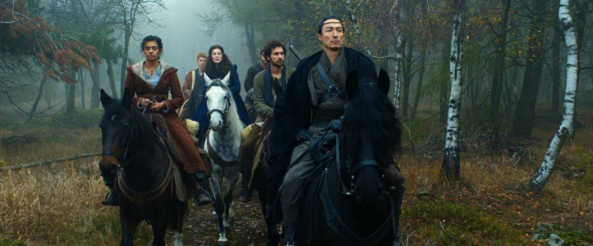

Let's get a few brief thoughts out of the way (these are quick initial impressions based on the first three episodes)

## Color Grading
The color grading in the trailer was really bad. It looked like something you would see out of an early 2000's SyFy fantasy series. Times have changed and when you are inevitably going to be compared to *The Witcher*, you need to put in the work on the look and feel.

I thought the color in the first three episodes was "acceptable" -- nothing that would blow your socks off, but no longer distracting.

## Sets
The sets, location, CG combination look cheap. The ground in almost every location looks immaculate (very much a sound stage look and feel). I never got that feeling when watching the *The Witcher*, but if this production is *actually* looking to cover the breath of the series, they need to spread the money out as thinly as possible. I think the improved color grading choices helped this a bit (when compared to the trailer).

## Magic
It's not what I imagined and seems very slow. Reading the books, I never got the impression that the One Power was slow -- this seems very much a stylistic choice but one that I'm definitely *meh* on.  Also the director seems hung up on the "back arch" while doing it 🙄

## Cast

For the most part I think they did well with the casting. They nailed Lan and Matt and I think the rest could grow on me.

## Adaptation Tweaks
There is a big one with Perrin that I haven't read the justification for yet but I assume the reaction wasn't great (it was genuinely distracting, in my opinion). I'm going to count it a blessing that I haven't read *The Eye of the World* in close to 20 years -- I'm not going to be constantly comparing it to the source material.

## Overall
They did well enough to draw me in. I had forgotten how quickly the party was separated in the first book, so we'll have to see how the showrunners deal with the multiple story lines (that's a big deal throughout the series).
