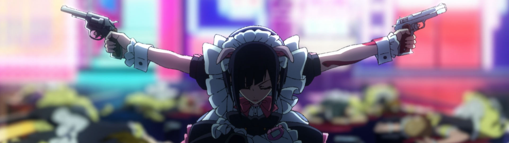

A little late this time around... Not like there is anything else going on presently that has been completely distracting.

Anyway, let us get to some anime content...

### [Cyberpunk: Edgerunners](https://anilist.co/anime/120377)

With the botched release of *Cyberpunk: 2077*, I've been holding off on the game until [CD Projekt Red](https://www.cdprojektred.com/en/) had a chance to fix up the game. I didn't pick up *The Witcher 3* until all the expansions were released, and the game was really polished. The anime changed my mind (and it's the second reason I'm a bit behind with this post 😉)

*Trigger* went **ALL** out with this production and I love every bit of it. You don't need any context from the game to enjoy the show.

### [Chainsaw Man (Chainsaw Man)](https://anilist.co/anime/127230)

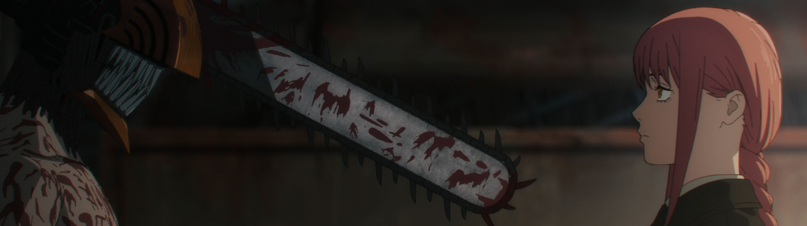

I'm not sure if I completely understand why this property is so beloved, but I'm at least happy for all the fans -- this looks like a top-notch MAPPA adaption.

The show is incredibly juvenile -- it is not [Jujutsu Kaisen](https://anilist.co/anime/113415/Jujutsu-Kaisen/) -- but if you go into it with appropriate expectations, I think there is enjoyment to be found.

### [SPY×FAMILY Part 2 (SPY x FAMILY Cour 2)](https://anilist.co/anime/142838)

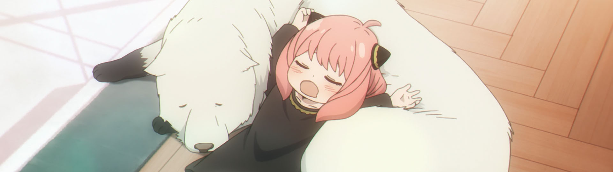

The return of everyone's favorite family! I fully expect more entertaining hijinx, and I'm here for all of it.

Not that there is any competition (that I know of) but we at least have `Best Dog` lined up.

### [Mob Psycho 100 III (Mob Psycho 100 III)](https://anilist.co/anime/140439)

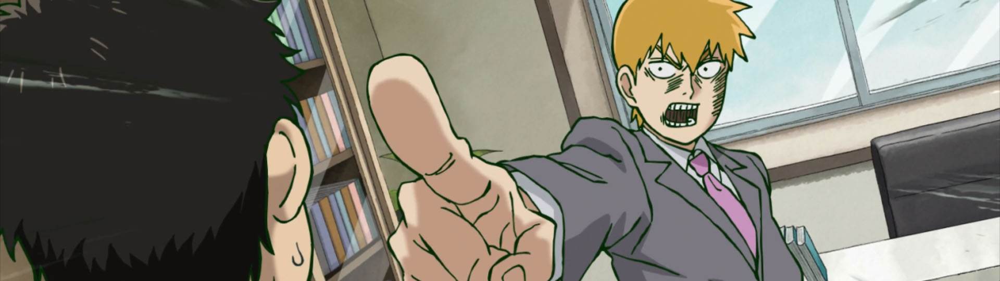

MOB requires no introduction.  Come for the great characters and animation. Stay for the feels.

### [Uzaki-chan wa Asobitai! ω (Uzaki-chan Wants to Hang Out! Season 2)](https://anilist.co/anime/124395)

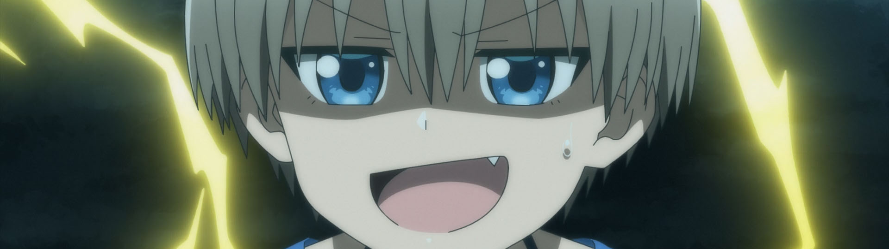

The first season was solidly in "OK" territory, so I'll be casually following this second season. If it's just more of the same gags however, I'll probably trail off.

### [Bocchi the Rock! (BOCCHI THE ROCK!)](https://anilist.co/anime/130003)

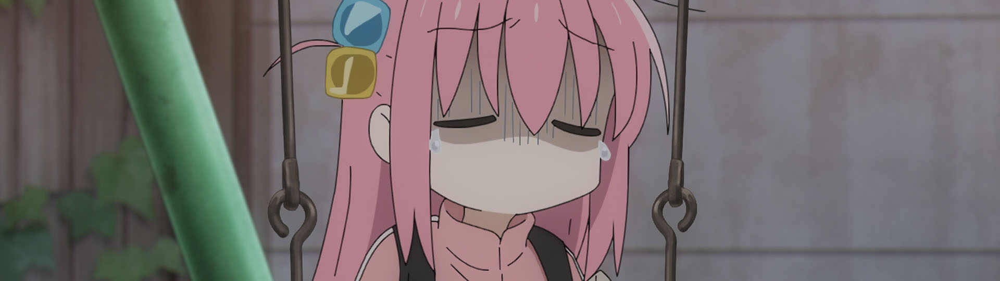

`I feel seen` the animation...

There is so much to like about this show -- I can't recommend it highly enough. The animation is spectacular, the reality breaking trips through Bocchi's headspace are hilarious, and the voice acting is spot on.

### [Do It Yourself!! (Do It Yourself!!)](https://anilist.co/anime/131516)

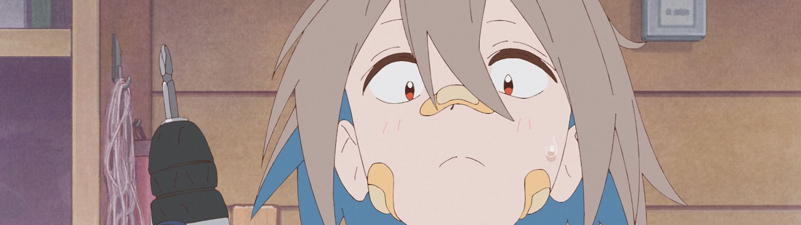

My [Yuru Camp](https://anilist.co/anime/98444) of the season.  I love the expressive character designs and animation. The broken english is a little bit distracting if I'm being honest, but I'm definitely not going to let that detract from my pure enjoyment of this show.

In general, I've been a fan of [Pine Jam's](https://anilist.co/studio/6103) previous shows, and this one will certainly continue that trend.

### [Akiba Meido Sensou (Akiba Maid War)](https://anilist.co/anime/151379)

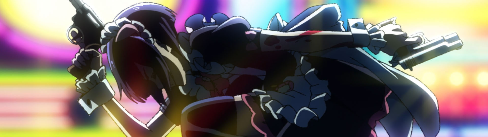

With all the hard hitting shows of this season, this one might unfortunately fly under a lot of people's radar -- It has AOTS potential! Don't sleep on this one.

Go into it cold.  Don't read up on it. Enjoy the ride in all its glory!

### [Kidou Senshi Gundam: Suisei no Majo (Mobile Suit Gundam: The Witch from Mercury)](https://anilist.co/anime/139274)

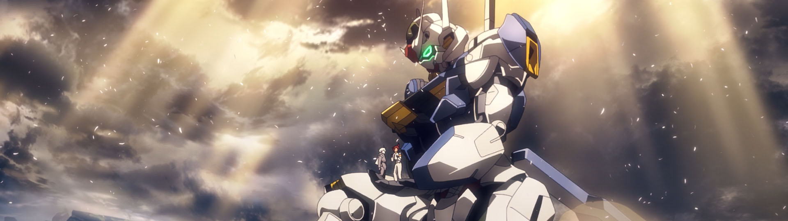

The show I didn't have on my radar whatsoever -- but I'm absolutely not saying no to yuri + robots!

Having never watched any of the previous gundam shows, I can't say how this one compares, but I'm throughly enjoying it so far.  The giant robots seem more like the backdrop to the narrative rather than the objective, so count me in to what will hopefully be a good yuri-space-robot-romance.

### [Koukyuu no Karasu (Raven of the Inner Palace)](https://anilist.co/anime/142701)

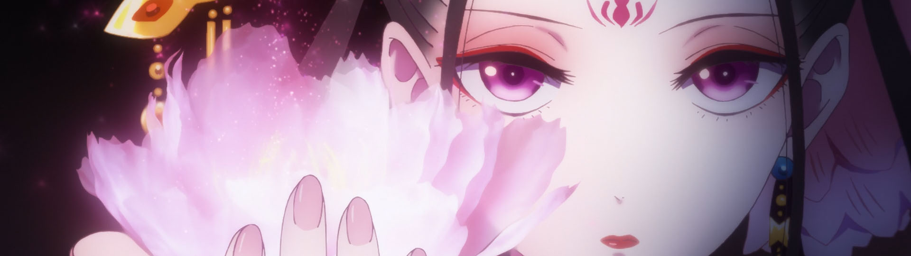

As far as historical dramas go, this one has been excellent. I'm not positive it will retain my interest, but I've enjoyed the first few episodes.

### [Yama no Susume: Next Summit (Encouragement of Climb: Next Summit)](https://anilist.co/anime/131182)

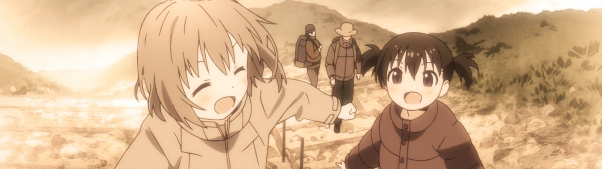

I was hoping for something closer to [Yuru Camp](https://anilist.co/anime/98444), but unfortunately the rushed opening episode was definitely a let-down from those expectations. Instead of introducing each of the girls in their own episode, *everything* is crammed into the first half of episode 1, inducing whiplash as characters are suddenly friends after a single line of dialog.

I'll give the next few episodes a shot, but my expectations were definitely too high for this one.

