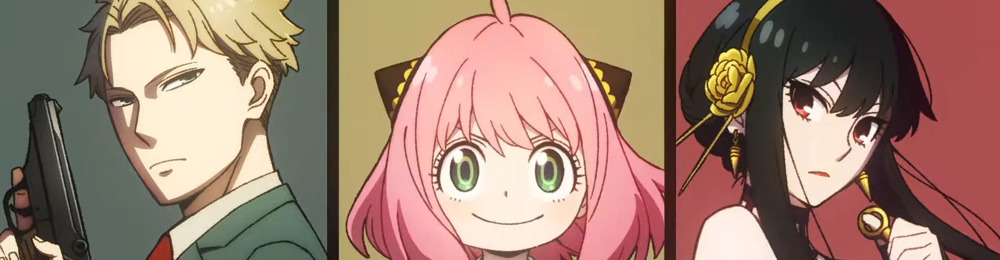
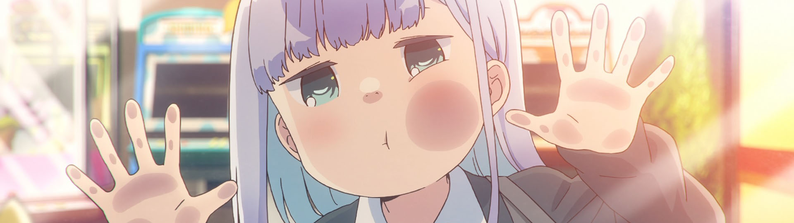
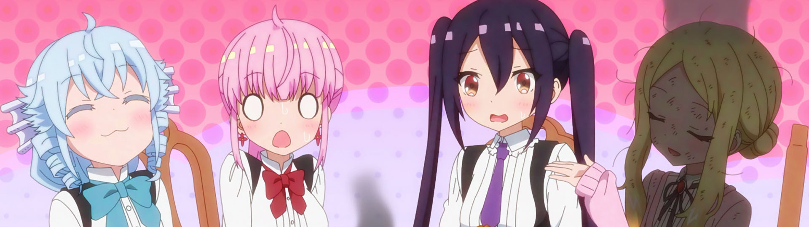

I definitely spent the relatively light spring season *not* catching up on all the shows I mean to ¯\_(ツ)\_/¯. I am making a valiant effort to get through [Fruits Basket](https://anilist.co/anime/120/Fruits-Basket/), but that's certainly going to continue through this season and possibly the next.

It's a sequel heavy season, but there looks to be quite a few new and hidden gems that I'm really excited about.  This isn't everything and it already feels like a lot.  There are a few shows that aren't airing until the end of the month (and some shows that Netflix and Disney picked up where I'm not sure when they will drop).

### [Tate no Yuusha no Nariagari Season 2 (The Rising of the Shield Hero Season 2)](https://anilist.co/anime/111321)


Anticipating this second season dropping, I went back and finally finished season 1. It was sitting squarely in the "just OK" realm for me. Honestly, if it wasn't for [Kevin Penkin](https://anilist.co/staff/121796)'s OST, I might have decided to just drop it.

Season 2 seems to be set up for more "Hero" and less "Edge Lord" thankfully, but they doubled down on the "slave contract" thing, which I could have really done without. There are so many other shows I'm a lot more excited about than this one, so it won't be high on priority watching each week.


### [Kaguya-sama wa Kokurasetai: Ultra Romantic (Kaguya-sama: Love is War -Ultra Romantic-)](https://anilist.co/anime/125367)


Pure, unadulterated pleasure -- I love this series.

I had a smile plastered on my face from the opening scene (which is genuinely clever and absolutely hilarious). This is one of the few shows where I give a pass that there is no romantic progression between our romantic leads -- the comedy is that good.

(I'm still secretly hoping for a honest confession…)


### [SPY×FAMILY (SPY x FAMILY)](https://anilist.co/anime/140960)


I saw many people super excited for this to get an adaptation -- personally, I hadn't picked up the [manga](https://anilist.co/manga/108556). After this premiere, I feel like I missed out. [Anya](https://anilist.co/character/138100) is absolutely and positively adorable.  When I heard the premise, I assumed that she would be exceptionally smart beyond her years, but she truly is a sweet five-year old that just happens to have ESP. While we have yet to fully form our special family, I'm fairly confident this will be an extraordinary cast.  I can't wait to follow the shenanigans each week.


### [Kawaii dake ja Nai Shikimori-san (Shikimori's Not Just a Cutie)](https://anilist.co/anime/127911)


This show also had a lot of buzz going for it, and being a [Doga Kobo](https://anilist.co/studio/95) show, I was even more intrigued. The first episode was… good? I guess I had higher expectations and was hoping for a bit more. I'm also not sure what kind of show this will be and how they will choose to develop their cast. Given the studio's track record, I'm definitely going to giving them the benefit of the doubt.


### [Aharen-san wa Hakarenai](https://anilist.co/anime/137281)



Cute and a few laugh out loud moments, but probably not enough to interest me each week.  I will give props to the art style -- it's nice to see some variation in the medium.  I'll give this another episode or two to see if they can introduce a fuller cast to make up for two monotone leads.


### [Shokei Shoujo no Virgin Road (The Executioner and Her Way of Life)](https://anilist.co/anime/129193)


Surprise of the season? Strong opening episode (like a knife to the temples, so to speak). I like this twist on your traditional *isekai* setup, and the magic system feels well developed.

This is one of the few light novels I've picked up, and I thought the initial adaptation was actually much stronger than the source material. There is lots of room to jump the shark, but I'll absolutely be tuning in each week for this one.


### [Machikado Mazoku: 2-Choume (The Demon Girl Next Door Season 2)](https://anilist.co/anime/123330)


So many lovable goofballs in this series -- I missed them.  The rapid fire comedy doesn't disappoint. The production is still simple (limited animation, lots of still screens) but it works.  I don't believe the source is a 4-coma manga, but the adaption feels like it is.


### [Mahoutsukai Reimeiki (The Dawn of the Witch)](https://anilist.co/anime/133175)


I was a fan of [Grimoire of Zero](https://anilist.co/anime/97682/Zero-kara-Hajimeru-Mahou-no-Sho/) when it came out a few years ago (wait... 2017?! 😳) This seems set in the same universe, but I'm not quite sure how it will relate to the first series (from the OP it definitely seems we will see our two returning MCs). Bottom line is I went into the first episode without any expectations and came away looking forward to the next one.


### [Love Live! Nijigasaki Gakuen School Idol Doukoukai 2 (Love Live! Nijigasaki High School Idol Club Season 2)](https://anilist.co/anime/133891)


Someone was doing God's work by casting our girls in suits again. 

```
(๛ ˘ ³˘)۶
```

Good song in the opening episode while seeding a bit of drama *Love Live!* style. Looking forward to all the performances this season.


### [Heroine Tarumono!: Kiraware Heroine to Naisho no Oshigoto (Heroines Run the Show)](https://anilist.co/anime/138459)


Another show that I went in with zero expectations and came away smitten with the main character. I just hope the love triangle isn't too over the top in this one.

Trust me, 


She is adorable.


### [Paripi Koumei (Ya Boy Kongming!)](https://anilist.co/anime/141774)


OP of the season, [hands down](https://www.youtube.com/watch?v=oYmznjPfosE), no contest.

Where else but in anime can you have a Three Kingdom's era military strategist reincarnated into present day Japan to become an idol manager and have it *work* so well?!

Don't sleep on this one (it was picked up by HIDIVE, but it's worth subscribing just for this show). 

*Side Note:* With the merging of Funimation and Crunchyroll, I'm happy to subscribe to boost some competition in this space (even though it is technically a win for me as I got to consolidate a subscription service).  HIDIVE has a great catalog, even if they only pick up one or two shows a season.


### [RPG Fudousan (RPG Real Estate)](https://anilist.co/anime/130319)



Our second Doga Kobo show this season. Definitely your quiet slice-of-life offering this season if you're into that. Keep your expectations low, and you'll probably be OK, but this one is skippable if you already have a full slate.


### [BIRDIE WING: Golf Girls' Story](https://anilist.co/anime/140830)


Come on, you knew Japan could deliver a golf anime with shonen style power moves.  This one doesn't disappoint.  If I had to guess, the golf side will just be an excuse to do some character development, but I won't be surprised if Episode 7 deals with a head-to-head epic par 5.


### [Healer Girl](https://anilist.co/anime/133412)


[Studio 3Hz](https://anilist.co/studio/6069/Studio-3Hz) is another *can't miss* studio for me. This one seems very much out of left field (and definitely a show you'd never see in the west) but I enjoyed the first episode (it's a music heavy season and I'm definitely enjoying it).

