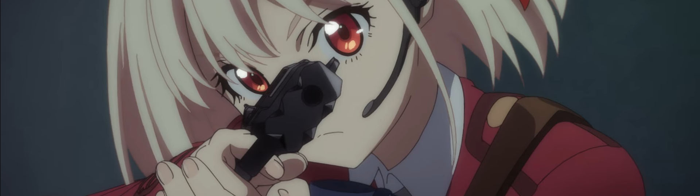
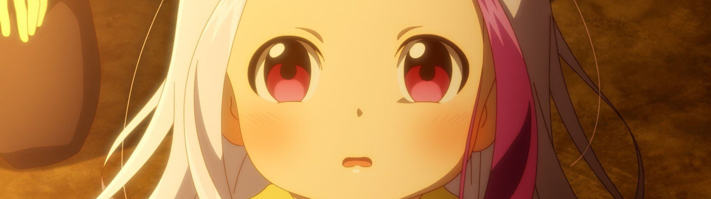
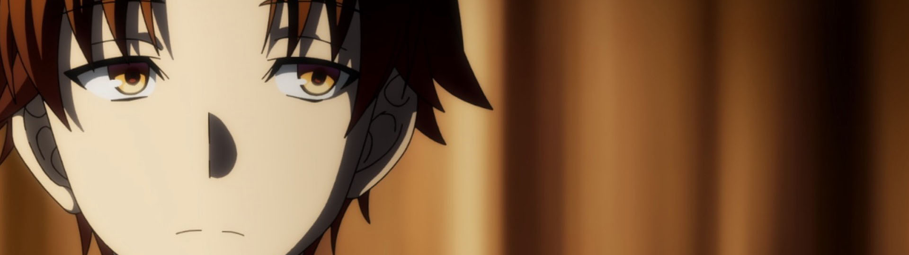
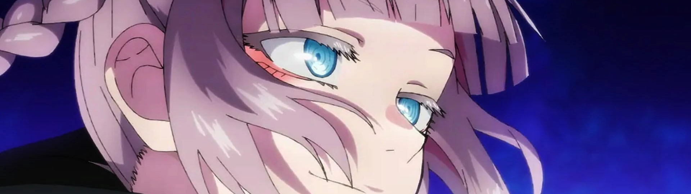
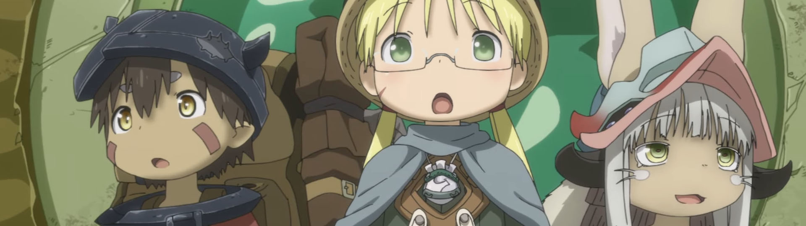
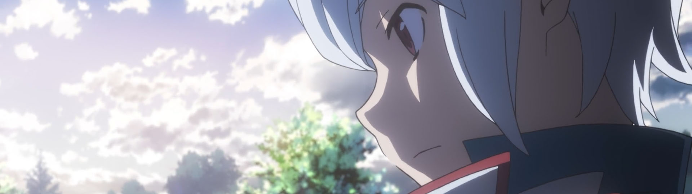
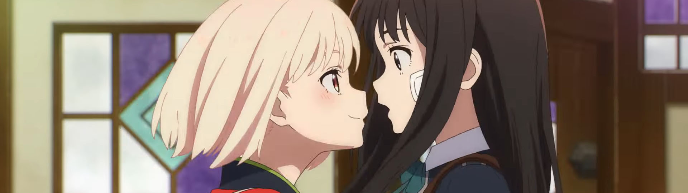
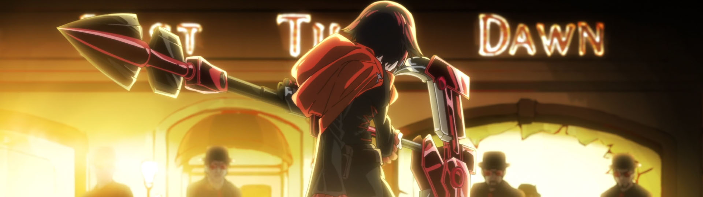
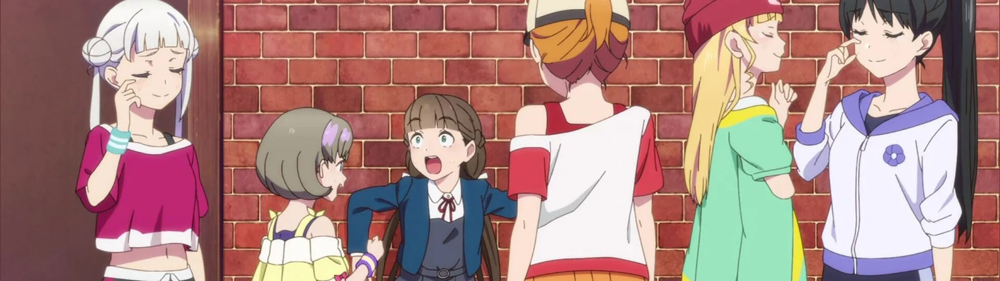

A bit late with this one, but a few of the shows had very late starts. It's definitely a "Sequel Summer" but that doesn't mean you should ignore the one original anime in this list (spoiler: it's definitely going to be my favorite of the season)

### [Hataraku Maou-sama!! (The Devil is a Part-Timer! Season 2)](https://anilist.co/anime/130592)

Leading off a set of surprise sequels (literally *nine* years after the first season), Maou is finally back!

This is one of the few shows where I enjoyed the dub far more than the original Japanese cast.  I have no idea if 1) Crunchyroll will choose to dub this (given Funimation did the previous dub) or 2) If they can (or have interest) in reviving the original English cast.  I'm keeping my fingers crossed because an English dub with the OG cast would be a monumental win.

### [Youkoso Jitsuryoku Shijou Shugi no Kyoushitsu e 2nd Season (Classroom of the Elite Season 2)](https://anilist.co/anime/145545)

Speaking of which, this is another show I definitely thought would never get a second season. If you didn't watch the first season, there is no reason to pick this one up. It isn't a show where I would recommend catching up by watching the first season. It's a so-so series, but at this point I have enough investment that sheer curiosity is driving me to watch it this time around.

### [Yofukashi no Uta (Call of the Night)](https://anilist.co/anime/141391)

`(Dagashi Kashi x Monogatari) - Shaft`

The backgrounds in this show are a must-see. I don't know anything about the manga, but the art and overall vibe of the show has me hooked.

### [Made in Abyss: Retsujitsu no Ougonkyou (Made in Abyss: The Golden City of the Scorching Sun)](https://anilist.co/anime/114745)

In prep for this dropping, I finally watched the movie (which you really *have* to watch to understand where Season 2 is going) – Season 1 was a visceral viewing experience, and the movie even more so. This new season is picking up right where the movie left off and is already starting to twist the knife.

This show is not for the faint of heart. It relishes in explicitly showing the torture of kids. Despite that warning, Made in Abyss is still one of my favorite shows of all time.

### [Dungeon ni Deai wo Motomeru no wa Machigatteiru Darou ka IV: Shin Shou Meikyuu-hen (Is It Wrong to Try to Pick Up Girls in a Dungeon? IV)](https://anilist.co/anime/129196)

Our team of cinnamon rolls are back for more adventures, and I'm totally here for it. I don't have any sense of what those adventures might be for this fourth installment, but I'm excited for some more world building. The show is getting a late (and slow) start – the opening few episodes have been exceptionally dialog heavy with very little development. I'm not giving it up, but I'm hoping it picks up soon.

### [Lycoris Recoil](https://anilist.co/anime/143270)

Easily my favorite show of the season. The art is fantastic, action is thrilling, and the hint of yuri is the cap stone. [Chika Anzai](https://anilist.co/staff/106030/Chika-Anzai) is sensational as Chisato (such a contrast to her performance as [Reina](https://anilist.co/character/88710/Reina-Kousaka) from [Hibike! Euphonium](https://anilist.co/anime/20912)).  Don't sleep on this original anime!

### [RWBY: Hyousetsu Teikoku (RWBY: Ice Queendom)](https://anilist.co/anime/146668)

I knew of RWBY, but I had always dismissed it as not my cup of tea. Lesson learned – don't assume without at least trying once (given how many times I try to give that lesson to my kids, one would think that I could learn that lesson myself).

The anime and original [web series](https://roosterteeth.com/series/rwby) are both very different, but both worth watching on their own.  After the first three episodes of the anime adaptation dropped, I binged the first volume.  I'm going to let the anime take the lead and then tackle the web series.

### [Love Live! Superstar!! 2 (Love Live! Superstar!! Season 2)](https://anilist.co/anime/140642)

Back to back seasons with *Love Live* sequels!  *Superstar* has a much more expressive and slapstick animation style, which I find quite endearing. So far, the music hasn't been quite as good as *Nijigasaki*, but I'm still a sucker for this franchise.