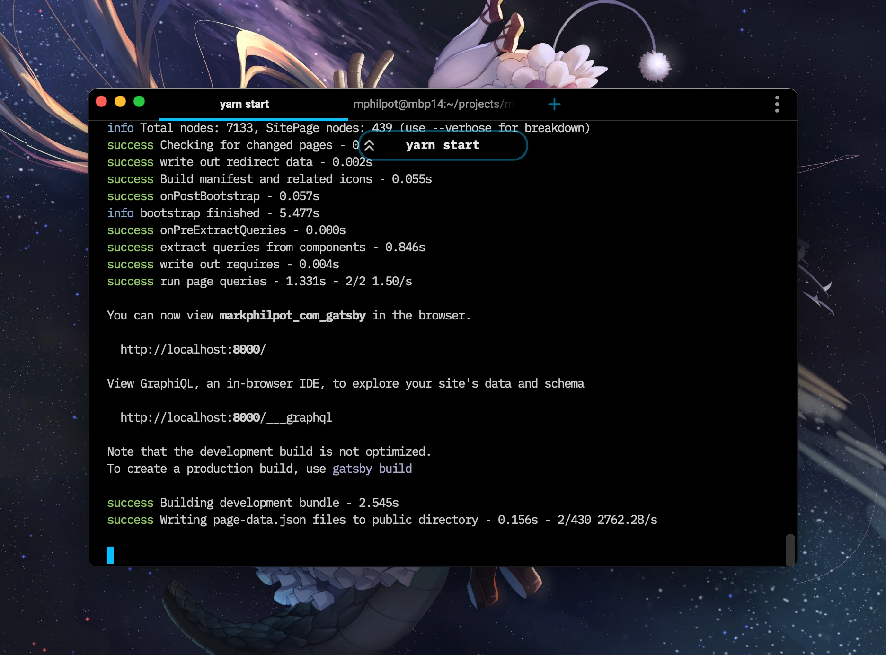
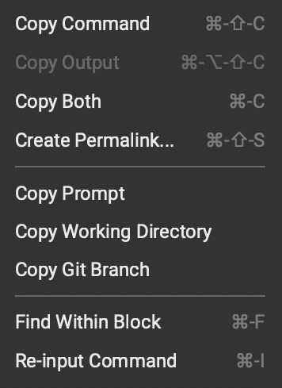

Some quick thoughts after playing around with [Warp](https://www.warp.dev/) - a new terminal emulator for Mac (Windows and Linux reportedly coming later).

It's great to see some innovation coming to a tool I use daily. My current terminal emulator [iTerm2](https://iterm2.com/) has served me very well for more than a decade. I tried a few of the JS/CSS-based emulators that came out a few years ago, but they weren't offering anything that I needed and introduced a whole new set of downsides.

## The Good

It's fast and looks great. It's very opinionated, and I give the dev team props for that (e.g. by default they ignore your $PS1 prompt setting, though thankfully you can change it). Compared to iTerm's settings (everything under the sun to the point of overwhelming) having that default opinion definitely provides a great "out of the box" experience.

If you are a developer who just uses the default shell with no customizations, I think Warp is for you.  To imply that the world of shell customization is vast and overwhelming is a considerable understatement. The thought of bringing the *best of* those features to the default experience is fantastic.

The command block concept is really great and something genuinely new in this space.

Treating each terminal command and it's output as an addressable (possibly sharable item) is a pretty neat idea.

It's nice that there is a command pallet, but I didn't find a lot there that I would end up using (see below). I appreciate the little `^^` pill showing you what command is currently running when that input has scrolled away. I love the fact that opening a new tab starts in the current tab's working directory (really need to see if that's an option in iTerm)

## Incomplete & Questions

**Profiles** -- The lack of profiles seems like something they are bound to add eventually, but something I leverage a decent amount in iTerm (and really should do more)

**Input Divisions** -- Warp's PS1 override isn't selectable (can't double-click the git branch you're in to select it). It definitely breaks a lot of my workflows. I don't mind the input pinned to the bottom rather than reflowing to the top, but I can see that being jarring for some folks.

**New Shortcuts** -- While I'm glad almost everything has keyboard shortcuts (and a command pallet to find them all). If your fingers already know emacs or vim style shell manipulation, you might be bothered by the need to rebind or relearn many new shortcuts.

Speaking of retraining, I find the auto-complete ghost helpful but distracting. I think my brain doesn't process the difference between the actual text color and the muted suggestion. It just thinks the command is complete and ready (you have to press the right arrow, and annoyingly my muscle memory says to use tab).

**Account Requirement** -- The account requirement was jarring, even though I knew it was coming.  Warp is a VC backed company and obviously are looking to build a business ecosystem out of development tooling. There is nothing there currently that justifies that yet (no sharing, no collaboration, or anything else as far as I can tell) but obviously, they are trying to build a business foundation for it.

**What Is Next?** -- So far, what we can see is a sleek, fast terminal emulator with many promises for future cloud and P2P connectivity.  None of that seems to be here yet (but probably good idea to nail the foundation before moving up the stack).

## Unfortunately

I live in [tmux](https://github.com/tmux/tmux/wiki) (a terminal multiplexer -- think nested terminals). I use [tmuxinator](https://github.com/tmuxinator/tmuxinator) to have several preset configs (think profiles on steroids).  It has become my portable terminal configuration. I'm not an expert by any means, but I know enough to be dangerous, and it's key to my development workflow.

Most of the innovations that Warp is trying to bring to the table breakdown as soon as you enter tmux (your activity becomes completely opaque to the parent application)

## Conclusion

If you are a developer who uses the stock shell configuration (and probably the default mac Terminal), try Warp. I think you'll enjoy the experience.

If you are a developer who has customized their shell ([oh-my-zsh](https://ohmyz.sh), [prezto](https://github.com/sorin-ionescu/prezto), etc) you aren't going to find anything new here (though I will say performance wise it might be a bit faster than a laden zsh customization). Presented another way, if you are a developer who *has* customized their shell environment but found it overwhelming and didn't do much outside a few plugins, you might find Warp meets your needs out of the box.

Personally, I'm going to keep it installed and shunt a few workflows through it.  Warp is definitely the best *new emulator* that I've used, and I want to see where it goes.

I also started supporting [iTerm2](https://iterm2.com/donate.html) via Patreon (considered using github, but I already have a Patreon budget so for me, it made more sense keeping it centralized). I wish Warp had a way of directly supporting them -- it's not a business around an open-source product.  If they can't realize a business around their cloud features, the product might not continue to exist. It's a risk when adopting any new tool, so keep that in mind as you consider if it is a tool for you.