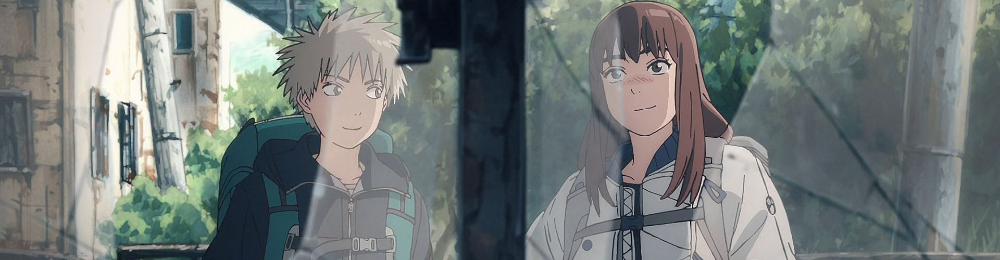

To say this is a stacked season is a understatement of ultimate proportions...

### [Jigokuraku (Hell’s Paradise)](https://anilist.co/anime/128893)

> The Edo period is nearing its end. Gabimaru, a shinobi formerly known as the strongest in Iwagakure who is now a death row convict, is told that he will be acquitted and set free if he can bring back the Elixir of Life from an island that is rumored to be the Buddhist pure land Sukhavati. In hopes of reuniting with his beloved wife, Gabimaru heads to the island along with the executioner Yamada Asaemon Sagiri. Upon arriving there, they encounter other death row convicts in search of the Elixir of Life... as well as a host of unknown creatures, eerie manmade statues, and the hermits who rule the island. Can Gabimaru find the Elixir of Life on this mysterious island and make it back home alive?&lt;br&gt;&lt;br/&gt;&lt;br&gt;
(Source: Crunchyroll)

### [[Oshi no Ko] (Oshi No Ko)](https://anilist.co/anime/150672)

> When a pregnant young starlet appears in Gorou Amemiya’s countryside medical clinic, the doctor takes it upon himself to safely (and secretly) deliver Ai Hoshino’s child so she can make a scandal-free return to the stage. But no good deed goes unpunished, and on the eve of her delivery, he finds himself slain at the hands of Ai’s deluded stalker — and subsequently reborn as Ai’s child, Aquamarine Hoshino! The glitz and glamor of showbiz hide the dark underbelly of the entertainment industry, threatening to dull the shine of his favorite star. Can he help his new mother rise to the top of the charts? And what will he do when unthinkable disaster strikes? &lt;br&gt;&lt;br/&gt;&lt;br&gt;
(Source: HIDIVE)
&lt;br&gt;&lt;br&gt;

&lt;i&gt;Note: Episode 1&lt;b&gt;【推しの子】Mother and Children&lt;/b&gt; was pre-screened in advance in Japanese theaters on March 17, 2023. The regular TV broadcast begins on April 12, 2023. The first episode has an extended runtime of \~82 minutes.&lt;/i&gt;

### [Kono Subarashii Sekai ni Bakuen wo! (KONOSUBA -An Explosion on This Wonderful World!)](https://anilist.co/anime/150075)

> This feisty young wizard will stop at nothing to master the spell that saved her life: Explosion! Megumin, the “Greatest Genius of the Crimson Magic Clan,” has chosen to devote her studies to the powerful offensive magic used by her mysterious savior. Then one day, her little sister finds a black kitten in the woods. But this cat isn’t just a new furry friend—she’s the key to awakening a Dark God!&lt;br&gt;&lt;br&gt;&lt;br/&gt;
(Source: Crunchyroll)

### [Tengoku Daimakyou (Tengoku Daimakyo)](https://anilist.co/anime/155783)

> In the year 2024, the world has collapsed. Grotesque monsters lurk amongst the ruins of Japan, while remaining people scrape together what they can to survive. Kiruko, an odd-job girl in Nakano, accepts a mysterious woman&#x27;s dying wish to take a boy named Maru to a place called Heaven.&lt;br&gt;&lt;br/&gt;&lt;br&gt;
(Source: Disney+, edited)

### [Yamada-kun to Lv999 no Koi wo Suru (My Love Story with Yamada-kun at Lv999)](https://anilist.co/anime/154965)

> Recently dumped, Akane is just about to quit the game she used to play with her boyfriend, when she meets Yamada in the same RPG. Yamada in real life turns out to be somewhat of a legend. The only problem is - he is ONLY interested in the game. As Akane&#x27;s feelings grow, will Yamada&#x27;s focus stay on the game?&lt;br&gt;&lt;br/&gt;&lt;br&gt;
(Source: Mangamo)

### [Tonikaku Kawaii Season 2 (TONIKAWA: Over The Moon For You Season 2)](https://anilist.co/anime/141208)

> The second season of &lt;i&gt;Tonikaku Kawaii&lt;/i&gt;.&lt;br/&gt;&lt;br&gt;&lt;br&gt;
The sweet story of Nasa and Tsukasa continues! After surviving some awkward first nights together, dealing with doubters, and recovering from their apartment fire, it&#x27;s clear the fate of these lovers was written in the stars. Now, they&#x27;re ready to settle back into domestic bliss and finally plan their wedding ceremony! But with plenty of new friends on the way, what will their big day look like?!
&lt;br&gt;&lt;br&gt;
(Source: Crunchyroll)

### [Kimi wa Houkago Insomnia (Insomniacs after school)](https://anilist.co/anime/143653)

> Ganta Nakami is a high school student who suffers from insomnia. One day, he meets Isaki Magari, a girl with the same condition. A strange, but special relationship forms as they share a secret and catch up on their sleep in their school’s abandoned observatory…&lt;br&gt;&lt;br/&gt;&lt;br&gt;
(Source: HIDIVE)

### [Skip to Loafer (Skip and Loafer)](https://anilist.co/anime/141911)

> This country girl is ready for the big city! Well, at least she thought she was. Mitsumi’s dream is to attend a prestigious school and make the world a better place. But when she finally gets to Tokyo, it turns out she isn’t exactly prepared for city life. Luckily, she runs into Shima, a sweet and handsome classmate who becomes her first friend! Can she make it in Tokyo with Shima by her side?&lt;br&gt;&lt;br/&gt;&lt;br&gt;
(Source: Crunchyroll)

### [My Home Hero (My Home Hero)](https://anilist.co/anime/151189)

> After killing his daughter’s abusive yakuza boyfriend to save her, ordinary salaryman Tetsuo Tosu becomes embroiled in the dark criminal underworld. The wish for a simple life he and his wife Kasen had for their daughter has been reduced to a wish for survival. Though middle-aged and weak, he’ll put his life on the line using only his wits in order to protect his family.&lt;br&gt;&lt;br/&gt;&lt;br&gt;
(Source: Crunchyroll)

### [Mahoutsukai no Yome SEASON 2 (The Ancient Magus’ Bride Season 2)](https://anilist.co/anime/154364)

> The second season of &lt;i&gt;Mahoutsukai no Yome&lt;/i&gt;. &lt;br&gt;&lt;br&gt;&lt;br/&gt;Chise was able to accept Elias and herself, if not necessarily everything about her situation. After Cartaphilus fell back into a slumber that would not last forever, Chise was able to go back to her regular life. Then she receives an invitation from a mutual aid organization for mages called the College.&lt;br&gt;&lt;br&gt;

Under the British Library exists a secret society of mages. Encounters and interactions with people are about to open some new doors.&lt;br&gt;&lt;br&gt;
This is a story about saving yourself to save another. &lt;br&gt;&lt;br&gt;
(Source: Crunchyroll) &lt;br&gt;&lt;br&gt;

&lt;i&gt;Note: Episode 1 of season two premiered in a preview screening event together with &quot;Fuyu no Okorimono&quot; at Tachikawa Cinema City&#x27;s Cinema Two in Tokyo on March 11, 2023.&lt;/i&gt;

 

### [Otonari ni Ginga (A Galaxy Next Door)](https://anilist.co/anime/148098)

> Ever since their father died, Ichirou Kuga has struggled to support his two younger siblings on nothing but a small inheritance and his passion for drawing manga. But it’s becoming harder to keep up with his growing responsibilities and deadlines, especially after his last two assistants quit to follow their dreams. &lt;br&gt;&lt;br/&gt; &lt;br&gt;
Just as he’s nearing his breaking point, the beautiful and scarily competent Shiori Goshiki applies to become his new assistant. But there’s something almost otherworldly about Goshiki, and soon Kuga finds his reality turned upside down when she suddenly declares them engaged to marry!&lt;br&gt;
&lt;br&gt;(Source: Crunchyroll)

### [Kuma Kuma Kuma Bear Punch! (Kuma Kuma Kuma Bear - Punch!)](https://anilist.co/anime/127550)

> The second season of &lt;i&gt;Kuma Kuma Kuma Bear&lt;/i&gt;.

### [Watashi no Yuri wa Oshigoto desu! (Yuri Is My Job!)](https://anilist.co/anime/149028)

> Worried about her reputation, Hime covers shifts for a cafe manager she accidentally injures to maintain her picture-perfect princess image. But this cafe has a peculiar theme—private school. To put on her best barista schoolgirl act, she’ll be trained by the most graceful girl there, Mitsuki. Under her guidance, Hime’s feelings start to brew, but there’s just one problem—Mitsuki can’t stand her!&lt;br&gt;&lt;br/&gt;&lt;br&gt;
(Source: Crunchyroll)

### [BIRDIE WING: Golf Girls&#x27; Story Season 2 (BIRDIE WING -Golf Girls’ Story- Season 2)](https://anilist.co/anime/151606)

Our two lovable dorks are back on the course.