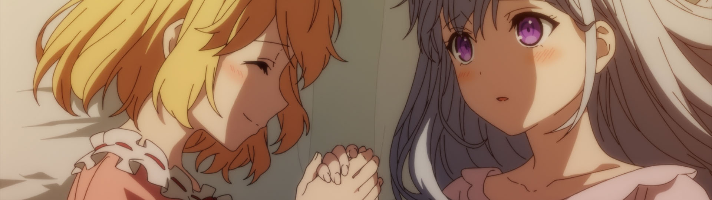
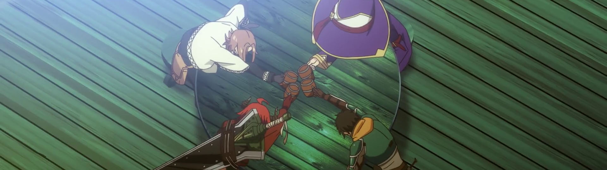

Let's jump in, shall we?

### [NieR:Automata Ver1.1a](https://anilist.co/anime/145665)

Unlike [Edgerunners](https://anilist.co/anime/120377) from last season, I was a few hours into this game before putting it on hold (with every intention of getting back to it). If I recall correctly, I picked up Persona 5 shortly after grabbing NieR on sale -- It's hard to compete with one of my favorite games of all time.

I'm going to hold myself to completing the game before diving into the anime (which means a lot of spoiler-avoiding-ninjitsu for me this season). The opening episode was solid despite a bit of CGI wonkiness. Having Aimer singing the OP does mean I will miss out on an epic song each week, but I can still appreciate it until I can beat the game.

<lite-youtube videoid="Xcx6MVs2o8E" playlabel="Adobe Answers YOUR Questions on AI, Controversies, and Photography! | The PetaPixel Podcast" params="start=1685"></lite-youtube>

### [Tomo-chan wa Onnanoko! (Tomo-chan Is a Girl!)](https://anilist.co/anime/151806)

I am a *massive* fan of the manga and was really excited to see this get an adaptation. After a few episodes, I'm honestly grateful I read the manga first (the manga is finished, and I seriously doubt the anime will cover the entire story in a single cour). A 4-koma manga is hard to translate to anime, and I feel I can definitely see the seems in this one.

Despite all that, the voice acting is great, and I get to spend more time with these great characters. Win-win.

### [Otonari no Tenshi-sama ni Itsunomanika Dame Ningen ni Sareteita Ken (The Angel Next Door Spoils Me Rotten)](https://anilist.co/anime/143338)

From the "I'm pretty sure I've seen this wish fulfillment fantasy before" department… Most likely a solid pass, but I'm going to give it one more episode to be certain. Absolutely safe to skip regardless.

### [Koori Zokusei Danshi to Cool na Douryou Joshi (The Ice Guy and His Cool Female Colleague)](https://anilist.co/anime/151252)

I can't help but be reminded of [Wotakoi](https://anilist.co/anime/99578) and unfortunately this show is a pale imitation of it in almost every way -- the pacing is too slow, the comedy is flat, the characters have no depth.  It's disappointing, as we don't get enough workplace romances between adults in anime. I'm going to stick with it for a few more episodes to see if the characters come along once the introductory period is over, but I have my doubts.

### [Buddy Daddies](https://anilist.co/anime/155907)

There are probably going to be many comparisons to [Spy X Family](https://anilist.co/anime/140960) with this one (think *Three Men and a Baby* but with assassins), but this one is right up [PA Works]()' wheelhouse. The graphic violence is a perfect contrast with the sweet, 4-year-old antics of Miri. Hearing [Kouki Uchiyama](https://anilist.co/staff/96764) chew through the scenery as Rei is a treat, and [Toshiyuki Toyonaga](https://anilist.co/staff/95600) as Kazuki is a perfect foil.

The next show will probably be my favorite of the season, but this one is likely a close second.

### [Tensei Oujo to Tensai Reijou no Mahou Kakumei (The Magical Revolution of the Reincarnated Princess and the Genius Young Lady)](https://anilist.co/anime/153629)

2023 is shaping up to be an excellent year for the yuri community, and *Magical Revolution* is leading it with a *strong* start. 2022 had some exceptional shows with yuri subtext ([Lycoris Recoil](https://anilist.co/anime/143270), [Gundam - Mercury Witch](https://anilist.co/anime/139274), hell even [Bocchi the Rock!](https://anilist.co/anime/130003)), but *Magical Revolution* is one of the most popular yuri stories since [Bloom Into You](https://anilist.co/anime/101573).

While this show is technically isekai on the tin, it's not central to the story (at least as far as my understanding of the source material goes). I also appreciate that the show runners feel confidant enough to change the order of some events to give us some better character development. Barring outright mishandling, I think it's a safe bet this will be my anime of the season.

### [Ningen Fushin no Boukensha-tachi ga Sekai wo Sukuu you desu (Disillusioned Adventurers)](https://anilist.co/anime/137909/Ningen-Fushin-no-Boukenshatachi-ga-Sekai-wo-Sukuu-you-desu/)

I will admit, this one will probably just be a guilty pleasure rather than being something I would recommend. Four adventurers that have been burned for one reason or another, learn to trust again and come out the other side as a party and friends.

The chance this one goes off the rails (or jumps the shark) is quite good, but I'm going to stick with it for a bit longer, as I'm a bit of a sucker for this setup.

### [REVENGER](https://anilist.co/anime/155202)

From the twisted genius of [Gen Urobuchi](https://anilist.co/staff/105308/Gen-Urobuchi) comes a tail of revenge... er.  Revenger.

I was honestly going to skip this one, but I usually check in on anything Urobuchi writes to see if it's another [Madoka Magica](https://anilist.co/anime/9756).  After two episodes, I can't tell yet if it will just be a "revenge of the week" sort of show, or if there is any overarching structure to be found.  Solidly OK is what I would give it so far.

### [Sugar Apple Fairy Tale](https://anilist.co/anime/139821)

Is *reverse slavery romance* a tag now? 

Apparently not quite…

This show is full of contradictions, and I'm not sold on this eventual romance. There is nothing new here, and I remain skeptical that I will continue watching after a few more episodes.

Watch [Spice & Wolf](https://anilist.co/anime/2966) instead (and actually the English dub version!) -- A much better story, characters, and premise that *Sugar* is trying to woefully imitate.

### [Ars no Kyojuu (GIANT BEASTS OF ARS)](https://anilist.co/anime/155089)

There are actually a lot of great pure fantasy shoes this season and this is one of them. Don't judge the show based on the opening scene -- it's a bit misleading. Once the show gets into a bit of world building, the promise begins to show a bit.  This is one of two shows HIDIVE picked up that I'm interested in this season.

### [Mononogatari (Malevolent Spirits: Mononogatari)](https://anilist.co/anime/141785)

Based on the MC, I was *this* close to dropping it after a single episode.  The only thing saving it is I know there are a bunch of other characters that hadn't been introduced yet that I was willing to give it a shot.

I still don't like the MC, but there is enough around the edges that I haven't dropped it yet.  By the end of the third episode, I think I'll make a call.

### [Hikari no Ou (The Fire Hunter)](https://anilist.co/anime/125869)

Post apocalypse, great world building, unique art style?

Count me in! I was very impressed after the first episode. There is almost a post-apocalyptic-steampunk vibe going on, and I'm absolutely here for it.

### [Mou Ippon! (Ippon! again)](https://anilist.co/anime/136435)

This one will be my *relaxing* show of the season. It's fascinating to see how a show like this which definitely doesn't have a lot of money chooses to spend it's animation budget. The key judo scenes are well animated, and the show takes necessary shortcuts where it can.