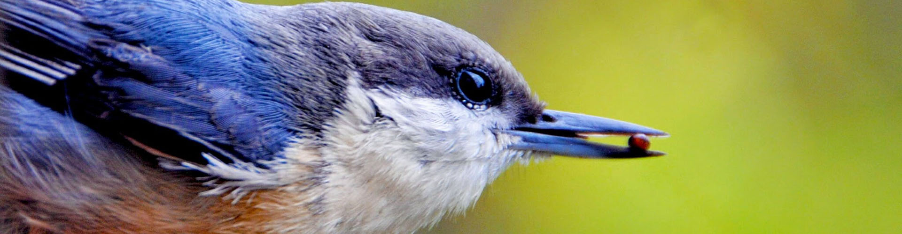

I never used Twitter “normally” — I always used third-party clients. I never tolerated the algorithmic timeline. I was a completionist — I wanted to pick up where I left off and tried to make sure I read *everything* in my timeline. I was extremely picky who I followed, but for that reason, I really enjoyed my timeline.

I followed a few core communities that didn’t exist anywhere else. Seeing the writing on the wall, I still wanted to see what they had to say, even as I moved elsewhere. I followed everyone I could in other networks they were in, but there are a handful that didn't seem to have any presence apart from Twitter.

Twitter ending the API as it has existed for more than a decade signals the end, whether I like it or not.  When they unceremoniously cut off Twitterrific, I pruned everything back and used Reeder to follow as if it were an RSS feed. Now that’s likely going to fall by the wayside.

Twitter hasn’t yet specified how you “pay” for API access (because of course, they haven’t) — is it a developer choice or a user choice? If the only thing that’s left is twitter.com or twitter.app then I’m pretty sure I won’t be back.

As I consume what remains of my timeline as an RSS feed, I keep hoping everyone I follow will announce they too are moving somewhere else. Every post that goes by where that doesn’t happen leaves me feeling a bit emptier.

Truly, the end of an era…

