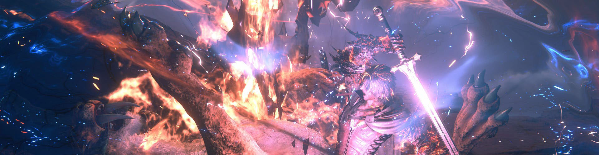
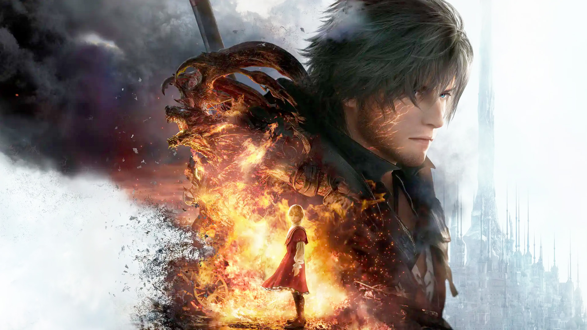

While I usually wait a year for these large titles to go on sale, I bit the bullet and picked up *Final Fantasy 16* a few weeks after its release. Honestly, I truly wanted to play a new FF game – I never got past the first few hours in FF15, the vibe never clicking with me.

I ended up rapidly finishing FF16 in record time, and that really says something.  However, before we get to the more lengthy part of this post, lets at least give credit where it's due.

## The Good

The **graphics** are excellent if you enjoy a realistic aesthetic.

The **voice acting** is great (I played through with the English cast).

The **seams** (at least within an area) are well hidden with small forced movements.

The bottom line, FF16 is what you might expect if you merged the style of *FF7 Remake* and the tone of *FF14*

## The Bad

The **upgrade system** is bad. There is absolutely no degree of meaningful customization – you are largely just picking out which animation loops you want to see.  Additionally, you can "upgrade" each "circle" 2-3 times, but it's never clear what subsequent upgrades actually do. Maybe longer reach, maybe more damage, maybe shorter cool down times, *who knows!*

The gameplay is exceptionally **linear**. *FF13* gets flack for being very linear, but at least it does open up in the back third. *FF16* feels incredibly claustrophobic after the first 10 hours or so.

While **side quests** offer a bit of much-needed character development, the objectives seem to have been placed as far away from each other as possible just to pad out the game length on an already short game.

I miss the traditional FF turn-based combat. **Real-time combat** doesn't lend itself to any sort of strategy.  There is no ability for buffs and debuffs, no weakness planning, and no balancing out party composition with strengths and weaknesses.

The world feels **absolutely empty**.  Compared with the latest CD Projekt Red games (*Witcher 3*, *Cyberpunk*) or even Mass Effect, it really feels like you are alone in this world.  Villages have less than 10 people, and capitals don't have much more.  Yes, abandoned villages are a set piece in the world building, but the lack of life everywhere really reduces the stakes.

More than anything else, *FF16* felt like a massive interactive movie and not a game.  There were massive stretches of time just watching characters converse.  Boss fights turn into exaggerated cinematic sequences where it becomes 100% scripted (i.e. no consequences).  The light and effects combined with the button mashing gives fills the screen with light noise, and you can hardly tell what's going on.

Yes, the game felt polished, but I definitely didn't come away enjoying my time spent playing.