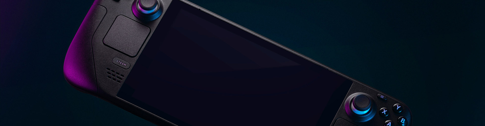

Ok, I know I'm late to the party, but I finally picked up the Steam Deck when Valve released the OLED version, and OMG is this device awesome.

First off, it's *huge* -- I'd been meaning to upgrade the size of my backpack, but opening the box for this tipped the scales on that debate. It's solid, comfortable to hold and the sticks and buttons are excellent (though I do miss the PS5's trigger feedback)

Second, the OLED screen was reason enough to wait. I'm currently making my way through *Witcher 3* and the environments look absolutely amazing. Because of the Steam Deck, I'm doubling down on my Steam game catalog.  I can't wait to play some old favorites and new ones with this device.  I think this does mean that I'll need to eventually get an OLED screen or small TV for my gaming PC in the basement.