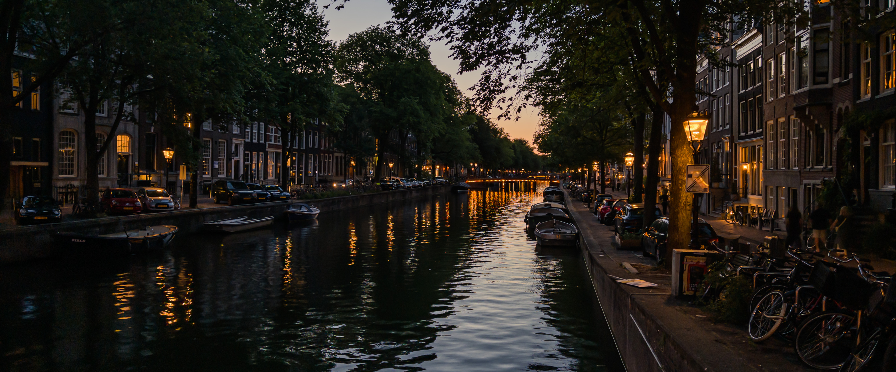
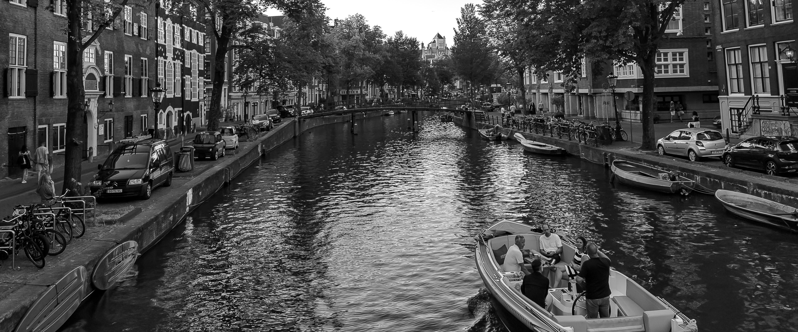

Adobe recently released a "research project" camera app for the iPhone, low-key released as [Project Indigo](https://research.adobe.com/articles/indigo/indigo.html). Its goal resonated with me to a T — most photos coming from an iPhone (or any smartphone for that matter) have a strong "smartphone photo" look to them — highly processed, over sharpened, and "flat" to my eyes.  I much prefer the images I get from my "big" cameras (Nikon Z8 and Leica Q) completely unprocessed.  Some of that is due to the sensor size, but a lot has to do with the default image processing pipeline.

On a whim, I installed it before my recent vacation and assigned it to my camera button, and so far I've been pleasantly impressed by the results. The computational "Night Mode" is the one thing that's neigh impossible to get with an SLR unless you're sporting a tripod (and I didn't bring mine on this trip to save weight). I was able to get some nice shots casually walking around Paris and Amsterdam at night that I just couldn't have shot otherwise.

I still prefer shooting with a dedicated camera — the ergonomics are far superior — but following the adage of "the best camera is the one you have with you" getting more satisfying results from my phone means I can get shots I just would have passed on before.

The app shoots RAW+JPG, and it's easy to get photos into Lightroom for processing.  One thing I've noticed is that the collection of presets I've created and collected behave differently with images from Indigo. I don't know yet if that's because I've mostly shot night photos, or if the tone mapping is different enough that it's worth creating a set of dedicated presets for photos shot with Indigo. 

The app has received a few updates since it's initial release, so it doesn't seem like it's a one-off proof of concept. I don't know what future Adobe envisions for this project, but I hope they keep it alive and iterate on it.

