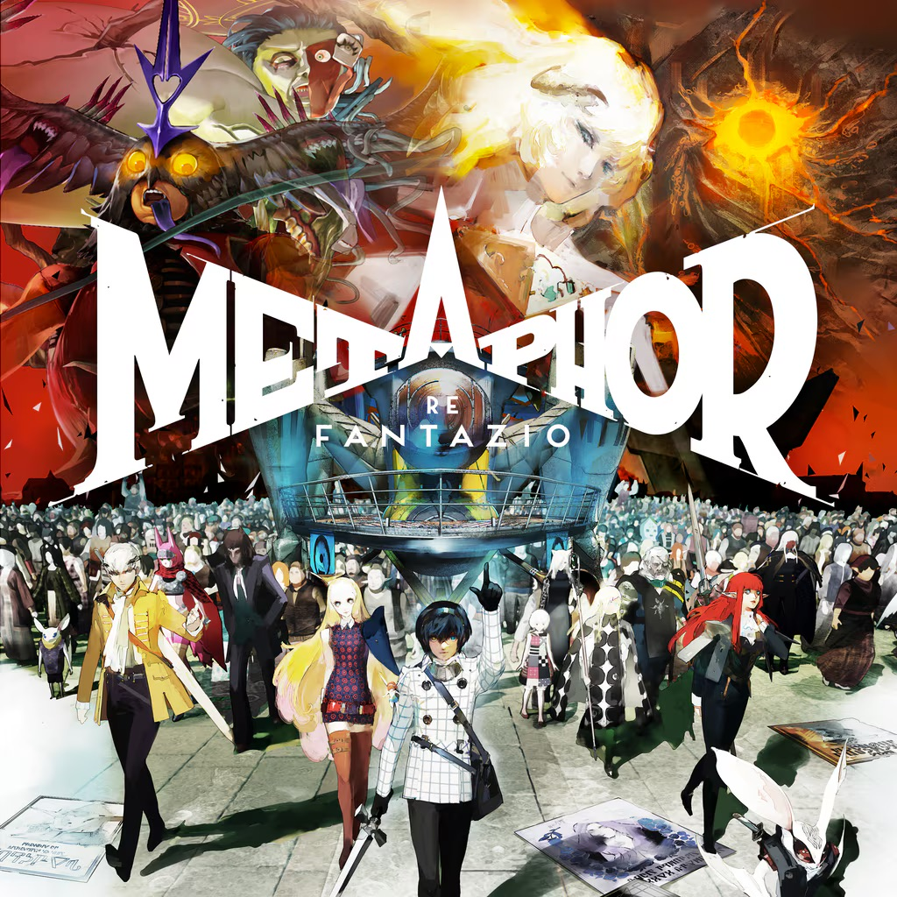

[Metaphor: ReFantazio](https://metaphor.atlus.com/index.html?lang=en)

Improved Persona-esque mechanics with a more complex and flexible combat/upgrade system. The story didn't quite resonate with me (felt very one note) and while the OST is good, it's not Persona.

7/10