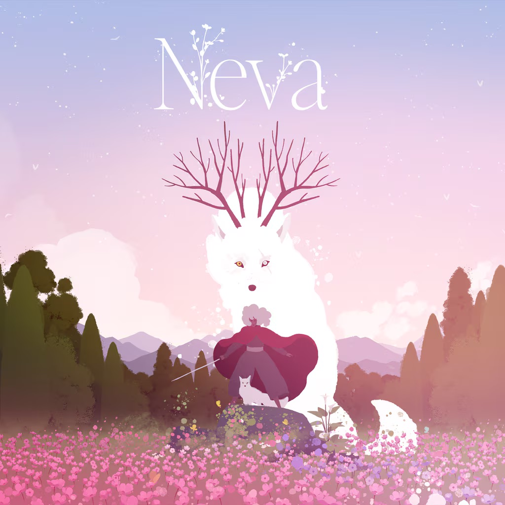

Neva lets you pet, play, scratch, cuddle, and fight with the dog (and tears were definitely shed in the process). Gris is a better game and I prefer the puzzle platforming versus the combat in Neva, but the mechanics are tight and ultimately satisfying.

8/10