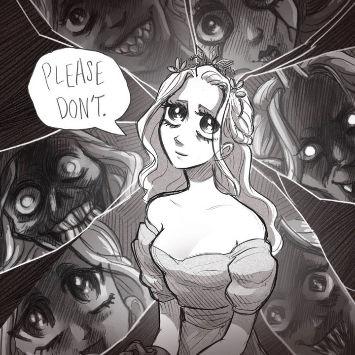

[Slay the Princess](https://www.slaytheprincess.com/)

A visual novel style horror "sequence" very much in the vein of "The Stanley Parable" (with a bit of "Doki Doki" thrown in). The art by Abby Howard steals the show, in what is more a non-linear experience, rather than a story. I kept trying to find hidden loops, but as far as I can tell, the story is a straight fanout with narrative building on iterations through the story. Solid game if you're a fan of the prior art.

6/10