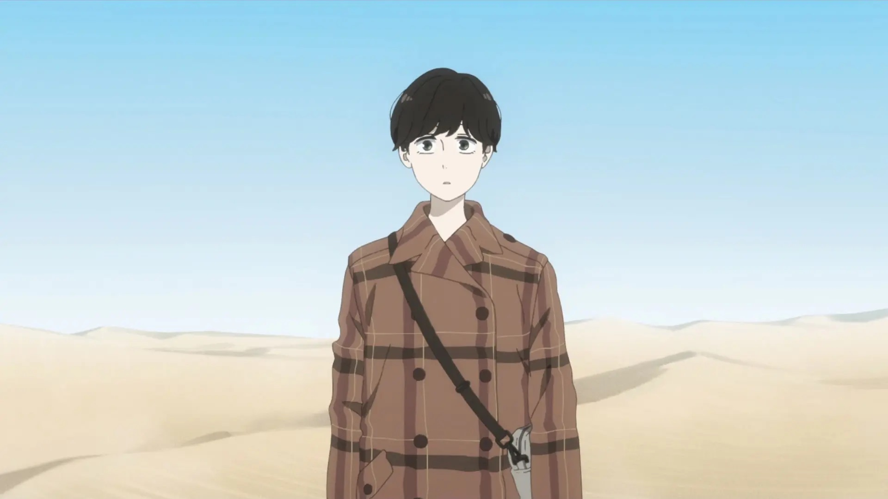

### [Ikoku Nikki](https://anilist.co/anime/177385/Ikoku-Nikki/)

This story was such an interesting take on grief, loss, and what it means to be family. There was only enough time to focus on the two main characters, but I wish they had a bit more time to dedicate to the side characters in their orbit (and even then, the ending felt rushed).

I truly appreciate that that anime allows you to tell these smaller, one-off stories -- No need to franchise *everything* to find the next lucrative sequel.  Check this one out!

8/10