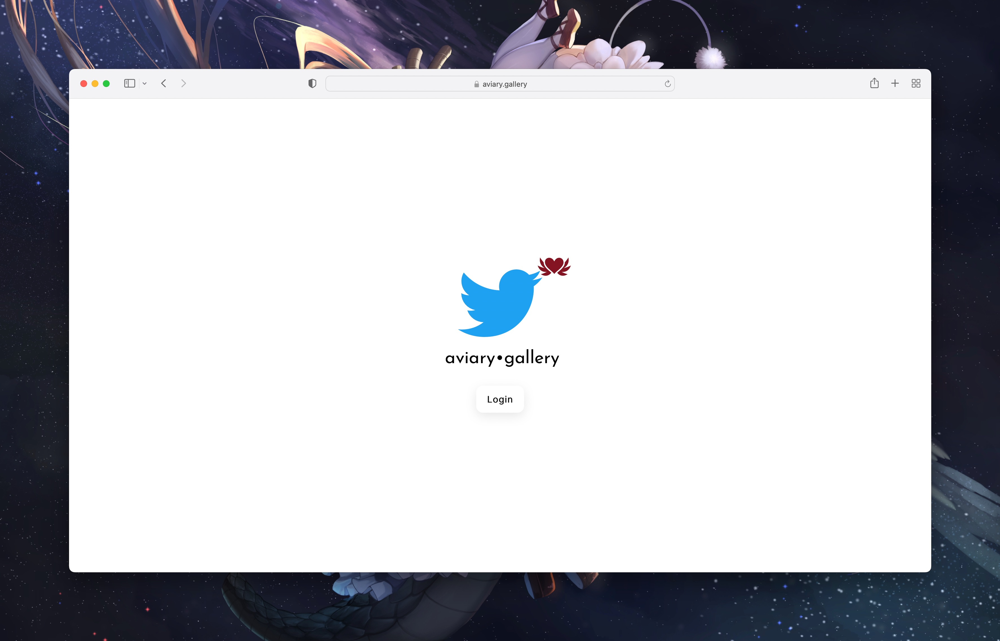
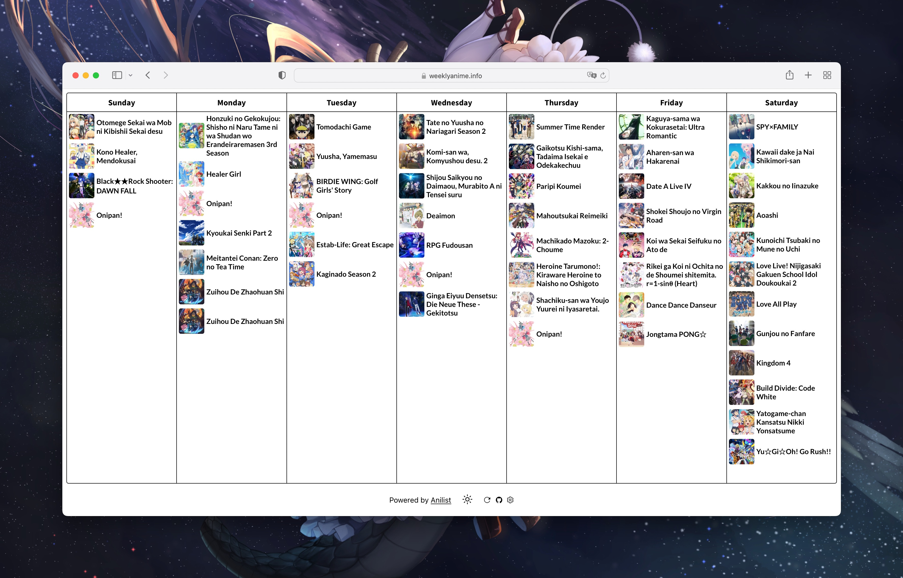
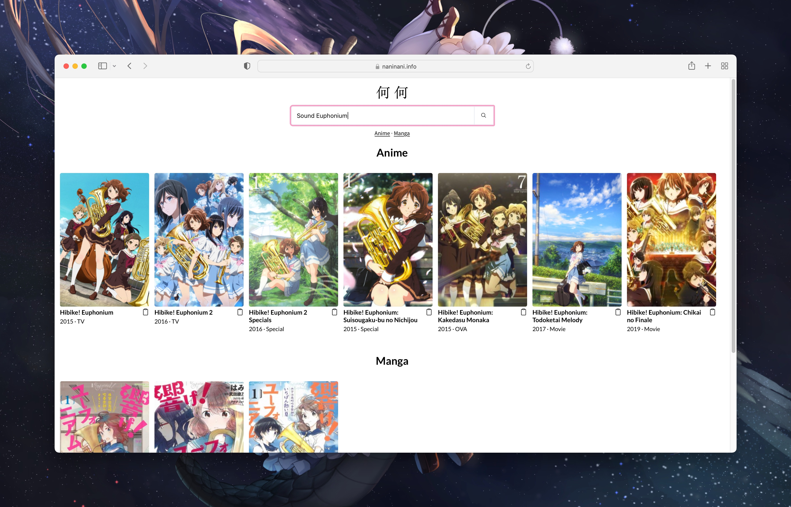
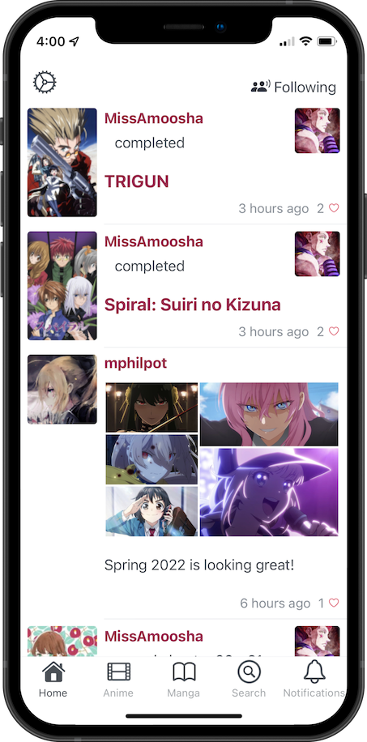
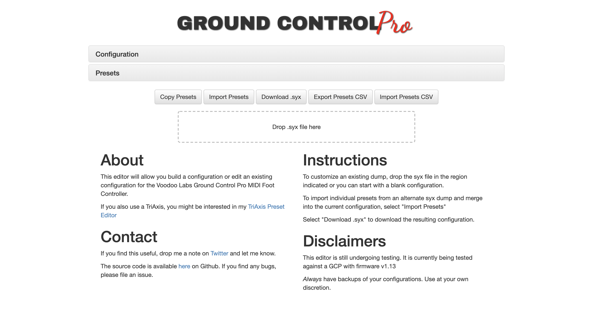

## Aviary (Twitter Favorite Gallery)

[aviary.gallery](https://aviary.gallery) -- If you frequently like twitter posts from artists posting their latest creations, this site displays all that art in a dedicated gallery without all the twitter chrome around it.

## Weekly Anime

[weeklyanime.info](https://weeklyanime.info) -- A simple site that shows the current seasonal anime airing during the week.  You can enter your Anilist username and the week will be your shows

## 何 Nani

[naninani.info](https://naninani.info) -- An anime and manga search engine that lets you programmatically query it through the `?q=` search parameter.

## anilime

Manage your AniList anime & manga on iOS

## [Own Goals Podcast](projects/own_goals)

Discussing various topics with [Chris Biscardi](https://twitter.com/chrisbiscardi) around software development, hardware, and games while trying very hard not to screw things up too badly.

## TriAxis &amp; Ground Control Pro Web Apps

[triaxiseditor.com](https://triaxiseditor.com)

[gcproeditor.com](http://gcproeditor.com)

## DaedaFusion OSS

[DaedaFusion Github](https://github.com/daedafusion)

