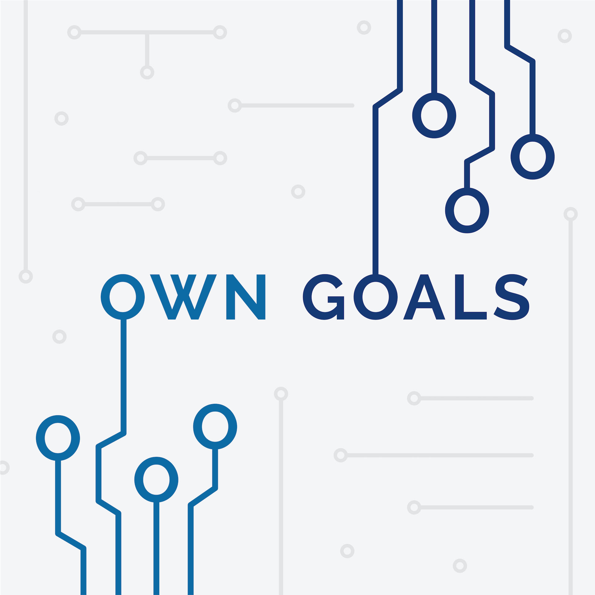

Your hosts Chris Biscardi and Mark Philpot discuss various topics around software development, hardware, and games while trying very hard not to screw things up too badly.

## E6: Consulting

*November 3, 2019*

<audio controls style="width: 100%; box-shadow: 2px 2px 4px 0px #006773; border-radius: 4px;">
    <source src='https://own-goals-archive.s3-us-west-1.amazonaws.com/20191010-episode-6_tc.mp3'/>
</audio>

Gatsby raises a series A which raises questions about open source business models and selecting open source libraries for your projects. We then explore Chris' consulting background and how to go about doing what you want to do (and maybe get paid for it)

- [The Complete Guide to FaunaDB](https://egghead.io/playlists/the-complete-guide-to-faunadb-74bef44b)

## E5: Gatsby & Software "Architecture"

*September 25, 2019*

<audio controls style="width: 100%; box-shadow: 2px 2px 4px 0px #006773; border-radius: 4px;">
    <source src='https://own-goals-archive.s3-us-west-1.amazonaws.com/20190919-episode-5_tc.mp3'/>
</audio>

Chris relates his start with the Gatsby project and where Gatsby Themes might be headed in the future.

- [Gatsby Themes](https://www.gatsbyjs.org/docs/themes/what-are-gatsby-themes/)
- [Introducing Gatsby Themes by Chris Biscardi](https://www.gatsbyjs.com/gatsby-days-themes-chris/)
- [Github Actions at Work](https://egghead.io/playlists/github-actions-at-work-ad05f3ff)

## E4: Personal Content Workflow

*September 3, 2019*

<audio controls style="width: 100%; box-shadow: 2px 2px 4px 0px #006773; border-radius: 4px;">
    <source src='https://own-goals-archive.s3-us-west-1.amazonaws.com/20190826_episode_4_tc.mp3'/>
</audio>

Chris and Mark dive into ways to think about personal content generation -- specifically how to avoid a blog full of unpublished drafts.

## E3: Ripped to Threads - DIY Build Wrap-up, Mechanical Keyboards & Ergonomics

*August 2, 2019*

<audio controls style="width: 100%; box-shadow: 2px 2px 4px 0px #006773; border-radius: 4px;">
    <source src='https://own-goals-archive.s3-us-west-1.amazonaws.com/20190727_episode_3_tc.mp3'/>
</audio>

Mark completes his DIY build (but not without a few snags along the way) while Chris deploys some water cooling &amp; sound treatments. We round up with some thoughts on mechanical keyboards and ergonomics.

- [Corsair Hydro-X](https://www.corsair.com/us/en/hydro-x-series-custom-cooling)
- [Acoustic Room Divider](https://www.versare.com/shop/versifold-acoustical-room-divider.html)
- [WASD CODE Keyboard](http://www.codekeyboards.com/)

## E2: Care Must Be Made - Typescript vs Flow, 17-year-old Web App

*July 21, 2019*

<audio controls style="width: 100%; box-shadow: 2px 2px 4px 0px #006773; border-radius: 4px;">
    <source src='https://own-goals-archive.s3-us-west-1.amazonaws.com/20190711_episode_2_tc.mp3'/>
</audio>

Chris and Mark open up a can of worms discussing Typescript and Flow which degenerates into the inevitable Static/Dynamic/Strong/Weak Typing discussion. Mark relates a story 17 years in the making and Chris takes his first NAS steps.

## E1: Pilot - RLCS, E3 & Ryzen

*July 15, 2019*

<audio controls style="width: 100%; box-shadow: 2px 2px 4px 0px #006773; border-radius: 4px;">
    <source src='https://own-goals-archive.s3-us-west-1.amazonaws.com/20190615_episode_1_tc.mp3'/>
</audio>

Chris and Mark discuss RLCS and how it fits within the larger eSports landscape, a tangent filled discussion on E3, and some thoughts and progress on our DIY PCs

- [RLCS](https://www.rocketleagueesports.com/schedule/)
- [Final Fantasy VII Remake Trailer](https://www.youtube.com/watch?v=Z3xSGv3Hfio)
- [Breath of the Wild 2 Teaser](https://www.youtube.com/watch?v=3fr1Z07AV00)